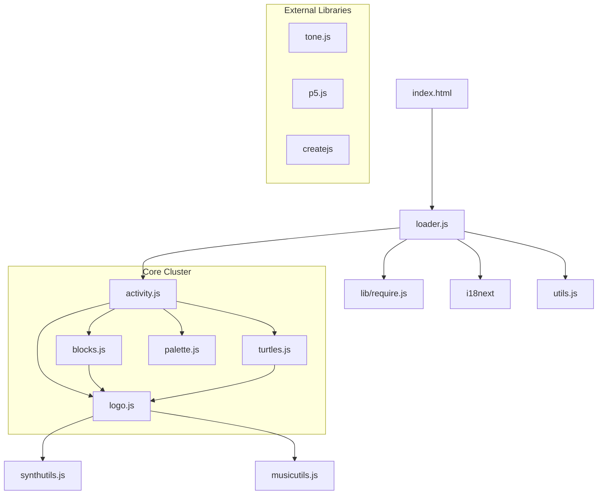

# Music Blocks Module Architecture & Dependency Analysis

## Overview
This document outlines the current state of the Music Blocks module system as of January 2026. The architecture is currently in a transition phase between global-scope scripts and an asynchronous module definition (AMD) system using RequireJS.

## 1. Core Bootstrap Sequence
The application initialization follows a multi-phase approach:
1.  **Phase 0 (HTML/Splash)**: `index.html` loads early scripts and CSS.
2.  **Phase 1 (Loader)**: `js/loader.js` configures RequireJS and initializes `i18next`.
3.  **Phase 2 (Core Load)**: RequireJS loads `activity/activity` and `utils/utils`.
4.  **Phase 3 (App Initialization)**: The `Activity` class initializes the UI, Canvas, and secondary modules.

## 2. Dependency Management Strategy
Music Blocks primarily uses two methods for dependency management:
- **RequireJS (AMD)**: Used for external libraries (Tone.js, p5.js, i18next) and some internal utilities.
- **Global Namespace**: Most internal modules (`Logo`, `Blocks`, `Turtles`) are loaded via RequireJS but register themselves on the `window` object or rely on other globals being present.

### Key Module Manifests
Internal dependencies are manually managed in `js/activity.js` via the `MYDEFINES` array. Analysis shows **97 modules** are orchestrated this way.

## 3. High-Risk Dependency Chains (Data-Driven)
Based on automated analysis of 123 modules and **792 implicit dependencies** via globals, the following "Bottleneck Modules" have been identified:

| Module | Incoming Dependencies | Role |
| :--- | :--- | :--- |
| `js/utils/musicutils.js` | 177 | Core music logic, pitch/frequency conversions. |
| `js/artwork.js` | 118 | Visual assets and block icons. |
| `js/logo.js` | 99 | Execution engine and core state. |
| `js/utils/utils.js` | 97 | General-purpose helpers (DOM, math, browser). |
| `js/protoblocks.js` | 56 | Block definitions and structure. |

### Interpretation
A change in `musicutils.js` potentially affects 177 other modules. This is the highest-risk area for regressions.

## 4. Identified Architectural Risks
1.  **Implicit Globals (792 instances)**: Most module "dependencies" are not managed by RequireJS but are instead implicit. If `musicutils.js` fails to load or registers its globals late, 177 other modules may crash.
2.  **Circular Dependencies**: Since variables are registered globally, it is easy to create cycles where `logo.js` uses `musicutils.js` which in turn might use a constant from `logo.js`.
3.  **Global Namespace Overcrowding**: There are over 468 unique symbols exported to the global namespace, increasing the likelihood of name collisions.

## 5. Visual Dependency Graph (High Level)


## 6. Tooling & Maintenance

### Source Control Policy
To maintain a clean repository and avoid merge conflicts on binary/large generated files:
1. **Source Files (Committed)**: The Python analysis script (`scripts/analyze-dependencies.py`), the Graphviz source (`Docs/architecture/dependency-graph.dot`), and the rendered SVG (`Docs/architecture/dependency-graph.svg`) are versioned for easier review.
2. **Generated Data (Ignored)**: Output reports (`.json`) are excluded from Git to prevent merge conflicts.

### Regeneration Instructions
To update the dependency analysis data after making module changes, run:
```bash
python3 scripts/analyze-dependencies.py
```
This script will automatically update the `.dot`, `.json`, and `.svg` files (if Graphviz is installed).

### Visual Audit Tool
A local visualizer is provided for deep-dive architecture audits:
- **Location**: `Docs/architecture/dev_architecture.html`
- **Regeneration**: This file can be updated to point to the latest `dependency-graph.dot` for interactive exploration.
- **Audience**: This is an internal tool for maintainers and contributors during the refactoring of #2632.


