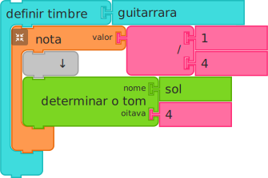

Using Music Blocks
==================

Music Blocks is a fork of [Turtle Blocks](https://turtle.sugarlabs.org). It has extensions for exploring music: pitch and rhythm.

Music Blocks is designed to run in a browser. Most of the development has been done in Chrome.

Browser       | Comments
------------- | -------------
Chrome        | Supported
Safari        | Supported
Firefox       | Supported
Opera         | Supported
IE            | Not Supported
Edge          | Coming soon

You can run it from [https://musicblocks.sugarlabs.org](https://musicblocks.sugarlabs.org).

Getting Started
---------------

When you first launch Music Blocks in your browser, you'll see a stack of blocks representing four notes: `Do 4`, `Mi 4`, `Sol 4` and `Do 5`. The first note is a `1/2` note; the second and third notes are `1/4` notes; the fourth note is `1/1` note.

Try clicking on the *Start* block or click on the *Play* button. You should hear the notes play in succession: `Do` `Mi` `Sol` `Do`.

To write your own programs, drag blocks from their respective palettes on the left side of the screen. Use multiple blocks in stack(s) to create music and drawings; as the mouse moves under your control, colorful lines are drawn and music of your creation is played.

Note that blocks either snap together vertically or horizontally. Vertical connections indicate program (and temporal) flow. Code is executed from the top to bottom of a stack of blocks. Horizontal connections are used for parameters and arguments, e.g., the name of a pitch, the duration of a note, the numerator and denominator of a division. From the shape of the block, it should be apparent whether they connect vertically or horizontally.

Some blocks, referred to as "clamp" blocks, have an interior—child—flow. This might be code that is run *if* a condition is true, or, more common, the code that is run over the duration of a note.

For the most part, any combination of blocks will run (although there is no guarantee that they will produce music). Illegal combinations of blocks will be flagged by a warning on the screen as the program runs.

You can delete a block by dragging it back into the trash area that appears at the bottom of the screen.

To maximize screen real estate, Music Blocks overlays the program elements (stacks of blocks) on top of the canvas. These blocks can be hidden at any time while running the program.

Toolbars
--------

There are four toolbars:

1. The *Main* toolbar across the top of the screen. There you will find the *Play* button, the *Stop* button, the *New Project* button, buttons for loading and saving projects and the *Find and Share projects* button.

2. The *Secondary* toolbar, in the lower-right corner of the screen. There you will find the *Home* button, buttons for show/hide blocks, expand/collapse blocks and decrease/increase block size.

3. The *Auxiliary* toolbar below the *main* toolbar. It appears when *auxiliary menu* button is clicked. There you will find the buttons *Run slowly*, *Run step by step*, *Display Statistics*, *beginner/advanced mode*, etc. and also the button for selecting language.

4. The *Palette* toolbar on the left side of the screen. An additional menu appears when a "right click" is applied to a stack of blocks.

These toolbars are described in detail in the [Turtle Blocks documentation pages](https://github.com/sugarlabs/turtleblocksjs/tree/master/documentation).

Keyboard Shortcuts
------------------

*PgUp* and *PgDn* will scroll the screen vertically. This is useful for creating long stacks of blocks.

You can use the arrow keys to move blocks and the *Delete* key to remove an individual block from a stack.

*Enter* is the equivalent of clicking the *Run* button.

*Alt-C* is copy and *Alt-V* is paste. Be sure that the cursor is highlighting the block(s) you want to copy.

You can directly type notes using *d* for `Do`, *r* for `Re`, *m* for `Mi`, *f* for `Fa`, *s* for `Sol`, *l* for `La`, and *t* for `Ti`.

Block Palettes
--------------

The block palettes are displayed on the left side of the screen. These palettes contain the blocks used to create programs.

See the [Turtle Blocks Programming Guide](https://github.com/sugarlabs/turtleblocksjs/tree/master/guide/README.md) for general details on how to use the blocks.

See the [Music Blocks Programming Guide](https://github.com/sugarlabs/musicblocks/tree/master/guide/README.md) for details specific to music: *Rhythm*, *Meter*, *Pitch*, *Intervals*, *Tone*, *Ornament*, *Volume*, *Drum*, and *Widget*.

All of the other palettes are described in the [Turtle Blocks documentation pages](https://github.com/sugarlabs/turtleblocksjs/tree/master/documentation).

Defining a Note
---------------

At the heart of Music Blocks is the concept of a note. A note, defined by the *Note value* block defines a length of time and a set of actions to occur in that time. Typically the action is to play a pitch, or series of pitches (e.g., a chord). Whatever blocks are placed inside the "clamp" of a *Note value* block are played over the duration of the note.

The duration of a note is determined by its note value. By default, we use musical notation, referring to whole notes (`1`), half notes (`1/2`), quarter notes (`1/4`), etc.  

The *Pitch* block (found on the Pitch Palette) is used to specify the pitch of a note. By default, we use traditional western Solfege, i.e., `Do`, `Re`, `Mi`, `Fa`, `Sol`, `La`, `Ti`.

As noted, and described in more detail in the [Music Blocks Programming Guide](https://github.com/sugarlabs/musicblocks/tree/master/guide/README.md), you can put as many *Pitch* blocks inside a note as you'd like. They will play together as a chord. You can also insert graphics blocks inside a note in order to create sound-sync animations.

A quick tour of selected blocks
-------------------------------

Creating Help Artwork
---------------------

The artwork used by the help widget (and used in this README file) can be created by typing *Alt-H* into Music Blocks. Artwork for each block will be generated and saved by the browser.