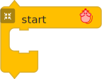
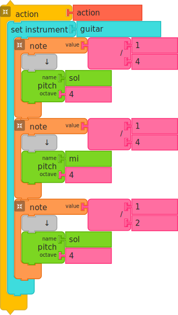
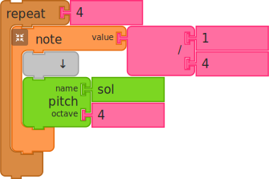

# Program Blocks

Music Blocks is a visual programming environment for learning music through code.
Program blocks are the structural components of Music Blocks that control the
**execution flow** and **organization** of a project.

## Introduction

In Music Blocks, you create music by snapping blocks together. Some blocks represent musical sounds, while others represent the logic of the program. These logical blocks are known as **Program Blocks**. They are essential for turning a simple sequence of notes into a complex composition.

## Role in Music Blocks

Program blocks act as the "engine" of your project. They tell Music Blocks:
*   **Where to start** (using the Start block)
*   **How to repeat** a sequence of notes (using loops)
*   **How to group** actions together (using action blocks)
*   **When to perform** certain tasks based on conditions (using logic blocks)

Crucially, **program blocks do not directly produce sound**. Instead, they contain and manage other blocks that do.

## Program vs. Sound Blocks

Think of a music project like a performance:
*   **Sound Blocks** are the musicians and their instruments (e.g., "Play a C chord for 1/4 note").
*   **Program Blocks** are the conductor and the musical score (e.g., "Repeat the chorus 3 times" or "When the Play button is clicked, start here").

| Block Type | Purpose | Example |
| :--- | :--- | :--- |
| **Program Blocks** | Control, structure, and flow | Start, Action, Repeat, If/Then |
| **Sound Blocks** | Produce music and sound | Pitch, Note, Set Instrument |

## Common Program Blocks

Program blocks are primarily found in the **Action** and **Flow** palettes.

### 1. Start Block
The **Start** block is the entry point of your program. Any blocks placed inside its "clamp" will run as soon as you click the **Play** button. You can use multiple Start blocks to create "counterpoint," where different voices play at the same time.

### 2. Action Block
An **Action** block allows you to group a set of blocks together and give them a name (like "Chorus" or "Bassline"). When you create an Action block, a new block with that name appears in your palette, allowing you to "call" that action whenever you need it.

### 3. Loop Blocks
Loops allow you to repeat a sequence of blocks multiple times. This is much easier than stacking the same blocks over and over!
*   **Repeat**: Runs the blocks inside it for a specific number of times.
*   **Forever**: Runs the blocks inside it until you click the Stop button.
*   **While / Until**: Runs the blocks based on a certain condition (like "While the music is playing").

## How to Use Program Blocks

Most program blocks are **"clamp" blocks**. They have an open space (a clamp) where you can snap other blocks inside.

1.  **Stacking**: You can stack program blocks vertically to define a sequence.
2.  **Nesting**: You can place program blocks inside other program blocks. For example, you can put a **Repeat** block inside an **Action** block to repeat a phrase within that action.
3.  **Organization**: Use Action blocks to break your music into sections. This makes your code easier to read and edit.

## Best Practices

*   **Label your Actions**: Give your Action blocks descriptive names so you know exactly what each part of your program does.
*   **Avoid "Invisible" Errors**: Since program blocks don't make sound, it can sometimes be hard to tell if one is working. Use the **Print** block (found in the Extras palette) to see messages that help you understand what your program is doing.
*   **Keep it Simple**: Start with a single Start block. As your music gets more complex, start using Action blocks to keep things organized.
