# Music Blocks for Snap Users

“All musicians are subconsciously mathematicians.” — Monk

“Music is a hidden arithmetic exercise of the soul, which does not
know that it is counting.” — Leibniz

## Introduction

While much about the Music Blocks user experience will seem familiar
to Snap users, e.g., palettes of colorful snap-together bricks, there
are some aspects of the interface that may be confusing. This document
aims to highlight those differences and explain where Music Blocks
does things a bit differently.

The roots of Music Blocks are in Brian Smith’s Turtle Art, a precursor
to Snap (or Scratch).

### Why Music Blocks?

Music manipulatives have been part of the Logo repertoire since the
1970s. Jeanne Bamberger, Hal Abelson, and Terry Winograd created
MusicLogo, “whose commands controlled a sound-emitting box [originally
Marvin Minsky and Ed Fredkin’s Music Box], allowing a tune to be
written in code and then immediately played aloud.” Exposed by the
language and built into some of Bamberger’s pedagogy were some
“powerful ideas”, such as some of the higher-level structural elements
of music: e.g., phrases and scalar steps.

Music composition and performance require practitioners to follow
basic control flow such as: sequences; conditionals and loops; data
abstractions such as changes in timbre, tone, and meter; functions and
operators such as transpositions, inversions, and retrograde; and
debugging—making corrections to a composition, perfecting a
transcription, or working through a section of music on an
instrument—that leads to a deeper understanding of music (and
computation) theory. The social aspect of musical performance also
parallels the perspective that computing is both collaborative and
creative. An analog can be built between the way programmers work
together, building communities around sharing and remixing code, and
the way in which musicians build communities of interest through
performance, sharing, and debating best practices. Programmers review
code and musicians critique performances. Both musicians and
programmers modify, improvise, and derive inspiration from the work of
peers and mentors. They also share lesson plans and innovations around
the use of manipulatives.

## Vive la différence

### The Workspace

Snap divides the screen up into three main sections: on the left, the
palettes; in the middle, the program composition area; and on the
right, the graphics viewport.

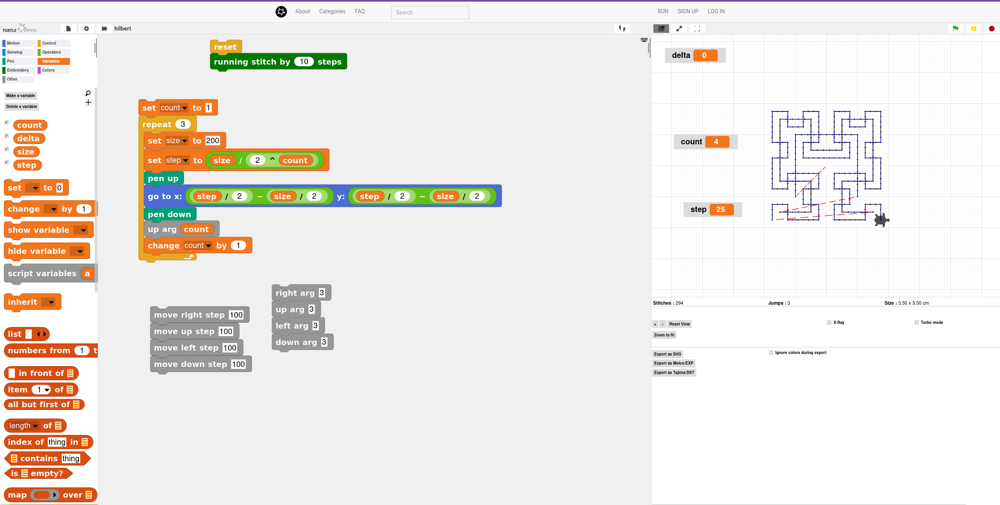

Music Blocks has a palette area on the left, but the program
composition area and the graphics viewport are layered on top of each
other.

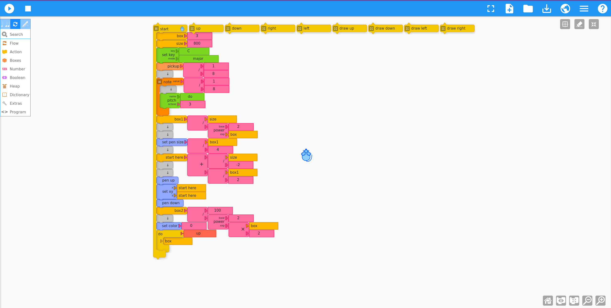

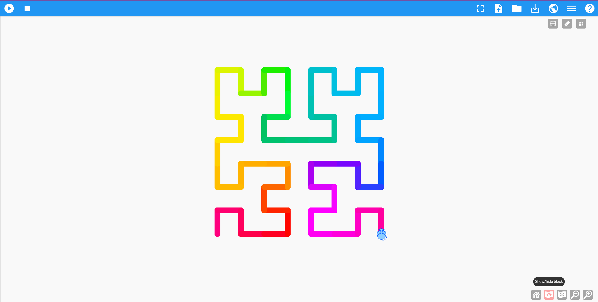

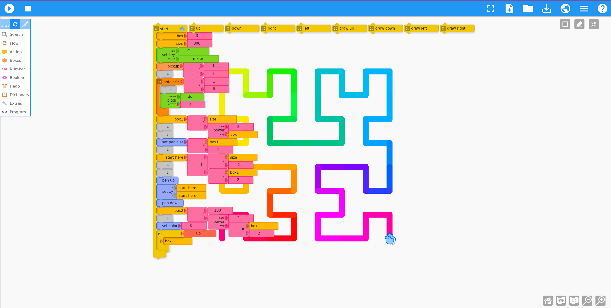

While the program runs, by default, the blocks are hidden. The
intention is to maximize the workspace for both blocks and
graphics. In the debugging section below, there are some details about
how to look at code (variables and comments) while running your
program.

You can also collapse (or expand) individual stacks of blocks. And
like Snap, you can change the size of the blocks.

### Operators and Predicates

Infix vs Prefix

Snap uses Infix notation for its operators:

Infix notation: X + Y

Operators are written in-between their operands.

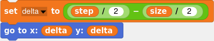

Music Blocks uses Prefix notation:

Prefix notation: + X Y

Operators are written to the left of the operands.

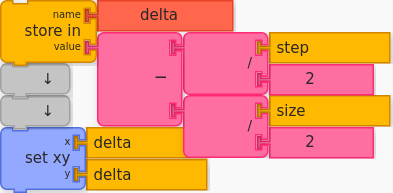

### Variables

In Music Blocks, we call variables “boxes”. There are a few boxes
predefined, but you can add/name as many new variables as you’d like.

In Snap, you make variables explicitly.

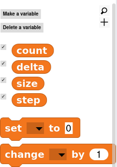

The Set To and Change By commands are specified through pull-down menus.
Store in Box

In Music Blocks, we use an analogy of a shoe box. You put something
into a box and then reference the thing by the name you have given to
the box. There are three predefined boxes (box, box1, and box2). And
you can make new variables using the Store In block.

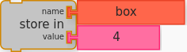

The name of the variable is determined by the value of the name
argument passed to the Store In block. For example, to make a size
variable:

This will create two new blocks at the top of the Boxes palette.

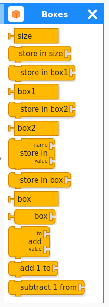

The size block we made is just like a variable you would create in Snap.

You use it just like you use the Set To command in Snap, but you get a
unique Store in for each box you create (no need for a pull-down
menu).

You can also use the various adder blocks with any variable. These are
the equivalent of the Snap Change By commands.

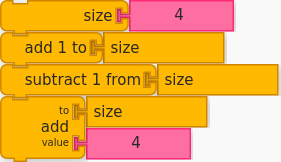

There is also a box “reporter” block that lets you access a variable
by reference. For example,

A bit obscure, but very powerful: Here I use it to record stats on
rolling dice. I have a box (variable) each for eleven boxes (named “2”
to “12”) to store the possible outcome of rolling two dice. I store in
the box named “box” the sum of two random numbers between 1 and 6, so
the box named “box” has a number between 2 and 12. Then I increment
the box named for the number stored in “box” by one. Later in the
program I make a bar chart showing the value stored in each box.

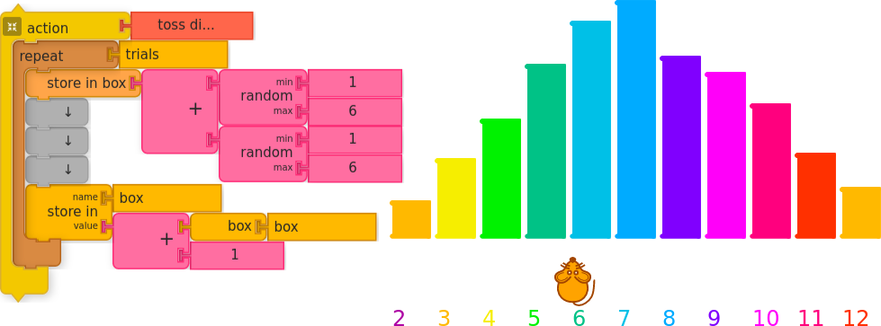

#### Variable Scope

Perhaps more detail than is necessary, but variables in Snap and boxes
in Music Blocks have a property called “scope”. The scope of a
variable defines where in your program the variable can be used. For
example, in Snap, a variable defined on the Variable palette can be
used anywhere. The variables defined inside of a Command can only be
used inside of the Command. They cannot be seen outside of the
command. “Anywhere” variables are called “global”. Variables defined
inside of commands are “local” to the command.

In Music Blocks, boxes defined on the Boxes palette are “global” and
shared between threads.

#### Lists and Heaps

Snap has support for “lists”.

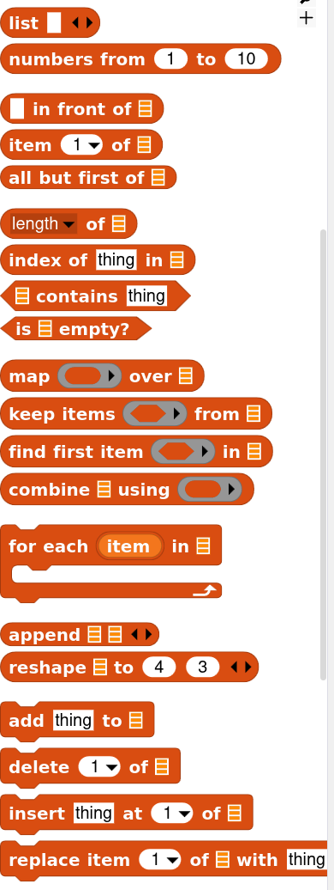

The Music Block equivalent of a list is the Heap. Think of it as a
pile of “shoe boxes”, where each shoe box has a variable stored in
it. You can put boxes on to the pile (using the Push block) and take a
box off of the top of the pile with the Pop block. You can also access
the contents of any box in the pile using the Index Heap block. (You
can also save/load heaps to/from a file.)

Heaps are “local”, as are the various blocks that maintain state,
e.g., x-position, y-position, color, heading, etc. (Each Start block
gets its own heap and each mouse has its own “local” state.)

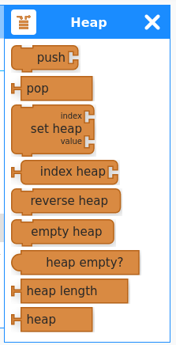

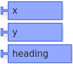

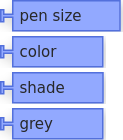

All of the state blocks can also be used with the Adders.

Action args (explained below) are “local”.

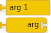

The Print command and the Status Widget.

The Print block can be used to print the value of a variable. Or you
can open the Status Widget to monitor whatever variables you are
interested in watching.

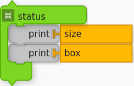

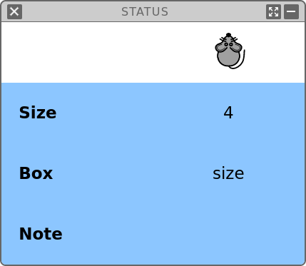

### The Start Block

It wouldn’t make a lot of sense to have more than one turtle in Turtle
Stitch, since the embroidery machines only have one needle (“single
threaded”). But in music, we often have more than one voice or
instrument. You get a separate “thread” for each Start block.

For example, we can implement a simple mirror paint by using four Start blocks.

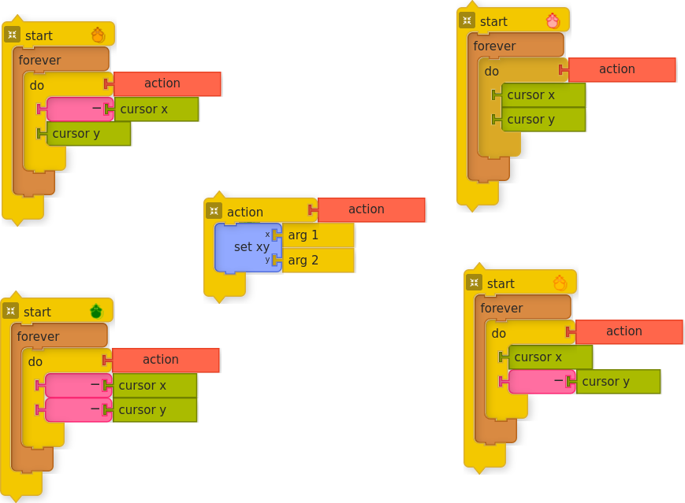

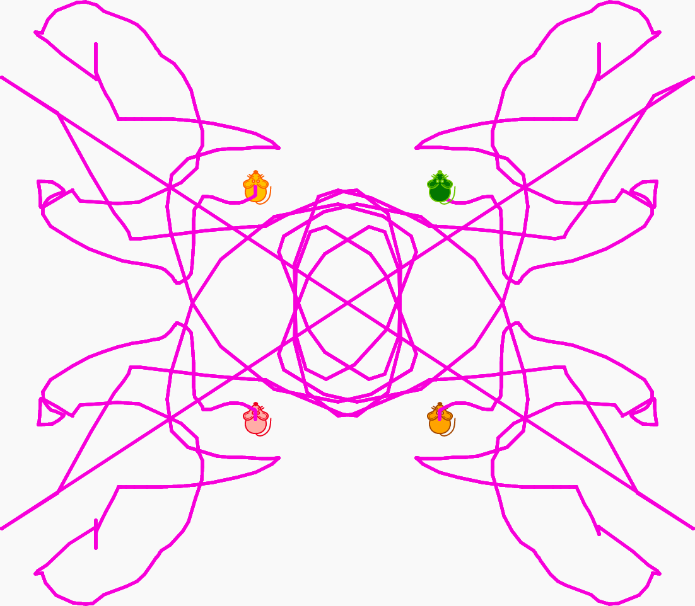

It is often useful to give a Start block a name, in part because the
“Ensemble” blocks let you query status between different threads,
which can be really useful in music projects.

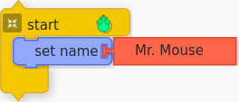

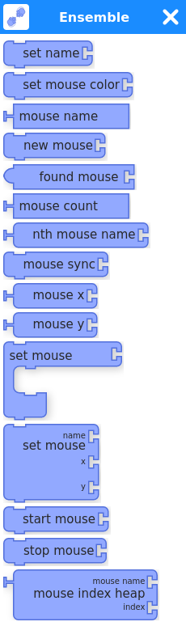

### Actions

Action blocks are just like Command blocks in Snap. 

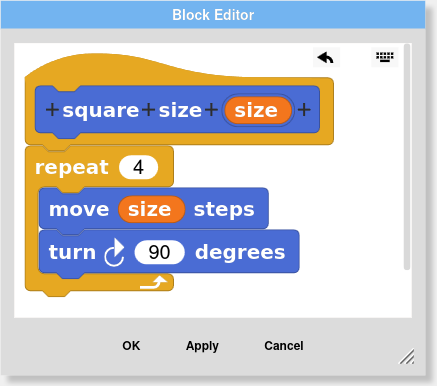

Rather than composing actions in a separate frame, you build them
directly in the programming workspace.

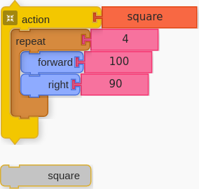

You can add args.

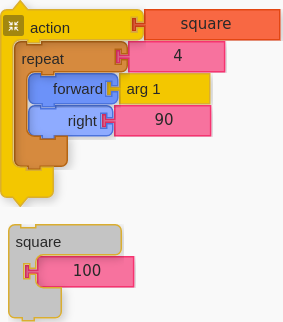

Although, unlike Snap, you cannot label the args… Maybe I should add
that feature.

You can also make "Reporter" blocks by using a Return.

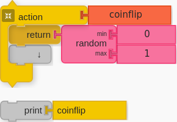

### Sensor and Events

Like Snap, Music Blocks has a Sensors palette.

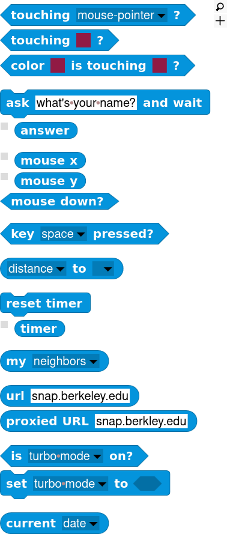

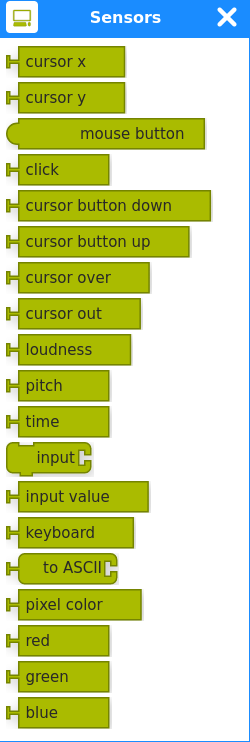

#### Broadcast events

Snap has a mechanism for broadcasting events and creating event handlers:

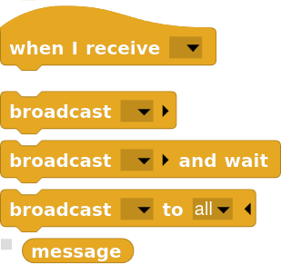

Music Blocks has similar blocks:

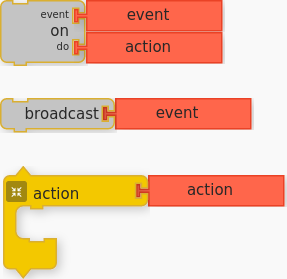

The On Do block also works with mouse events.

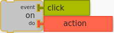

#### Musical events

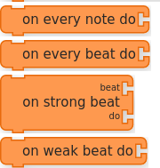

And because of its music focus, there are some special events handlers:

A fun event handler is one that can be used for generating musical notation:

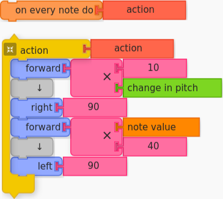

More on this when we talk about the Note block.

### Run modes

As in Snap, blocks run when you click on them. And there is a Play
button similar to the little green flag button.

In Music Blocks, every Start block runs when the Play button is pressed.

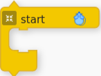

When you hit the Play button, the blocks will hide, exposing the
entire work area.

There are several other play modes: Play Slow and Step-by-Step. Play
Slow will briefly pause as each block is played (the blocks stay
visible on the screen and are highlighted as the program
progresses). Step-by-Step will advance just one block at a time with
each button press.

There are a few additional debugging aids:

* You can use the Show and Hide blocks to slow down and speed up
  program execution. This is like setting breakpoints in your code.

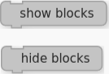

* The Comment block will put up messages, but only when the Play Slow
  button is pressed.

### The Planet

The Planet is a public forum for sharing projects. Unlike Turtle
Stitch, the Planet is anonymous. Projects can be downloaded and
“remixed” from the Planet.

### Widgets

Widgets are extensions to Music Blocks that target specific musical
ideas. Widgets are launched from Music Blocks and in most cases their
behavior is programmable. Widgets let you explore an idea and then
export Music Blocks code. For example, the Rhythm Ruler widget lets
you explore polyrhythms and create drum machines in Music Blocks. The
Phrase Maker widget lets you “paint” musical phrases and then export
them as actions to use in your program.

There are widgets for exploring pitch, rhythm, tempo, temperament,
mode, timbre, et al. There is even a widget that allows you to plug in
a MIDI keyboard and thus write code by playing the piano.

### Plugins

Like Snap, Music Blocks can be extended by plugins. There are plugins
for some more advanced math functions, controlling robots, et al.

## Music Features

When you first start Music Blocks, you are welcomed with a three-note
program.

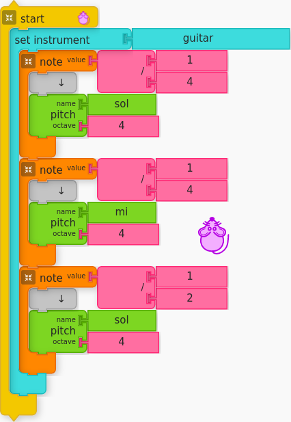

This is a good place from which to start exploring the Note block.

### The Note Block

#### Making Music

Music Blocks is explicit about exposing core ideas: not just notation,
but the ideas behind the notation, for example, the relationship
between a quarter note symbol and the fraction 1/4. Also, because
Music Blocks has built in the concepts of meter and beats per minute,
the note value can be tied to time and to events within a
measure. This is in contrast with the musical extensions typically
applied to block-based programming languages such as Blockly or
Scratch, which either operate in hard-coded time or a notation that is
unconnected to a measure.

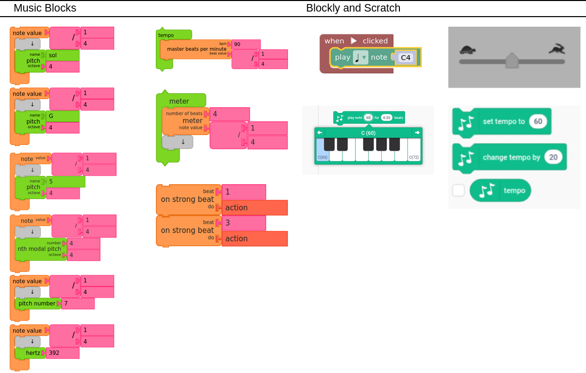

At the heart of Music Blocks is the concept of a note. A note, defined
by the Note block defines a length of time and a set of actions to
occur in that time. Typically the action is to play a pitch, or series
of pitches (e.g., a chord). Whatever blocks are placed inside the
"clamp" of a Note block are played over the duration of the note.

#### Note Value

The Note block takes one argument, the Note Value. This is usually
displayed in the form of a fraction and it represents the length of a
note in time, e.g., quarter note, half note, eighth note, whole note,
etc. If you click on one of the numeric value blocks, a pie menu
appears that lets you select among common note values. (You can also
type in a value.)

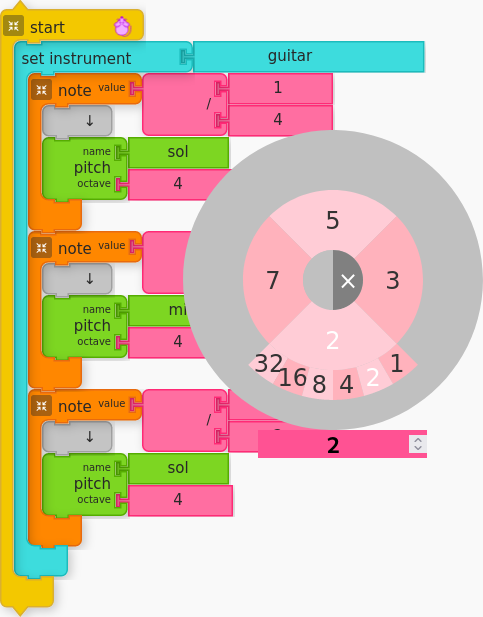

There are some practical limitations to note duration which you can
discover through experimentation.

The relative length of a quarter note is half as long as a half
note. By default, Music Blocks will play 90 quarter notes per second,
so each quarter note is 2/3 seconds (666 microseconds) in duration.

#### Pitch

Typically, inside of a Note block you will find one or more Pitch
blocks. Whereas the note value determines the length of the note, the
Pitch block determines which note will be played.

The Pitch block (found on the Pitch Palette) is used to specify the
pitch of a note. By default, we use traditional western Solfege, i.e.,
Do, Re, Mi, Fa, Sol, La, Ti, where Do is mapped to C, Re is mapped to
D, etc. (when the key and mode are C Major). You can also specify
pitch by using a note name, e.g., F#. An octave specification is also
required (as an argument for our pitch block) and changes integers for
every cycle of C (i.e. C4 is higher than B3). When used with the
Pitch-time Matrix block, a row is created for each Pitch block.

In addition to specifying the note name, you must also specify an
octave. The frequency of a note doubles as the octave increases. A2 is
110 Hertz; A3 is 220 Hertz; A4 is 440 Hertz; etc.

Two special blocks can be used with a Pitch block to specify the name
of the pitch: the Solfege block and the Pitch-Name block. The Solfege
block uses selectors to scroll through Do, Re, Mi, Fa, Sol, La, and
Ti. A second selector is used for sharps and flats. The Pitch-Name
block is similar in that it lets you scroll through C, D, E, F, G, A,
B. It also uses a second selector for sharps and flats.

Clicking on the pitch name will bring up a pie menu for selecting pitch.

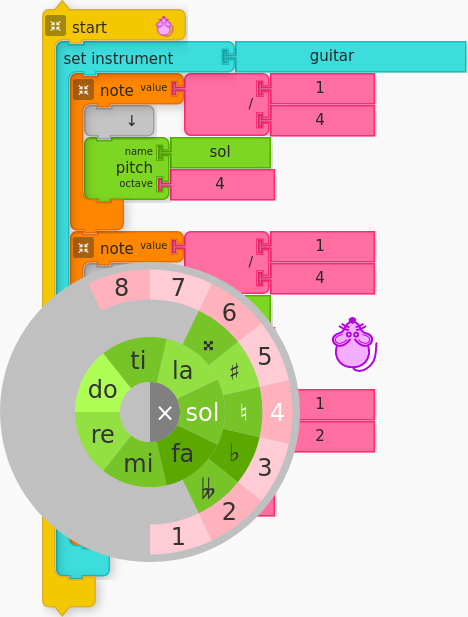

You can place multiple Pitch blocks within a note in order to play
chords. You can also put graphics blocks inside of a Note block in
order to sync your music with your drawing.

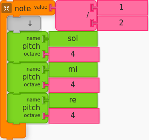

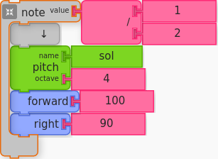

You can even put Note blocks inside of Note blocks.

A rest is a Note block containing silence.

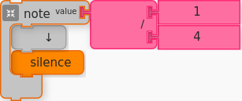

#### Modifying a Note

There are many ways to modify a note: either its value or pitch.

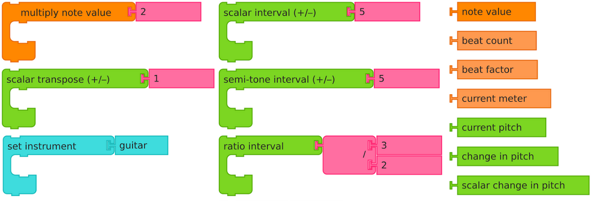

And there are additional blocks that let you monitor the status of
notes as they play.

There are also blocks for inversion, retrograde, arpeggio, crescendo,
staccato, vibrato, tremolo, et al.

### Phrases

A fundamental component of music is the phrase, i.e., a sequential
collection of notes.  Music Blocks uses Action blocks to contain
multiple Note blocks. The actions are used in combination to create
music.

Here is an example of a canon (Frère Jacques), using four voices, each
sharing the actions.

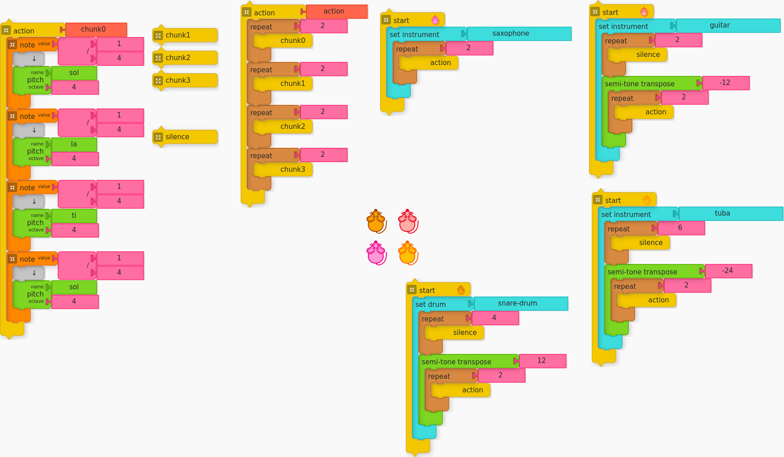

## For further information

[Music Blocks README](./README.md) exxplains where to find Music Blocks.

[Using Music Blocks](./documentation/README.md) has basic instructions.

[Music Blocks Guide](./guide/README.md) details on the musical aspects of Music Blocks.