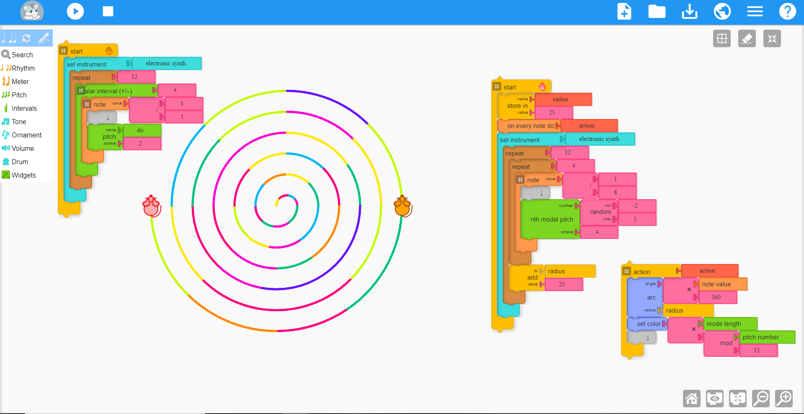

<a href="https://github.com//sugarlabs/musicblocks/graphs/contributors" alt="Contributors">
    
</a>

<a href="#license" alt="License">
    
</a>

<a href="https://github.com/sugarlabs/musicblocks/actions/workflows/node.js.yml" alt="CI">
    
</a>

# Music Blocks

“_All musicians are subconsciously mathematicians._” — Monk

“_Music is a hidden arithmetic exercise of the soul, which does not
know that it is counting._” — Leibniz

Music Blocks is a _Visual Programming Language_ and collection of
_manipulative tools_ for exploring musical and mathematical concepts
in an integrative and entertaining way.

## Getting Started

Music Blocks is an interactive Web Application &mdash; the interaction
is done via basic mouse events like _click_, _right click_, _click and
drag_, etc. and keyboard events like _hotkey press_.  The application
is audio-visual; it produces graphics, artwork and music. Here are a
couple of screenshots to give you an idea of how the application looks
like:




Visit the Music Blocks website for a hands on experience:
[https://musicblocks.sugarlabs.org](https://musicblocks.sugarlabs.org).

Or download Music Blocks from the [Google Play Store](https://play.google.com/store/apps/details?id=my.musicblock.sugarlab)

Additional background on why we combine music and programming can be found
[here](./WhyMusicBlocks.md).

**Refer to the following sections to get familiar with this application:**

- [Running Music Blocks](#RUNNING-MUSIC-BLOCKS)
- [How to set up a local server](#HOW-TO-SET-UP-A-LOCAL-SERVER)
- [Using Music Blocks](#USING-MUSIC-BLOCKS)

If you are a developer (beginner, experienced, or pro), you are very
welcome to participate in the evolution of Music Blocks.

**Refer to the following sections to get an idea:**

- [Code of Conduct](#CODE-OF-CONDUCT)
- [Contributing](#CONTRIBUTING)
- [Modifying Music Blocks](#MODIFYING-MUSIC-BLOCKS)
- [Reporting Bugs](#REPORTING-BUGS)

**Refer to the following for more information regarding the evolution
  of this project:**

- [Credits](#CREDITS)
- [Music Blocks in Japan](#MUSIC-BLOCKS-IN-JAPAN)

## <a name="RUNNING_MUSIC_BLOCKS"></a>Running Music Blocks

Music Blocks is available under the _GNU Affero General Public License
(AGPL) v3.0_, a free, copyleft license.

Music Blocks is designed to run on a web browser. The ideal way to run
Music Blocks is to visit the URL
[_musicblocks.sugarlabs.org_](https://musicblocks.sugarlabs.org) in
your browser — _Google Chrome_ (or _Chromium_), _Microsoft Edge_
(_Chromium-based_), _Mozilla Firefox_, and _Opera_ work best.

To run from the most recent master branch (experimental), visit
[_sugarlabs.github.io/musicblocks_](https://sugarlabs.github.io/musicblocks).

## <a name="HOW_TO_SET_UP_A_LOCAL_SERVER"></a>How to set up a _local server_

Music Blocks is written using native browser technologies. The bulk of
the functionality is in vanilla _JavaScript_. Therefore, most of
the functionality can be accessed by launching the
[index.html](./index.html) file in the browser using
`file:///absolute/path/to/index.html`.

However, doing so, some functionality will be unavailable. Therefore, it is
best to launch a _local web server_ from the directory of Music
Blocks.

1. [Download](https://github.com/sugarlabs/musicblocks/archive/master.zip)
Music Blocks, or clone (`https://github.com/sugarlabs/musicblocks.git`
for _HTTPS_, or `gh repo clone sugarlabs/musicblocks` for _GitHub
CLI_), on your local machine.

2. In a terminal, `cd` to the directory where you downloaded/cloned
Music Blocks, using `cd path/to/musicblocks/`.

3. After you are in `path/to/musicblocks/` directory, install the
dependencies using the following command

    ```bash
    npm install
    ```

4. After cloning the musicblocks repository, you can start a local
server using npm

    ```bash
    npm run dev
    ```

6. You should see a message `Serving HTTP on 127.0.0.1 port 3000
(http://127.0.0.1:3000/) ...` since the HTTP Server is set to start
listening on port 3000.

7. Open your favorite browser and visit `localhost:3000` or `127.0.0.1:3000`.

**NOTE:** _Use `ctrl + c` or `cmd + c` to quit the HTTP Server to avoid
`socket.error:[Errno 48]`_.

## Local Setup with Docker

## Prerequisites

Before you begin, ensure you have Docker installed on your machine. You can download and install Docker from the [official Docker website](https://www.docker.com/get-started).

## Installation

1. Clone the Music Blocks repository to your local machine:

   ```bash
   git clone https://github.com/sugarlabs/musicblocks.git
   ```

2. Navigate to the cloned repository:

   ```bash
   cd musicblocks
   ```

3. Build the Docker image using the provided Dockerfile:

   ```bash
   docker build -t musicblocks .
   ```
## Running Music Blocks

1. Run the Docker container using the built image:

   ```bash
   docker run -p 3000:3000 musicblocks
   ```

   This command will start a Docker container running Music Blocks and
   expose it on port 3000.

2. Access Music Blocks in your web browser by navigating to
`http://localhost:3000`.

## Stopping the Docker container

To stop the Docker container, use `Ctrl + C` in your terminal. This
will stop the container and free up the port it was using.

## Troubleshooting
When running Music Blocks locally using `npm run dev`, the UI may load successfully even if some interactions appear unresponsive.

New contributors may observe console errors such as:
- `$ is not defined`
- `lang is not defined`
- `p5 is not defined`

These errors can occur due to script loading order and initialization differences in local environments.

If the UI loads and assets render correctly, the setup is generally considered successful for development purposes.

Future improvements may address these issues as part of ongoing refactoring efforts.

## Additional Notes

- Make sure to replace `musicblocks` with the appropriate image name
  if you have tagged the Docker image differently.
- You can customize the port mapping (`-p`) if you prefer to use a
  different port for accessing Music Blocks.

---

This documentation provides a basic setup for running Music Blocks
locally using Docker. Feel free to customize it further based on your
specific requirements and environment.

## <a name="USING_MUSIC_BLOCKS"></a>Using Music Blocks

Once Music Blocks is running, you'll want suggestions on how to use
it. Follow [Using Music Blocks](./Docs/documentation/README.md) and [Music
Blocks Guide](./Docs/guide/README.md).

For Scratch and Snap users, you may want to look at [Music Blocks for
Snap Users](./Music_Blocks_for_Snap_Users.md).

Looking for a block? Find it in the
[Palette Tables](./Docs/guide/README.md#6-appendix).

## <a name="CODEOFCONDUCT"></a>Code of Conduct

The Music Blocks project adheres to the [Sugar Labs Code of
Conduct](https://github.com/sugarlabs/sugar-docs/blob/master/src/CODE_OF_CONDUCT.md)

## <a name="CONTRIBUTING"></a>Contributing

[Contributing.md](CONTRIBUTING.md) provides a general overview of
Sugar Lab's guidelines.

It contains best practices for writing code, submitting pull requests,
and following coding standards.  Please refer to this guide before
making contributions to ensure consistency and maintain the quality of
the project.

## <a name="MODIFYING_MUSIC_BLOCKS"></a>Modifying Music Blocks

The core functionality for Music Blocks resides in the [`js/`
directory](./js/). Individual modules are described in more detail in
[js/README.md](./js/README.md).

**NOTE:** As for any changes, please make a local copy by cloning this
[repository](https://github.com/sugarlabs/musicblocks.git). Make your
changes, test them, and only then make a pull request.

[Contributing
Code](https://github.com/sugarlabs/sugar-docs/blob/master/src/contributing.md)
provides a general overview of Sugar Lab's guidelines. See
[Contributing](#CONTRIBUTING) section for specific details about this
repository.

### Developer Quick Start

1. Clone and install: `git clone https://github.com/sugarlabs/musicblocks.git && npm install`
2. Run locally: `npm run dev`
3. Before pushing: `npm run lint && npx prettier --check . && npm test`

For writing tests, see [docs/TESTING.md](./docs/TESTING.md).

## <a name="REPORTING_BUGS"></a>Reporting Bugs

Bugs can be reported in the [issues
tab](https://github.com/sugarlabs/musicblocks/issues) of this
repository.

If possible, please include the browser _console log output_, and
_steps to reproduce_, when reporting bugs. To access the console, type
`Ctrl-Shift-J`/`F12` on most browsers. Alternately, _right click_ and
select `Inspect`. You may need to set the `Default levels` for the
console to `Verbose` in order to see all of the output, however, in
most cases that won't be required. In fact, it'll only clutter the
list, so select it only when required.

## <a name="CREDITS"></a>Credits

Music Blocks is a fork of [Turtle Blocks
JS](https://github.com/sugarlabs/turtleblocksjs) created by _Walter
Bender ([@walterbender](https://github.com/walterbender))_.

[_Devin Ulibarri_](http://www.devinulibarri.com/) has contributed
functional and user-interface designs. Many of his contributions were
inspired by the music education ideas, representations and practices
(e.g. aspects of matrix, musical cups) developed and published by
[_Larry
Scripp_](https://web.archive.org/web/20160204212801/http://www.larryscripp.net/)
with whom _Devin_ studied at New England Conservatory and for whom he
worked at Affron Scripp & Associates, LLC, [Center for Music and the
Arts in Education
(CMAIE)](https://web.archive.org/web/20210713204847/http://centerformie.org/),
and [Music in
Education](https://web.archive.org/web/20231130103746/http://music-in-education.org/). Some
of the initial graphics were contributed by [_Chie
Yasuda_](https://www.chieyasuda.com).

Much of the initial coding specific to Music Blocks was done by _Yash
Khandelwal ([@khandelwalYash](https://github.com/khandelwalYash))_ as
part of Google Summer of Code (GSoC) 2015. _Hemant Kasat
([@hemantkasat](https://github.com/hemantkasat))_ contributed to
additional widgets as part of GSoC 2016. Additional contributions were
made by _Tayba Wasim ([@Tabs16](https://github.com/Tabs16))_, _Dinuka
Tharangi Jayaweera ([@Tharangi](https://github.com/Tharangi))_,
_Prachi Agrawal
([@prachiagrawal269](https://github.com/prachiagrawal269))_, _Cristina
Del Puerto ([@cristinadp](https://github.com/cristinadp))_, and
_Hrishi Patel ([@Hrishi1999](https://github.com/Hrishi1999))_ as part
of GSoC 2017. During GSoC 2018, _Riya Lohia
([@riyalohia](https://github.com/riyalohia))_ developed a Temperament
widget.  _Ritwik Abhishek ([@a-ritwik](https://github.com/a-ritwik))_
added a keyboard widget and a pitch-tracking widget. During GSoC 2019,
_Favor Kelvin ([@fakela](https://github.com/fakela))_ refactored much
of the code to use promises. During GSoC 2020, _Anindya Kundu
([@meganindya](https://github.com/meganindya))_ did a major
refactoring of the code base to support JavaScript export. _Aviral
Gangwar ([@aviral243](https://github.com/aviral243))_ enhanced the
internal representation of mode and key.  _Saksham Mrig
([@sksum](https://github.com/sksum))_ fixed 70+ bugs and added support
for pitch tracking and MIDI import.

Many students contributed to the project as part of Google Code-in
(2015&ndash;2019).  _Sam Parkinson
([@samdroid-apps](https://github.com/samdroid-apps))_ built the Planet
during GCI.  _Emily Ong ([@EmilyOng](https://github.com/EmilyOng))_
designed our mouse icon and _Euan Ong
([@eohomegrownapps](https://github.com/eohomegrownapps))_ redesigned
the Planet code as a series of GCI tasks.  _Austin George
([@aust-n](https://github.com/aust-n))_ refactored the toolbars as a
series of GCI tasks. _Bottersnike
([@Bottersnike](https://github.com/Bottersnike))_ redesigned the
widgets and the Block API, _Andrea Gonzales
([@AndreaGon](https://github.com/AndreaGon))_ made the widgets
responsive, _Marcus Chong ([@pidddgy](https://github.com/pidddgy))_
refactored the update code, resulting in an order-of-magnitude
improvement in CPU usage, and _Samyok Nepal
([@nepaltechguy2](https://github.com/nepaltechguy2))_ updated the
local storage mechanism to use localForage.

A full list of
[contributors](https://github.com/sugarlabs/musicblocks/graphs/contributors)
is available.

## <a name="MUSIC_BLOCKS_IN_JAPAN"></a>Music Blocks in Japan

[Gakken STEAM](https://gakken-steam.jp/music_blocks/)

## License

Music Blocks is licensed under the
[AGPL](https://www.gnu.org/licenses/agpl-3.0.en.html), which means it
will always be free to copy, modify, and hopefully improve. We respect
your privacy: while Music Blocks stores your session information in
your browser's local storage, it does not and will never access these
data for purposes other than to restore your session. Music Blocks will
never share these data with any third parties.

There is a Planet where you can share your projects with others and
remix projects created by other Music Blocks users. Use of the Planet
is anonymous and not required in order to enjoy Music Blocks.

Have fun, play hard, and learn.
