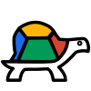

TurtleBlocks (the JavaScript version)
=====================================

Turtle Blocks is an activity with a Logo-inspired graphical "turtle"
that draws colorful art based on snap-together visual programming
elements. Its "low floor" provides an easy entry point for
beginners. It also has "high ceiling" programming, graphics,
mathematics, and Computer Science features which will challenge the
more adventurous student.

> Note: The JavaScript version of Turtle Blocks closely parallels the
> Python version of Turtle Blocks, which is included in the Sugar
> distribution. Sugar users probably want to use the Python version
> rather than the JavaScript version. (The JavaScript version is
> included in Sugarizer.)

Using Turtle Blocks
------------------- 

The Javascript version of Turtle Blocks is designed to run in a
browser. Most of the development has been done in Chrome, but it
should also work in Firefox, Opera, and Safari. You can run it
directly from index.html, from a [server maintained by Sugar
Labs](https://turtle.sugarlabs.org), from the [github
repo](https://rawgit.com/sugarlabs/musicblocks/master/index.html?turtle=true),
or by setting up a [local
server](./server.md).

Sugar users can run Turtle Blocks as an app embedded in the Browse
activity (See [Turtle Blocks
Embedded](https://github.com/sugarlabs/turtle-blocks-embedded-activity))
or simply open Turtle Blocks in the Browse activity itself.

Once you've launched Turtle Blocks in your browser, start by clicking
on (or dragging) blocks from the Turtle palette. Use multiple blocks
to create drawings; as the turtle moves under your control, colorful
lines are drawn.

You add blocks to your program by clicking on or dragging them from
the palette to the main area. You can delete a block by dragging it
back onto the palette. Click anywhere on a “stack” of blocks to start
executing that stack or by clicking in the Big Play Button 
(fast running) or press it for a long while for the Turtle
to run (slowly) on the Main Toolbar.

Getting Started Documentation
-----------------------------

The basic buttons and basic blocks are explained in detail in [Documentation](./documentation/README.md).

A guide to programming with Turtle Blocks is available in [Turtle Blocks Guide](./guide/README.md).

A quick start:

[Play](./documentation/play.png) Click to run the project at full speed.

[Stop](./documentation/stop.png) Stop the current project running.

[New project](./documentation/new-project.png) To start a new project.

[Save](./documentation/save-project.png) To save a project.

[Open](./documentation/open-project.png) To open a saved project.

Under the secondary menu [hamburger menu](./documentation/hamburger.png) there are additional play buttons.

[Play slow](./documentation/play-slow.png) Click to run the project slowly.

[Step](./documentation/step.png) Click to run the project step by step.

[Advanced mode](./documentation/advanced-mode.png) Use advanced mode to expose many additional blocks and features.

There are some buttons at the top of the canvas:

[Erase](./documentation/erase.png) The Show (or hide) grid button will display a pie menu with a variety of grid options. The Erase button will clear the screen and return the turtles to the center of the screen. The Screen button will shrink (or expand) the graphics area.

There are some buttons on the bottom of the canvas:

[Home/Hide/Collapse](./documentation/home-hide-collapse.png)
The Home buttom returns the blocks the center of the screen. The Hide button hides (or reveals) the blocks. The Collapse button collapses (or expands) stacks of blocks. The Shrink and Grow buttons change the size of the blocks.

Some basic blocks include:

[forward](./documentation/forward.png) Moves turtle forward.

[rotate](./documentation/right.svg) Turns turtle clockwise (angle in degrees).

[set color](./documentation/set_color.svg) Sets color of the line drawn by the turtle.

[set size](./documentation/set_pen_size.svg) Sets size of the line drawn by the turtle.

[repeat](./documentation/repeat.svg) Loops specified number of times.

[action](./documentation/action_flow.svg) Top of nameable action stack.

[do action](./documentation/action.svg) Invokes named action stack.

Google Code-in participant Jasmine Park has created some guides to
using Turtle Blocks: [Turtle Blocks: An Introductory
Manual](http://people.sugarlabs.org/walter/TurtleBlocksIntroductoryManual.pdf)
and [Turtle Blocks: A Manual for Advanced
Blocks](http://people.sugarlabs.org/walter/TurtleBlocksAdvancedBlocksManual.pdf)

Turtle Confusion
----------------

Turtle Confusion presents 40 shape challenges to the learner that must
be completed using basic Logo-blocks. The challenges are based on
Barry Newell’s 1988 book, *Turtle Confusion: Logo Puzzles and
Riddles*. You can access these puzzles from the [Turtle Confusion
page](./guide/Confusion.md).

Music Blocks
------------

[Music Blocks](https://github.com/sugarlabs/musicblocks) is fork of
Turtle Blocks with additional blocks for programming music.

Reporting Bugs
--------------

Bugs can be reported in the Music Blocks
[issues section](./issues) of
this repository.

Contributing
------------

Please consider contributing to the project, with your ideas, your
artwork, your lesson plans, and your code.

Programmers, please follow these general
[guidelines for contributions](./contributing.md).

Advanced Features
-----------------

Turtle Blocks has a plugin mechanism that is used to add new
blocks. You can learn more about how to use plugins (and how to write
them) from the [Plugins
Guide](./plugins/README.md).

List of Plugins
---------------

* [Mindstorms](https://github.com/SAMdroid-apps/turtlestorm): blocks to interact with the LEGO Mindstorms robotics kit
* [RoDi](https://raw.githubusercontent.com/sugarlabs/turtleblocksjs/master/plugins/rodi.json): blocks to interact with RoDi wireless robot
* [Carbon Calculator](https://raw.githubusercontent.com/sugarlabs/turtleblocksjs/master/plugins/carbon_calculator.json): blocks for exploring your carbon footprint
* [Maths](https://raw.githubusercontent.com/sugarlabs/turtleblocksjs/master/plugins/maths.json): addition blocks for some more advanced mathematics
* [Translate](https://raw.githubusercontent.com/sugarlabs/turtleblocksjs/master/plugins/translate.json): blocks for translating strings between languages, e.g., English to Spanish
* [Dictionary](https://raw.githubusercontent.com/sugarlabs/turtleblocksjs/master/plugins/dictionary.json): a block to look up dictionary definitions
* [Weather](https://raw.githubusercontent.com/sugarlabs/turtleblocksjs/master/plugins/weather.json): blocks to retrieve global weather forecasts
* [Logic](https://raw.githubusercontent.com/sugarlabs/turtleblocksjs/master/plugins/logic.json): blocks for bitwise Boolean operations
* [Finance](https://raw.githubusercontent.com/sugarlabs/turtleblocksjs/master/plugins/finance.json): a block for looking up market prices
* [Bitcoin](https://raw.githubusercontent.com/sugarlabs/turtleblocksjs/master/plugins/bitcoin.json): a block for looking up bitcoin exchange rates
* [Nutrition](https://raw.githubusercontent.com/sugarlabs/turtleblocksjs/master/plugins/nutrition.json): blocks for exploring the nutritional content of food
* [Facebook](https://raw.githubusercontent.com/sugarlabs/turtleblocksjs/master/plugins/facebook.json): a block for publishing a project to Facebook
* [Heap](https://raw.githubusercontent.com/sugarlabs/turtleblocksjs/master/plugins/heap.json): blocks to support a heap and for loading and saving data
* [Accelerometer](https://raw.githubusercontent.com/sugarlabs/turtleblocksjs/master/plugins/accelerometer.json): blocks for accessing an accelerometer
* [Turtle](https://raw.githubusercontent.com/sugarlabs/turtleblocksjs/master/plugins/turtle.json): blocks to support advanced features when using multiple turtles
* [Gmap](https://raw.githubusercontent.com/sugarlabs/turtleblocksjs/master/plugins/gmap.json): blocks to support generation of Google maps.
* [Random quote](https://raw.githubusercontent.com/sugarlabs/turtleblocksjs/master/plugins/random_quote.json): returns random quote of the day
