Turtle Confusion
================

 

Turtle Confusion presents 40 shape challenges to the learner that must
be completed using basic Logo-blocks. The challenges are based on
Barry Newell’s 1988 book, *Turtle Confusion: Logo Puzzles and
Riddles*. Gary Stager has posted a [scan of Newell’s
book](http://constructingmodernknowledge.com/tcbook.pdf) (with
permission of the author) ([en
español](http://github.com/downloads/humitos/turtle-confusion-es/la-confusion-de-la-tortuga.pdf)).

Below is a collections of Turtle Blocks projects stored on the Planet
that presents shape challenges to be programmed by moving the Logo
turtle.

----

1. Click on a challenge from the images below (or by searching for
'Challenge' on the Planet).

2. Use blocks from the various Turtle Block palettes to instruct the
Logo turtle to replicate the pattern.

3. You can redisplay the challenge image at any time by typing "Alt-P".

Most of the challenges are problems of symmetry and geometry which
typically can be solved by using a combination of rotations and repeat
blocks. You may have to use the *Pen Up* and *Pen Down* blocks on
occasion.

The Challenges
--------------

[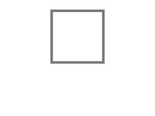](https://turtle.sugarlabs.org/index.html?id=1526567252260030)
[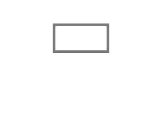](https://turtle.sugarlabs.org/index.html?id=1526567433188048)

[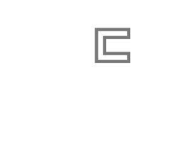](https://turtle.sugarlabs.org/index.html?id=1526564247350277)

[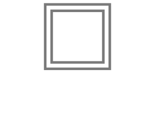](https://turtle.sugarlabs.org/index.html?id=1526567794575199)

[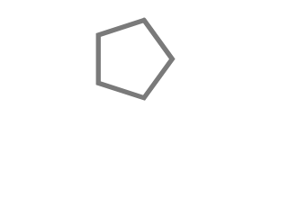](https://turtle.sugarlabs.org/index.html?id=1526568029056667)
[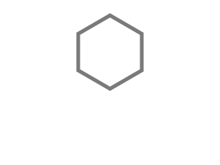](https://turtle.sugarlabs.org/index.html?id=1526568079924074)
[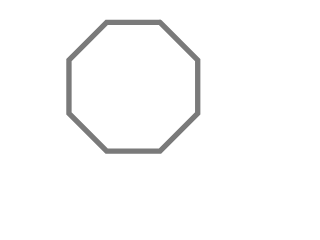](https://turtle.sugarlabs.org/index.html?id=1526568162465912)

[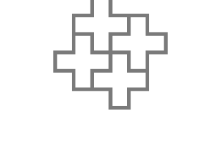](https://turtle.sugarlabs.org/index.html?id=1526559804645285)

[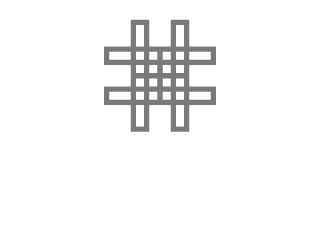](https://turtle.sugarlabs.org/index.html?id=1526590074923969)

[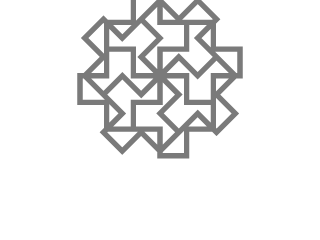](https://turtle.sugarlabs.org/index.html?id=1526591871020517)

[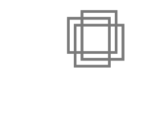](https://turtle.sugarlabs.org/index.html?id=1526598432196969)
[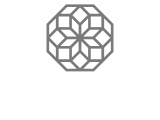](https://turtle.sugarlabs.org/index.html?id=1526599758237232)
[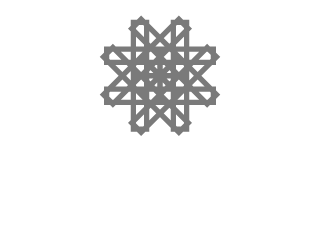](https://turtle.sugarlabs.org/index.html?id=1526600080947487)
[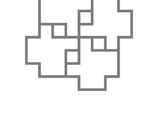](https://turtle.sugarlabs.org/index.html?id=1526599984856005)

[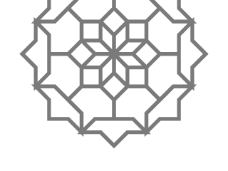](https://turtle.sugarlabs.org/index.html?id=1526600594394810)
[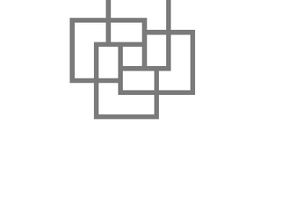](https://turtle.sugarlabs.org/index.html?id=1526601519424898)

[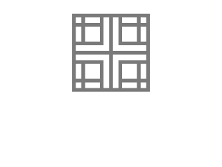](https://turtle.sugarlabs.org/index.html?id=1526605345312012)

----

More project ideas
------------------

There is a [Turtle Art page on
Pinterest](https://www.pinterest.com/walterbender/turtle-art/) that
has many ideas for Turtle Blocks projects.

Writing your own challenges
---------------------------

To create your own challenges, you need to use [Music Blocks](https://musicblocks.sugarlabs.org).

1. Create a project in Music Blocks.

2. Back up your project by saving it locally to the file system.

3. Run your project.

4. Drag all of the blocks from your project to the trash, except for
one *Start* block.

5. Save your project to the Planet.

6. Open your challenge in Turtle Blocks from the Planet.

What the above steps do is create a "compiled" image of your project,
which can be run without referring to the blocks used to create the
project. "Compiling" is a feature of Music Blocks that is disabled in
Turtle Blocks. But you can run "compiled" projects in Turtle Blocks by
typing Alt-P.
