Guide to Programming with Turtle Art
====================================

Turtle Blocks expands upon what children can do with Logo and how it
can be used as the underlying motivator for “improving” programming
languages and programmable devices.

In this guide, we illustrate this point by both walking the reader
through numerous examples, but also by discussing some of our favorite
explorations of Turtle Blocks, including multi-media, the Internet
(both as a forum for collaboration and data collection), and a broad
collection of sensors.

Getting Started
---------------

Turtle Blocks Javascript is designed to run in a browser. Most of the
development has been done in Chrome, but it should also work in
Firefox. You can run it from a [server maintained by Sugar
Labs](http://turtle.sugarlabs.org), from the [github
repo](http://sugarlabs.github.io/turtleblocksjs), or by setting up a
[local
server](./server.md).

You can also open it directly from `file://` with some browsers, e.g.,
FireFox.

Once you've launched it in your browser, start by clicking on (or
dragging) blocks from the *Turtle* palette. Use multiple blocks to
create drawings; as the turtle moves under your control, colorful
lines are drawn.

You add blocks to your program by clicking on or dragging them from
the palette to the main area. You can delete a block by dragging it
back onto the palette. Click anywhere on a "stack" of blocks to start
executing that stack or by clicking in the *Rabbit* (fast) or *Turtle*
(slow) on the Main Toolbar. The *Snail* will step through your
program, one block per click.

For more details on how to use Turtle Blocks JS, see [Using Turtle
Blocks
JS](./documentation)
for more details.

ABOUT THIS GUIDE
----------------

Many of the examples given in the guide have links to code you can
run. Look for RUN LIVE links that will take you to
http://turtle.sugarlabs.org.

TO SQUARE
---------

The traditional introduction to Logo has been to draw a square. Often
times when running a workshop, I have the learners form a circle
around one volunteer, the "turtle", and invite them to instruct the
turtle to draw a square. (I coach the volunteer beforehand to take
every command literally, as does our graphical turtle.) Eventually the
group converges on "go forward some number of steps", "turn right (or
left) 90 degrees", "go forward some number of steps", "turn right (or
left) 90 degrees", "go forward some number of steps", "turn right (or
left) 90 degrees", "go forward some number of steps". It is only on
rare occasions that the group includes a final "turn right (or left)
90 degrees" in order to return the turtle to its original
orientation. At this point I introduce the concept of "repeat" and
then we start in with programming with Turtle Blocks.

I. Turtle Basics
----------------

A single line of length 100 [RUN
LIVE](https://turtle.sugarlabs.org/index.html?id=1523359934621848&run=True)

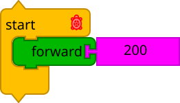

Changing the line length to 200 [RUN
LIVE](https://turtle.sugarlabs.org/index.html?id=1523360071975585&run=True)

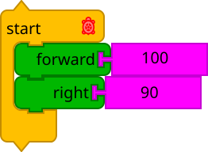

Adding a right turn of 90 degrees. Running this stack four times
produces a square. [RUN
LIVE](https://turtle.sugarlabs.org/index.html?id=1523360268417654&run=True)

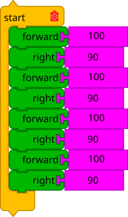

Forward, right, forward, right, ... [RUN
LIVE](https://turtle.sugarlabs.org/index.html?id=1523360327901636&run=True)

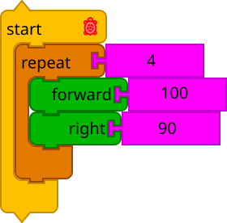

Using the *Repeat* block from the *Flow* palette [RUN
LIVE](https://turtle.sugarlabs.org/index.html?id=1523294074349148&run=True)

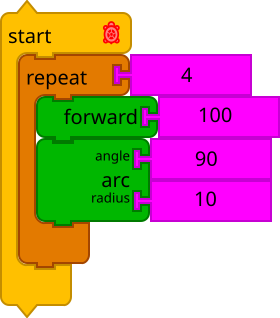

Using the *Arc* block to make rounded corners [RUN LIVE](https://turtle.sugarlabs.org/index.html?id=1523360547665676&run=True)

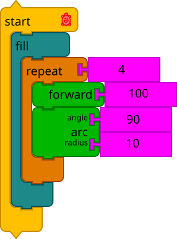

Using the *Fill* blocks from the Pen palette to make a solid square
(what ever is drawn inside the *Fill* clamp will be filled upon
exiting the clamp.) [RUN
LIVE](https://turtle.sugarlabs.org/index.html?id=1523360674936456&run=True)

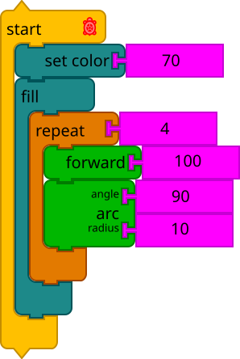

Changing the color to 70 (blue) using the *Set Color* block from the
*Pen* palette [RUN
LIVE](https://turtle.sugarlabs.org/index.html?id=1523360821674406&run=True)

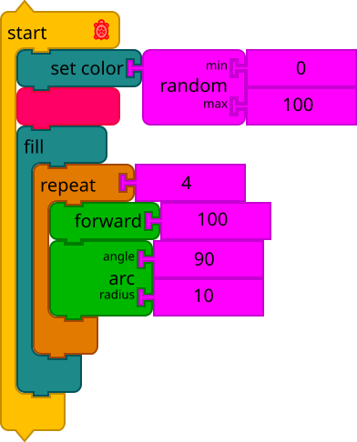

Using the *Random* block from the *Numbers* palette to select a random
color (0 to 100) [RUN
LIVE](https://turtle.sugarlabs.org/index.html?id=1523360917773878&run=True)

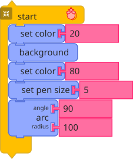

Use the *Background* block to set the background color to the current
pen color. Note that if you do not subsequently change the pen color
after you set the background, you will not be able to see what you are
drawing as your "ink" will be the same color as your "paper". [RUN
LIVE](https://turtle.sugarlabs.org/index.html?id=1581264197757866&run=True)

A SHOEBOX
---------

When explaining boxes in workshops, I often use a shoebox. I have
someone write a number on a piece of paper and put it in the
shoebox. I then ask repeatedly, "What is the number in the box?" Once
it is clear that we can reference the number in the shoebox, I have
someone put a different number in the shoebox. Again I ask, "What is
the number in the box?" The power of the box is that you can refer to
it multiple times from multiple places in your program.

II. Boxes
---------

Boxes let you store an object, e.g., a number, and then refer to the
object by using the name of the box. (Whenever you name a box, a new
block is created on the Boxes palette that lets you access the content
of the box.) This is used in a trivial way in the first example below:
putting 100 in the box and then referencing the box from the Forward
block. In the second example, we increase the value of the number
stored in the box so each time the box is referenced by the Forward
block, the value is larger.

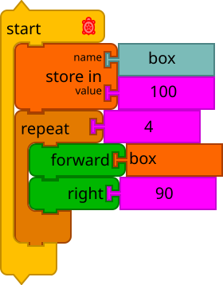

Putting a value in a *Box* and then referring to the value in *Box*
[RUN
LIVE](https://turtle.sugarlabs.org/index.html?id=1523361053378823&run=True)

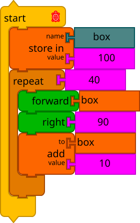

We can change the value in a *Box* as the program runs. Here we add 10
to the value in the *Box* with each iteration. The result in this case
is a spiral, since the turtle goes forward further with each
step. [RUN
LIVE](https://turtle.sugarlabs.org/index.html?id=1523361248940557&run=True)

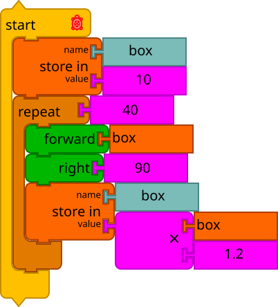

If we want to make a more complex change, we can store in the *Box* some
computed value based on the current content of the *Box*. Here we
multiply the content of the box by 1.2 and store the result in the
*Box*. The result in this case is also a spiral, but one that grows
geometrically instead of arithmetically.

In practice, the use of boxes is not unlike the use of keyword-value
pairs in text-based programming languages. The keyword is the name of
the *Box* and the value associated with the keyword is the value
stored in the *Box*. You can have as many boxes as you'd like (until
you run out of memory) and treat the boxes as if they were a
dictionary. Note that the boxes are global, meaning all turtles and
all action stacks share the same collection of boxes. [RUN
LIVE](https://turtle.sugarlabs.org/index.html?id=1523368886737682&run=True)

III. Action Stacks
------------------

With Turtle Blocks there is an opportunity for the learner to expand
upon the language, taking the conversation in directions unanticipated
by the Turtle Block developers.

*Action* stacks let you extend the Turtle Blocks language by defining
new blocks. For example, if you draw lots of squares, you may want a
block to draw squares. In the examples below, we define an action
that draws a square (repeat 4 forward 100 right 90), which in turn
results in a new block on the *Actions* palette that we can use whenever
we want to draw a square. Every new *Action* stack results in a new
block.

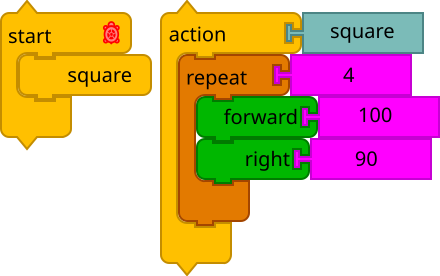

Defining an action to create a new block, "*Square*" [RUN LIVE](https://turtle.sugarlabs.org/index.html?id=1523369101107025&run=True)

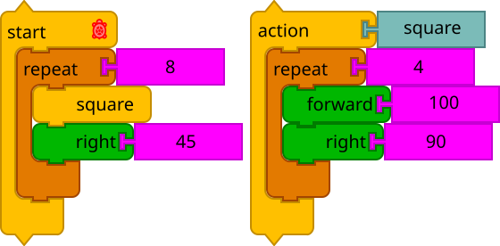

Using the "*Square*" block [RUN LIVE](https://turtle.sugarlabs.org/index.html?id=1523369182696942&run=True)

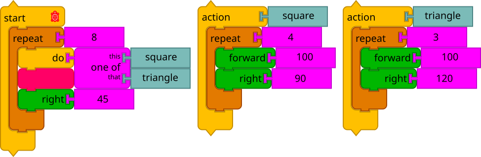

The *Do* block lets you specify an action by name. In this example, we
choose "one of" two names, "*Square*" and "*Triangle*" to determine which
action to take. [RUN LIVE](https://turtle.sugarlabs.org/index.html?id=1523369272178072&run=True)

IV. Parameters
--------------

Parameter blocks hold a value that represents the state of some turtle
attribute, e.g., the x or y position of the turtle, the heading of the
turtle, the color of the pen, the size of the pen, etc. You can use
parameter blocks interchangeably with number blocks. You can change
their values with the *Add* block or with the corresponding set blocks.

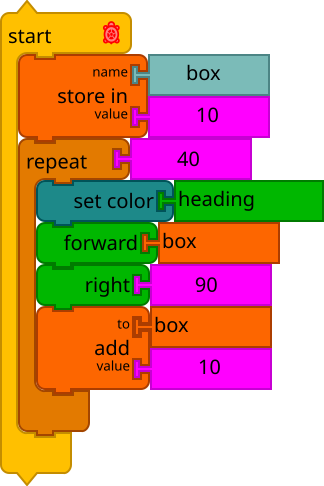

Using the *Heading* parameter, which changes each time the turtle
changes direction, to change the color of a spiral [RUN LIVE](https://turtle.sugarlabs.org/index.html?id=1523369515049913&run=True)

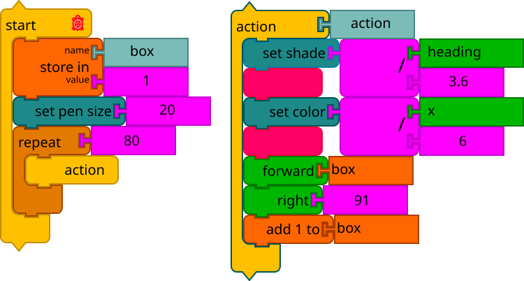

"Squiral" by Brian Silverman uses the *Heading* and *X* parameter
blocks. [RUN
LIVE](https://walterbender.github.io/musicblocks/index.html?id=1523410445476847&run=True)

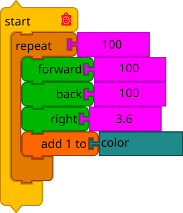

Often you want to just increment a parameter by 1. For this, use the
*Add-1-to* block. [RUN LIVE](https://turtle.sugarlabs.org/index.html?id=1523369660208921&run=True)

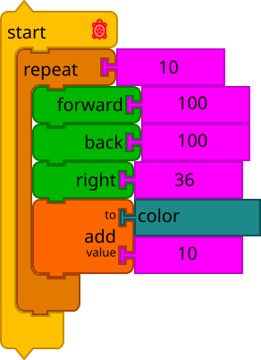

To increment (or decrement) a parameter by an arbitrary value, use the
*Add-to* block. [RUN LIVE](https://turtle.sugarlabs.org/index.html?id=1523370184642548&run=True)

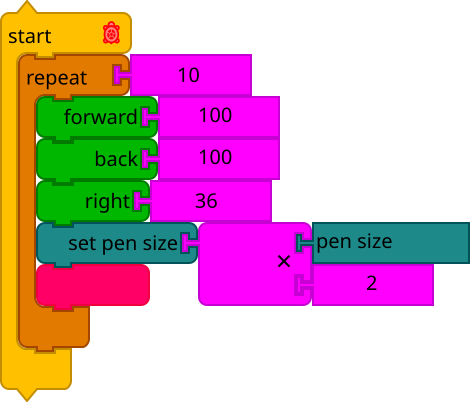

To make other changes to a parameter based on the current value, use
the parameter's *Set* block. In this example, the pen size is doubled
with each step in the iteration. [RUN LIVE](https://turtle.sugarlabs.org/index.html?id=1523370273985275&run=True)

V. Conditionals
---------------

Conditionals are a powerful tool in computing. They let your program
behave differently under differing circumstances. The basic idea is
that if a condition is true, then take some action. Variants include
if-then-else, while, until, and forever. Turtle Blocks provides
logical constructs such as equal, greater than, less than, and, or,
and not.

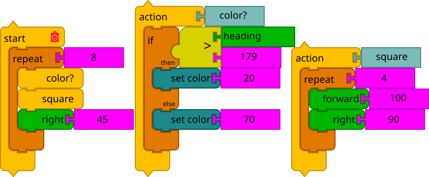

Using a conditional to select a color: Once the heading > 179, the
color changes. [RUN
LIVE](https://turtle.sugarlabs.org/index.html?id=1523370501577900&run=True)

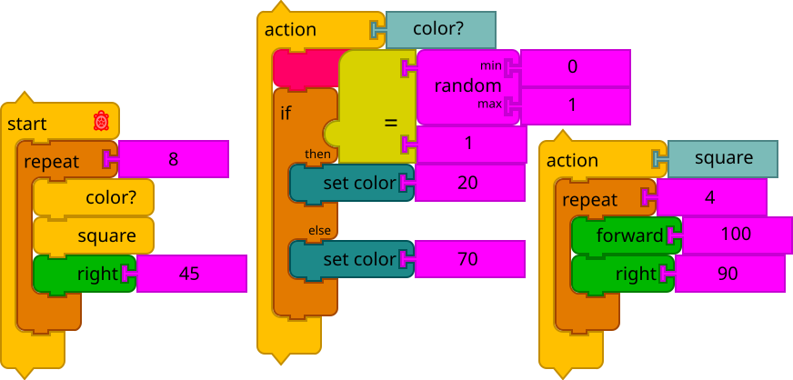

Conditionals along with the *Random* block can be used to simulate a
coin toss. [RUN
LIVE](https://turtle.sugarlabs.org/index.html?id=1523370743897698&run=True)

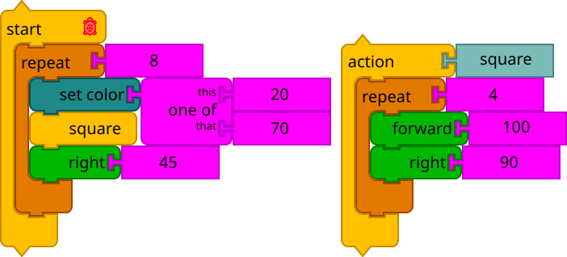

A coin toss is such a common operation that we added the *One-of* block
as a convenience. [RUN
LIVE](https://turtle.sugarlabs.org/index.html?id=1523370862902481&run=True)

VI. Multimedia
--------------

Turtle Blocks provides rich-media tools that enable the incorporation
of sound, typography, images, and video.

At the heart of the multimedia extensions is the *Show* block. It can be
used to show text, image data from the web or the local file system,
or a web camera. Other extensions include blocks for synthetic speech,
tone generation, and video playback.

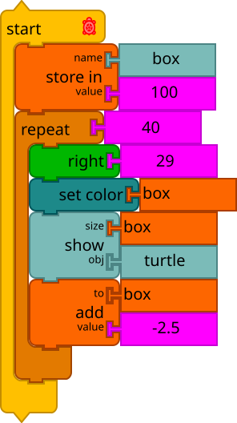

Using the *Show* block to display text; the orientation of the text
matches the orientation of the turtle. [RUN
LIVE](https://turtle.sugarlabs.org/index.html?id=1523370990567304&run=True)

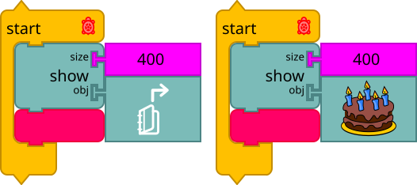

You can also use the *Show* block to show images. Clicking on the Image
block (left) will open a file browser. After selecting an image file
(PNG, JPG, SVG, etc.) a thumbnail will appear on the *Image* block
(right).

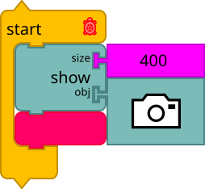

The *Show* block in combination with the *Camera* block will capture and
display an image from a webcam. [RUN
LIVE](https://turtle.sugarlabs.org/index.html?id=1523371139976408&run=True)

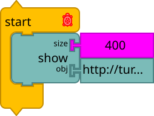

The *Show* block can also be used in conjunction with a URL that
points to media. [RUN
LIVE](https://turtle.sugarlabs.org/index.html?id=1523371406381048&run=True)

VII. Sensors
------------

Seymour Papert’s idea of learning through making is well supported in
Turtle Blocks. According to Papert, “learning happens especially
felicitously in a context where the learner is consciously engaged in
constructing a public entity, whether it’s a sand castle on the beach
or a theory of the universe”. Research and development that supports
and demonstrates the children’s learning benefits as they interact
with the physical world continues to grow. In similar ways, children
can communicate with the physical world using a variety of sensors in
Turtle Blocks. Sensor blocks include keyboard input, sound, time,
camera, mouse location, color that the turtle sees. For example,
children may want to build a burglar alarm and save photos of the
thief to a file. Turtle Blocks also makes it possible to save and
restore sensor data from a file. Children may use a “URL” block to
import data from a web page.

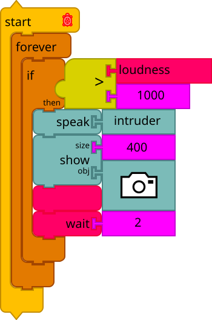

Using sensors. The *Loudness* block is used to determine if there is an
intruder. A loud sound triggers the alarm action: the turtle shouts
“intruder” and takes a picture of the intruder.

Teachers from the Sugar community have developed extensive collection
of examples using Turtle Block sensors. Guzmán Trinidad, a physics
teacher from Uruguay, wrote a book, *Physics of the XO*, which includes
a wide variety of sensors and experiments. Tony Forster, an engineer
from Australia, has also made remarkable contributions to the
community by documenting examples using Turtle Blocks. In one example,
Tony uses the series of switches to measure gravitational
acceleration; a ball rolling down a ramp trips the switches in
sequence. Examining the time between switch events can be used to
determine the gravitational constant.

One of the typical challenges of using sensors is calibration. This is
true as well in Turtle Blocks. The typical project life-cycle
includes: (1) reading values; (2) plotting values as they change over
time; (3) finding minimum and maximum values; and finally (4)
incorporating the sensor block in a Turtle program.

Example: Paint
--------------

As described in the Sensors section, Turtle Blocks enables the
programmer/artist to incorporate sensors into their work. Among the
sensors available are the mouse button and mouse x and y
position. These can be used to create a simple paint program, as
illustrated below. Writing your own paint program is empowering: it
demystifies a commonly used tool. At the same time, it places the
burden of responsibility on the programmer: once we write it, it
belongs to us, and we are responsible for making it cool. Some
variations of paint are also shown below, including using microphone
levels to vary the pen size as ambient sound-levels change. Once
learners realize that they can make changes to the behavior of their
paint program, they become deeply engaged. How will you modify paint?

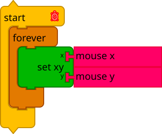

In its simplest form, paint is just a matter of moving the turtle to
wherever the mouse is positioned. [RUN
LIVE](https://turtle.sugarlabs.org/index.html?id=1523371509276932&run=True)

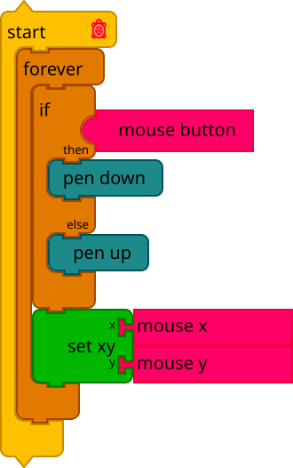

Adding a test for the mouse button lets us move the turtle without
leaving a trail of ink. [RUN
LIVE](https://turtle.sugarlabs.org/index.html?id=1523371673939089&run=True)

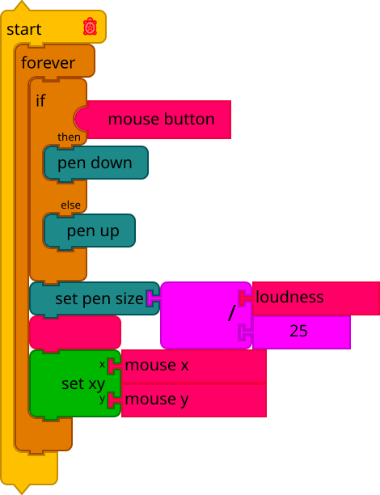

In this example, we change the pen size based on the volume of
microphone input. [RUN
LIVE](https://turtle.sugarlabs.org/index.html?id=1523371754657228&run=True)

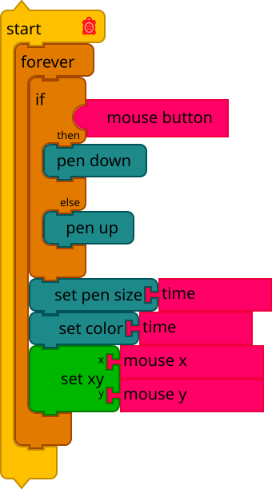

In another example, inspired by a student in a workshop in Colombia,
we use time to change both the pen color and the pen size. [RUN
LIVE](https://turtle.sugarlabs.org/index.html?id=1523371935195761&run=True)

Example: Slide Show
-------------------

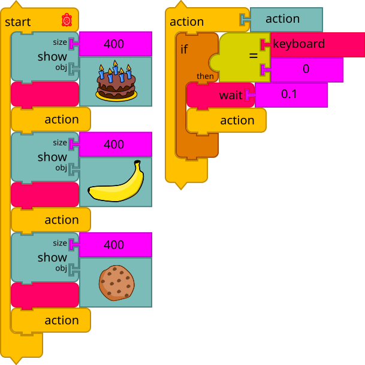

Why use Powerpoint when you can write Powerpoint? In this example, an
Action stack is used to detect keyboard input: if the keyboard value
is zero, then no key has been pressed, so we call the action again. If
a key is pressed, the keyboard value is greater than zero, so we
return from the action and show the next image.

Example: Keyboard
-----------------

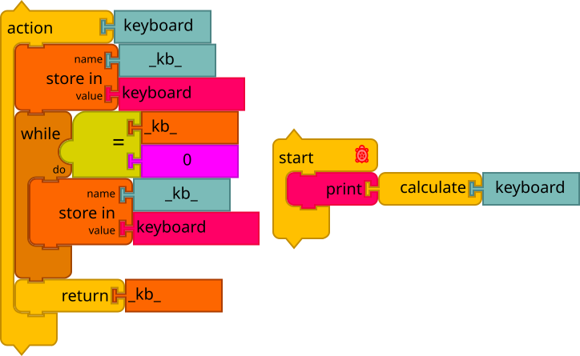

In order to grab keycodes from the keyboard, you need to use a *While*
block. In the above example, we store the keyboard value in a box,
test it, and if it is > 0, return the value. [RUN
LIVE](https://turtle.sugarlabs.org/index.html?id=1523376704342158&run=True)

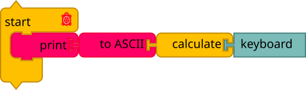

If you want to convert the keycode to a alphanumeric character, you
need to use the *To ASCII* block. E.g., *toASCII(65) = A* [RUN
LIVE](https://turtle.sugarlabs.org/index.html?id=1523377042822413&run=True)

VIII. Turtles, Sprites, Buttons, and Events
-------------------------------------------

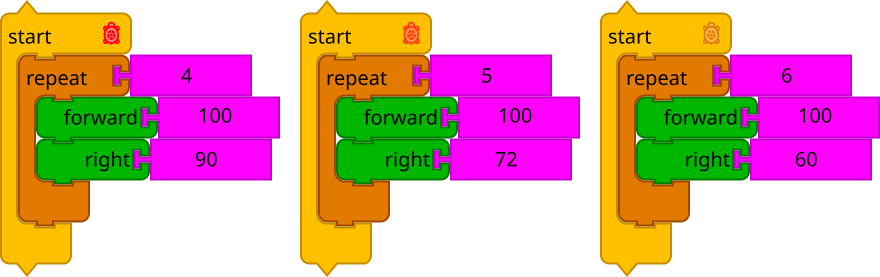

A separate turtle is created for each *Start* block. The turtles run
their code in parallel with each other whenever the *Run* button is
clicked. Each turtle maintains its own set of parameters for position,
color, pen size, pen state, etc. In this example, three different
turtles draw three different shapes. [RUN
LIVE](https://turtle.sugarlabs.org/index.html?id=1523377203344616&run=True)

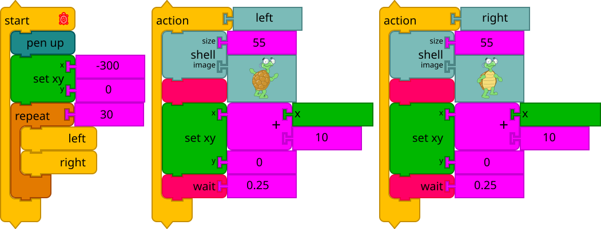

Custom graphics can be applied to the turtles, using the *Shell* block
on the *Media* palette. Thus you can treat turtles as sprites that can
be moved around the screen. In this example, the sprite changes back
and forth between two states as it moves across the screen. [RUN
LIVE](https://turtle.sugarlabs.org/index.html?id=1523377357693679&run=True)

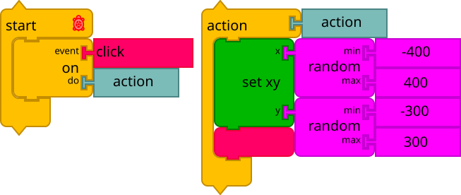

Turtles can be programmed to respond to a "click" event, so they can
be used as buttons. In this example, each time the turtle is clicked,
the action is run, which move the turtle to a random location on the
screen. [RUN
LIVE](https://turtle.sugarlabs.org/index.html?id=1523377513682595&run=True)

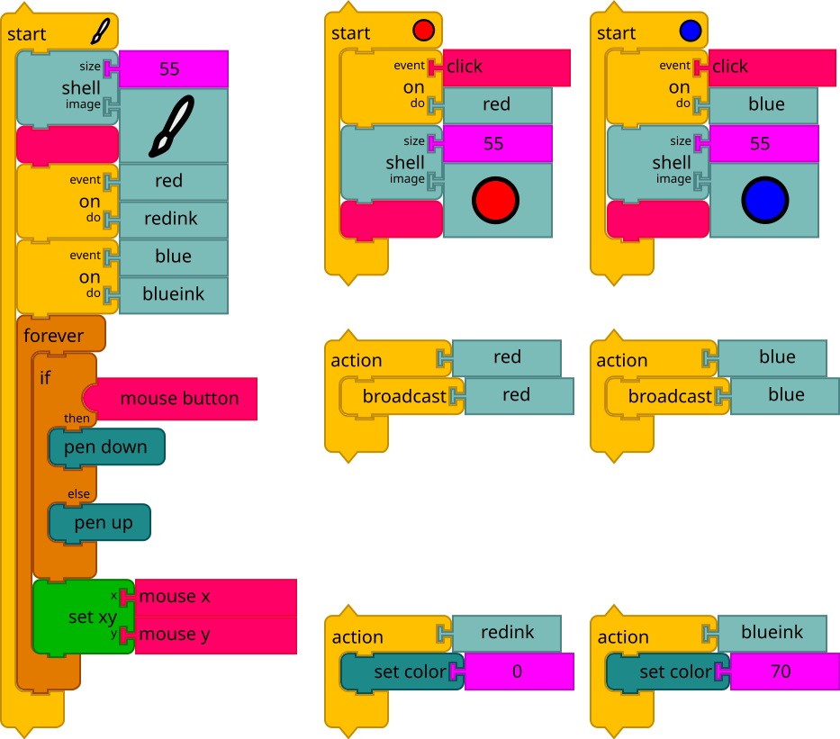

Events can be broadcast as well. In this example, another variant on
Paint, turtle "buttons", which listen for "click" events, are used to
broadcast change-color events. The turtle used as the paintbrush is
listening for these events. [RUN
LIVE](https://turtle.sugarlabs.org/index.html?id=1523378142359724&run=True)

IX. Advanced Actions
--------------------

Sometime you might want an action to not just run a stack of blocks
but also to return a value. This is the role of the return block. If
you put a return block into a stack, then the action stack becomes a
calculate stack.

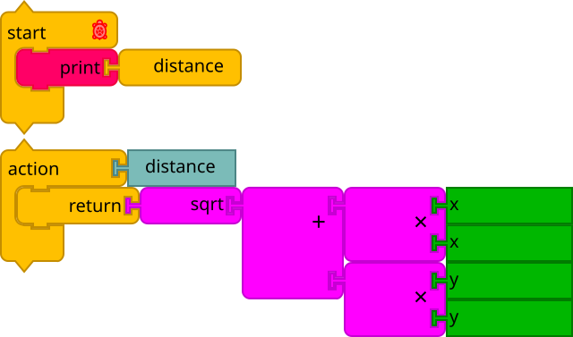

In this example, a *Calculate* stack is used to return the current
distance of the turtle from the center of the screen. Renaming an
action stack that has a *Return* block will cause the creation of a new
block in the *Actions* palette that can be used to reference the return
value: in this case, a *Distance* block is created. [RUN
LIVE](https://turtle.sugarlabs.org/index.html?id=1523383380320451&run=True)

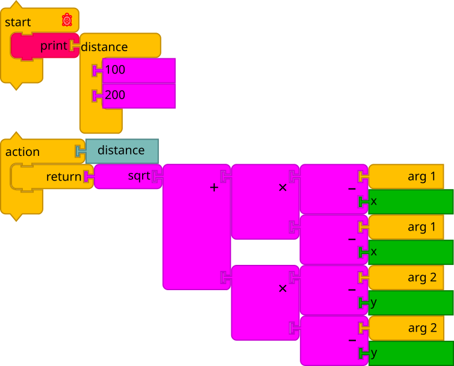

You can also pass arguments to an *Action* stack. In this example, we
calculate the distance between the turtle and an arbitrary point on
the screen by passing x and y coordinates in the *Calculate*
block. You add additional arguments by dragging them into the "clamp".

Note that args are local to *Action* stacks, but boxes are not. If you
planned to use an action in a recursive function, you had best avoid
boxes. [RUN
LIVE](https://turtle.sugarlabs.org/index.html?id=1523382801625028&run=True)

Example: Fibonacci
------------------

Calculating the Fibonacci sequence is often done using a recursive
method. In the example below, we pass an argument to the *Fib* action,
which returns a value if the argument is &lt; 2; otherwise it returns
the sum of the result of calling the *Fib* action with argument - 1 and
argument - 2.

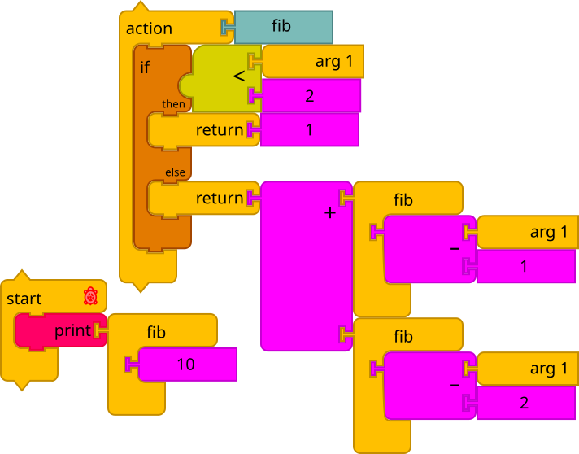

Calculating Fibonacci [RUN
LIVE](https://turtle.sugarlabs.org/index.html?id=1523388667520324&run=True)

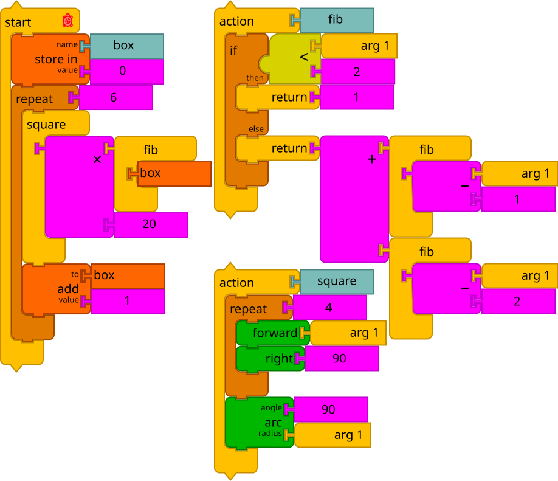

In the second example, we use a *Repeat* loop to generate the first six
Fibonacci numbers and use them to draw a nautilus.

Draw a nautilus [RUN
LIVE](https://turtle.sugarlabs.org/index.html?id=1523388775236172&run=True)

Example: Reflection Paint
-------------------------

By combining multiple turtles and passing arguments to actions, we can
have some more fun with paint. In the example below, the *Paint Action*
uses *Arg 1* and *Arg 2* to reflect the mouse coordinates about the y and
x axes. The result is that the painting is reflected into all four
quadrants.

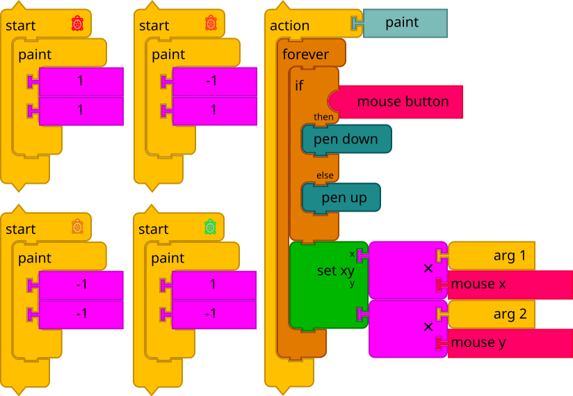

Reflection Paint [RUN
LIVE](https://turtle.sugarlabs.org/index.html?id=1523389168734406&run=True)

X. Advanced Boxes
-----------------

Sometimes it is more convenient to compute the name of a *Box* than to
specify it explicitly. (Note that the *Do* block affords a similar
mechanism for computing the names of actions.)

In the following examples, we use this to accumulate the results of
toss a pair of dice 1600 times (example inspired by Tony Forster).

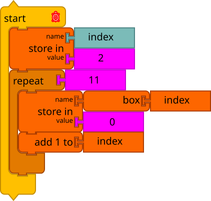

Rather than specifying a box to hold each possible result (2 through
12), we use a *Box* as a counter (index) and create a box with the name
of the current value in the counter and store in that box a value of
0.

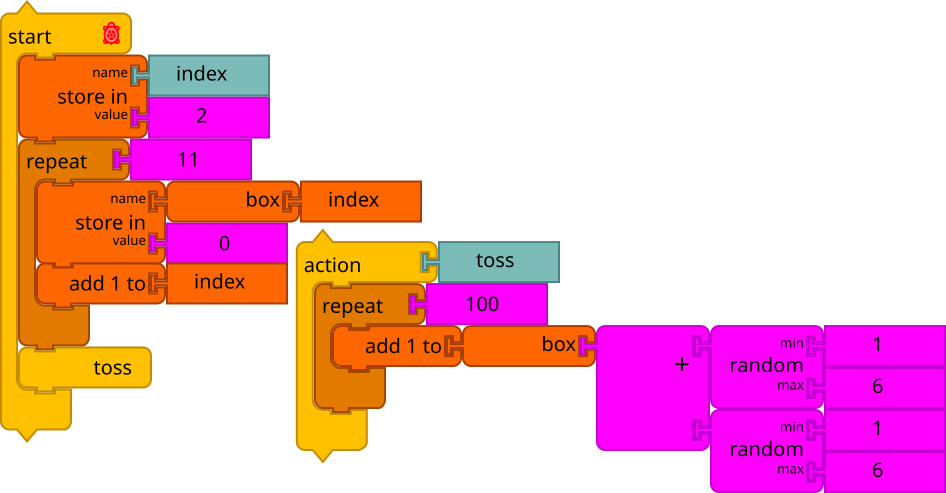

Next we add an *Action* to toss the dice 1600 times. To simulate tossing
a pair of dice, we sum two random numbers between 1 and 6. We use the
result as the name of the box we want to increment. So for example, if
we throw a 7, we add one to the *Box* named 7. In this way we increment
the value in the appropriate *Box*.

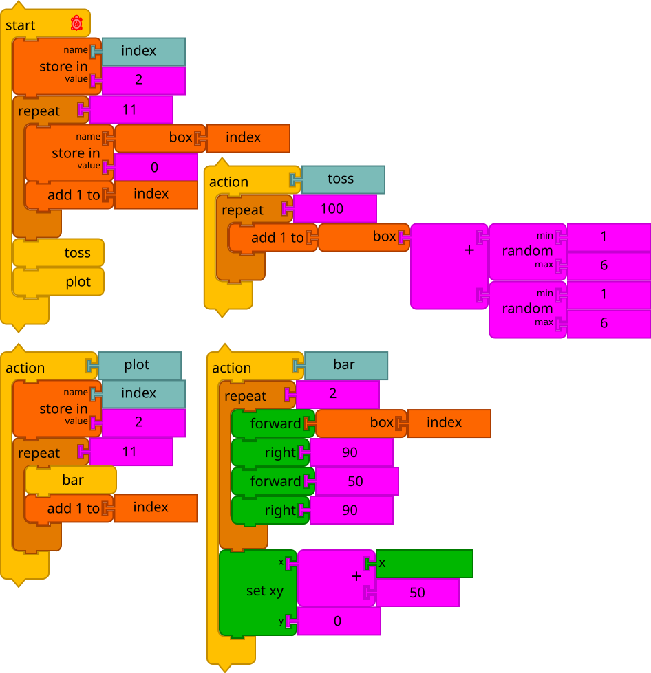

Finally, we plot the results. Again, we use a *Box* as a counter ("index")
and call the *Plot Action* in a loop. In the *Bar Action*, we draw a
rectangle of length value stored in the *Box* with the name of the
current value of the index. E.g., when the value in the index *Box* equals
2, the turtle goes forward by the value in *Box 2*, which is the
accumulated number of times that the dice toss resulted in a 2; when
the value in the *Index Box* is 3, the turtle goes forward by the value
in *Box 3*, which is the accumulated number of times that the dice toss
resulted in a 3; etc. [RUN
LIVE](https://turtle.sugarlabs.org/index.html?id=1523299313972510&run=True)

XI. The Heap
------------

Sometimes you need a place to temporarily store data. One way to do it
is with boxes (as mentioned at the end of the Boxes section of this
guide, they can be used as a dictionary or individual keyword-value
pairs). However, sometimes it is nice to simply use a heap.

A heap is a essential a pile. The first thing you put on the heap is
on the bottom. The last thing you put on the heap is on the top. You
put things onto the heap using the *Push* block. You take things off of
the heap using the *Pop* block. In Turtle Blocks, the heap is first-in
last-out (FILO), so you pop things off of the heap in the reverse
order in which you put them onto the heap.

There is also an *Index* block that lets you refer to an item in the
heap by an index. This essentially lets you treat the heap as an
array. Some other useful blocks include a block to empty the heap, a
block that returns the length of the heap, a block that saves the heap
to a file, and a block that loads the heap from a file.

In the examples below we use the heap to store a drawing made with a
paint program similar to the previous examples and then to playback
the drawing by popping points off of the heap.

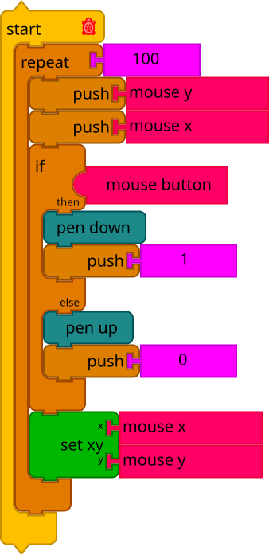

In the first example, we simply push the turtle position whenever we
draw, along with the pen state. Note since we pop in the reverse order
that we push, we push y, then x, then the mouse state.

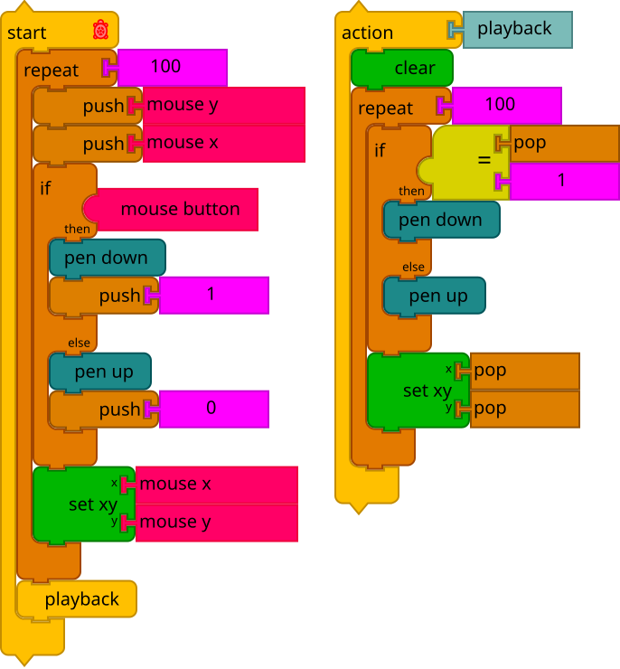

In the second example, we pop pen state, x, and y off of the heap and
playback our drawing. [RUN
LIVE](https://turtle.sugarlabs.org/index.html?id=1523389420306919&run=True)

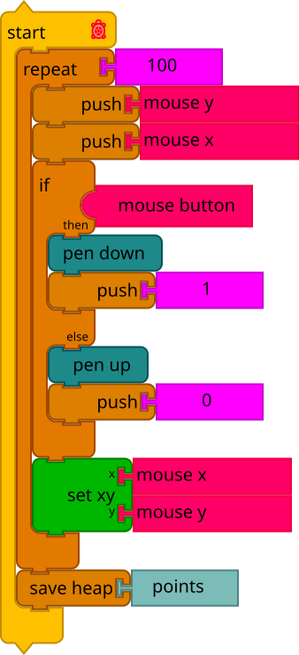

Use the *Save Heap* block to save the state of the heap to a file. In
this example, we save our drawing to a file for playback later. [RUN
LIVE](https://turtle.sugarlabs.org/index.html?id=1523390553182986&run=True)

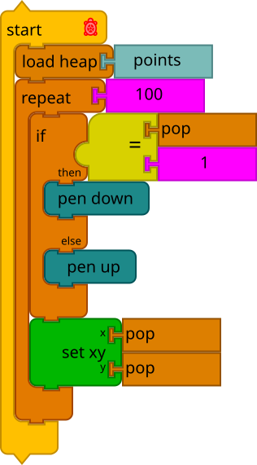

Use the *Load Heap* block to load the heap from data saved in a
file. In this example, we playback the drawing from data stored in a
file. [RUN
LIVE](https://turtle.sugarlabs.org/index.html?id=1523389601597904&run=True)

XII. Extras
-----------

The *Extras* palette is full of utilities that help you use your
project's output in different ways.

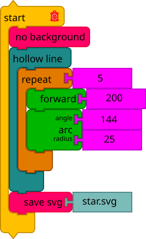

The *Save as SVG* block will save your drawing as simple vector graphics
(SVG), a format compatible with HTML5 and many image manipulation
programs, e.g., Inkscape. In the example above, we use it to save a
design in a from that can be converted to STL, a common file format
used by 3D printers. A few things to take note of: (1) the *No
Background* block is used to suppress the inclusion of the background
fill in the SVG output; (2) *Hollow lines* are used to make graphic have
dimension; and (3) the *Save as SVG* block writes to the Downloads
directory on your computer. (Josh Burker introduced me to Tinkercad, a
website that can be used to convert SVG to STL.) [RUN
LIVE](https://turtle.sugarlabs.org/index.html?id=1523390883477748&run=True)

The *New Turtle* block is used to create new turtles on the fly. The
*Set Turtle* block is used to run blocks by a selected turtle. In the
example below, 10 turtles are created on the fly and each turtle is
then set on a random walk across the screen. Note that the *Found
Turtle* block is used to ensure that the each new turtle is *ready*
before issuing commands. (Creating a turtle is not instantaneous and
the *New Turtle* block does not block program flow waiting for the
turtle to be created.) [RUN
LIVE](https://turtle.sugarlabs.org/index.html?id=1525211505767290&run=True)

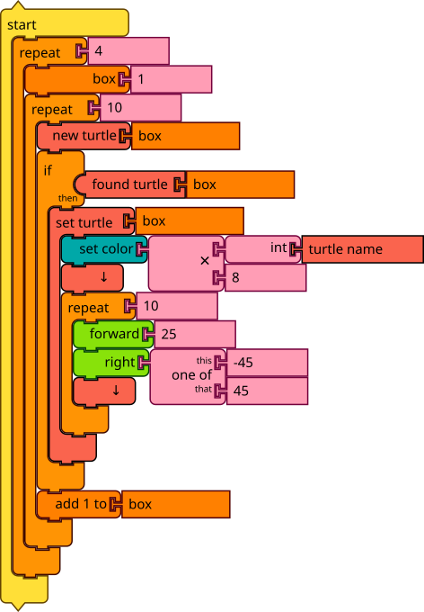

An alternative to using the *Found Turtle* block is to use the *Event* block. When a new turtle is created, an event with the name of the turtle is broadcast (See the example below).

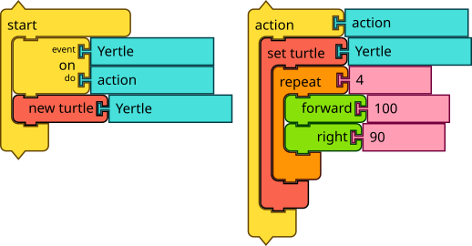

XIII. Debugging Aids
--------------------

Probably the most oft-used debugging aid in any language is the print
statement. In Turtle Blocks, it is also quite useful. You can use it
to examine the value of parameters and variables (boxes) and to
monitor progress through a program.

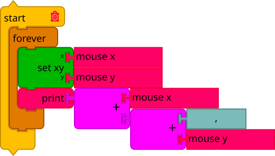

In this example, we use the addition operator to concatinate strings
in a print statement. The mouse x + ", " + mouse y are printed in the
inner loop. [RUN
LIVE](https://turtle.sugarlabs.org/index.html?id=1523391206069261&run=True)

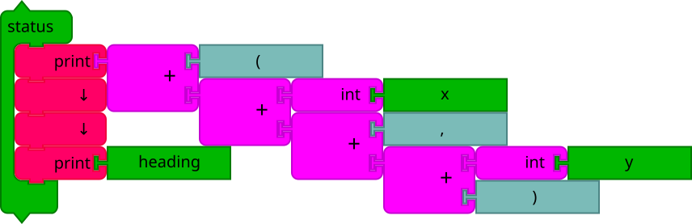

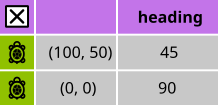

There is also a *Status* widget that can be programmed to show various
paramters as per the figures above. [RUN
LIVE](https://turtle.sugarlabs.org/index.html?id=1528388082677564&run=True)

Parameter blocks, boxes, arithmetic and boolean operators, and many
sensor blocks will print their current value as the program runs when
running in "slow" or "step-by-step" mode, obviating the need to use
the Print block in many situations.

The *Wait* block will pause program execution for some number (or
fractions) of seconds.

The *Hide* and *Show* blocks can be used to set "break points". When a
*Hide* block is encountered, the blocks are hidden and the program
proceeds at full speed. When a *Show* block is encountered, the program
proceeds at a slower pace an the block values are shown.

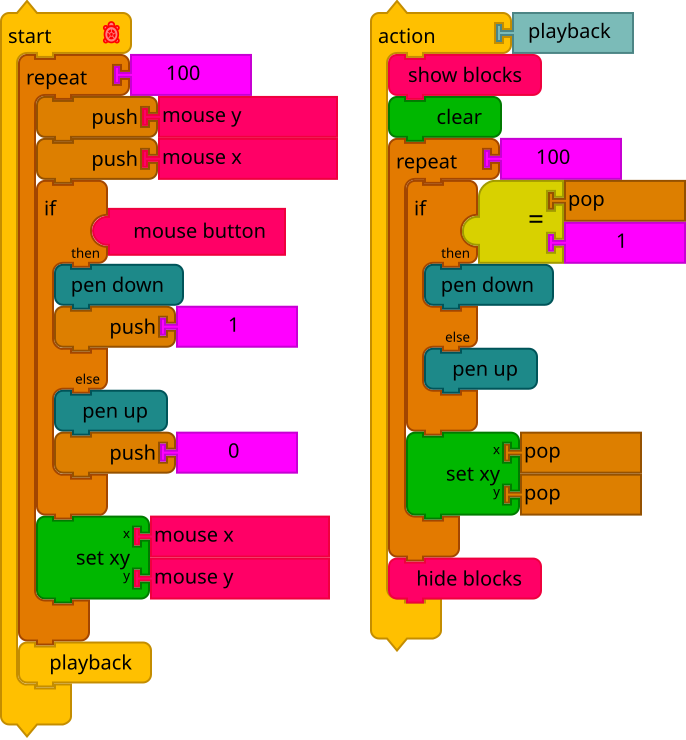

A *Show* block is used to slow down execution of the code in an *Action*
stack in order to facilitate debugging. In this case, we slow down
during playback in order to watch the values popped off the heap. [RUN
LIVE](https://turtle.sugarlabs.org/index.html?id=1523391034295213&run=True)

XIV. Advanced Color
-------------------

The internal representation of color in Turtle Blocks is based on the
[Munsell color
system](http://en.wikipedia.org/wiki/Munsell_color_system). It is a
three-dimensional system: (1) hue (red, yellow, green, blue, and
purple), (2) value (black to white), and (3) chroma (gray to vivid).

There are parameters for each color dimension and corresponding
"setters". All three dimensions have been normalized to run from 0 to
100. For Hue, 0 maps to Munsell 0R. For Value, 0 maps to Munsell value
0 (black) and 100 maps to Munsell value 10 (white). For chroma, 0 maps
to Munsell chroma 0 (gray) and 100 maps to Munsell chroma 26 (spectral
color).

A note about Chroma: In the Munsell system, the maximum chroma of
each hue varies with value. To simplify the model, if the chroma
specified is greater than the maximum chroma available for a hue/value
pair, the maximum chroma available is used.

The *Set Color* block maps the three dimensions of the Munsell color
space into one dimension. It always returns the maximum value/chroma
pair for a given hue, ensuring vivid colors. If you want to more
subtle colors, be sure to use the *Set Hue* block rather than the *Set
Color* block.

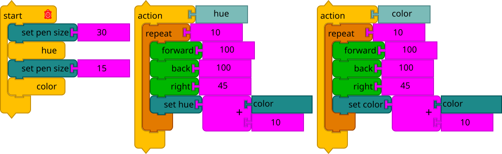

Color vs. hue example [RUN LIVE](https://turtle.sugarlabs.org/index.html?id=1523391601724568&run=True)

To set the background color, use the *Background* block. It will set the
background to the current hue/value/chroma triplet.

XV. Plugins
-----------

There are a growing number of extensions to Turtle Blocks in the from
of plugins. See
[Plugins](http://github.com/sugarlabs/turtleblocksjs/tree/master/plugins)
for more details.
