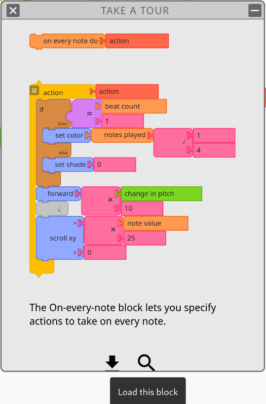
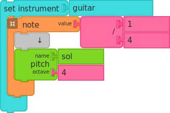
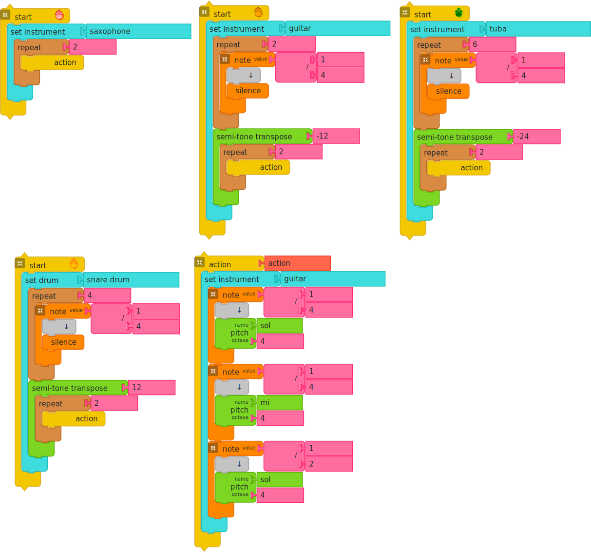
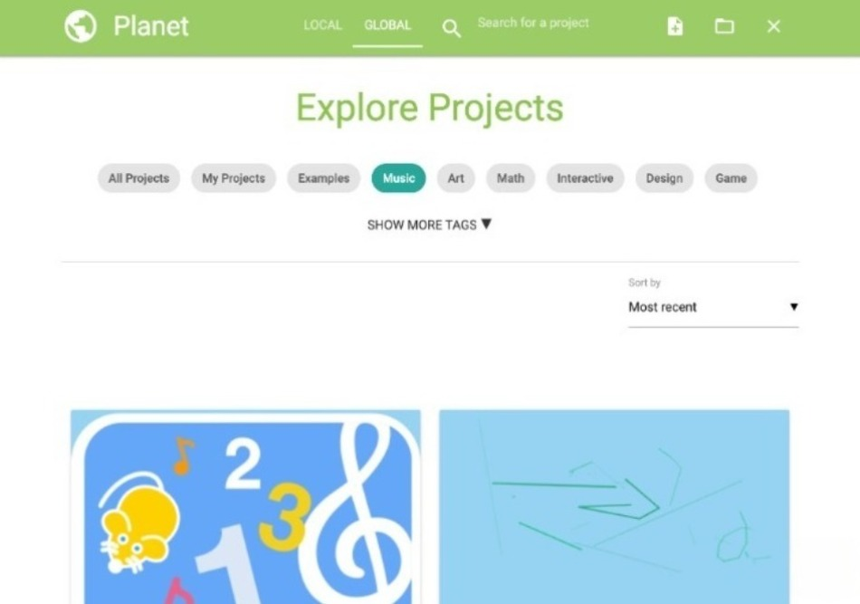
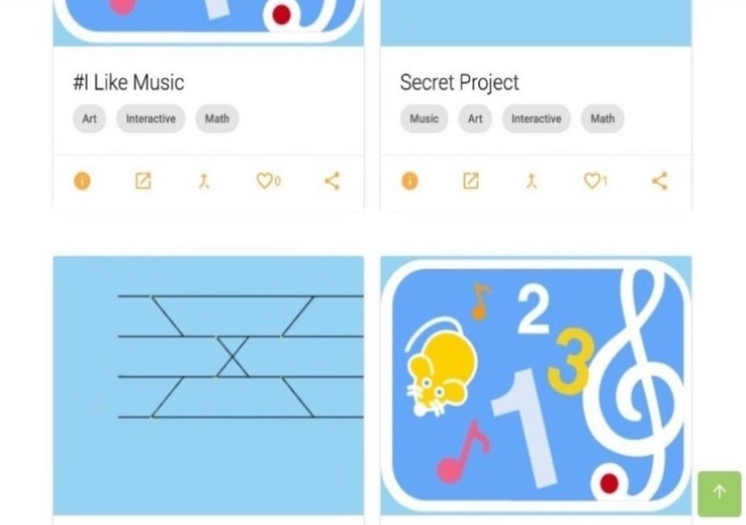

# Using Music Blocks

Music Blocks is a fork of [Turtle
Blocks](href="https://turtle.sugarlabs.org). It has extensions for
exploring music: pitch and rhythm.

Music Blocks is designed to run in a browser. Most of the development
has been done in Chrome.

| Browser | Comments                  |
| ------- | ------------------------- |
| Chrome  | Supported                 |
| Safari  | Supported                 |
| Firefox | Supported                 |
| Opera   | Supported                 |
| IE      | Not supported             |
| Edge    | Recent versions supported |

You can run it from
[https://musicblocks.sugarlabs.org](https://musicblocks.sugarlabs.org).

## <a>TABLE OF CONTENTS</a>

1. [Getting Started](#1-getting-started)
2. [Toolbars](#2-toolbars)
    1. [Main Toolbar](#1-main-toolbar)
    2. [Secondary Toolbar](#2-secondary-toolbar)
3. [Context Menus](#3-context-menus)
    1. [Contextual Menu for Blocks](#1-contextual-menu-for-blocks)
    2. [Contextual Menu for Background](#2-contextual-menu-for-background)
    3. [Pie Menus](#3-pie-menus)
4. [Keyboard Shortcuts](#4-keyboard-shortcuts)
5. [Block Palettes](#5-block-palettes)
    1. [Defining a Note](#1-defining-a-note)
    2. [A Quick Tour of Selected Blocks](#2-a-quick-tour-of-selected-blocks)
6. [Flow Palette](#6-flow-palette)
7. [Widget Palette](#7-widget-palette)
8. [Stats](#8-stats)
9. [Planet View](#9-planet-view)

## <a>1. Getting Started</a>

[Back to Table of Contents](#table-of-contents)

When you first launch Music Blocks in your browser, you'll see a stack
of blocks representing the notes: `Sol 4`, `Mi 4`and `Sol 4`. The first two notes are `1/4` note; third note is 
`1/2` note. [RUN LIVE](https://musicblocks.sugarlabs.org/index.html?id=1731947644713000&run=True)

Try clicking on the _Start_ block or click on the _Play_ button. You
should hear the notes play in succession: `Sol` `Mi` `Sol`.

To write your own programs, drag blocks from their respective palettes
on the left side of the screen. Use multiple blocks in stack(s) to
create music and drawings; as the mouse moves under your control,
colorful lines are drawn and music of your creation is played.

Note that blocks either snap together vertically or
horizontally. Vertical connections indicate program (and temporal)
flow. Code is executed from the top to bottom of a stack of
blocks. Horizontal connections are used for parameters and arguments,
e.g., the name of a pitch, the duration of a note, the numerator and
denominator of a division. From the shape of the block, it should be
apparent whether they connect vertically or horizontally.

Some blocks, referred to as "clamp" blocks have an
interior&mdash;child&mdash;flow. This might be code that is run _if_ a
condition is true, or, more common, the code that is run over the
duration of a note.

For the most part, any combination of blocks will run (although there
is no guarantee that they will produce music). Illegal combinations
of blocks will be flag by a warning on the screen as the program runs.

You can delete a block by dragging it back into the trash area that
appear at the bottom of the screen.

To maximize screen real estate, Music Blocks overlays the program
elements (stacks of blocks) on top of the canvas. These blocks can be
hidden at any time while running the program.

## <a>2. Toolbars</a>

[Back to Table of Contents](#table-of-contents)

There are five toolbars in Music Blocks, each serving a specific purpose to help you navigate and interact with the application. Below is a detailed description of each toolbar along with images to visually illustrate their functions:

### 1. Main Toolbar

The **Main** toolbar is located across the top of the screen. It contains several essential buttons for managing your project, controlling playback, and accessing various settings.

-   **Play Button**: Starts playing the project.
-   **Stop Button**: Stops the current project playback.
-   **New Project Button**: Creates a new project from scratch.
-   **Load Project from File Button**: Opens an existing project file.
-   **Save Project Button**: Saves the current project.
-   **Find and Share Project Button**: Opens the Planet view where you can explore and share projects with the community.
-   **Auxiliary Menu**: Provides additional tools for project settings and configuration.
-   **Help Button**: Opens the help menu, providing access to instructions and guidance.

---

### 2. Secondary Toolbar

The **Secondary** toolbar appears when you click the **hamburger button** (three horizontal lines) in the main toolbar. This toolbar provides several options to control the execution of your project and adjust your work environment.

-   **Run Slowly**: Executes the program slowly to allow you to follow the process step by step.
-   **Run Step by Step**: Runs the program one step at a time, ideal for debugging and analysis.
-   **Merge with Current Project**: Combines the current project with another, promoting collaboration and reusability.
-   **Turtle Wrap**: Enables wrapping of the turtle's position to seamlessly continue from the opposite edge of the canvas.
-   **Set Pitch Preview**: Lets users preview pitches while composing, providing instant feedback.
-   **Restore**: Resets changes and restores the project to its last saved state
-   **Switch to Advanced Mode**: Quickly transition from Beginner to Advanced mode for more tools and customization options.
        <h4>These are the extra options you get when you access the advanced mode:</h4>
        1. *Display Statistics*: Provides insights into project performance, such as usage and execution metrics. 
        2. *Load Plugin*: Integrates external plugins to enhance functionality and extend features. 
        3. *Delete Plugin*: Allows the removal of plugins that are no longer needed. 
        4. *Horizontal Scrolling*: Enables horizontal navigation for easier handling of large projects. 
        5. *JavaScript Editor*: Includes an editor for writing and embedding custom JavaScript code. 
        6.*Record*: Adds a "Record" button to the main palette, enabling users to record their compositions directly.

-   **Select Language**: Offers a multilingual interface, allowing users to change the language as per their preference.

---

### 3. Palette Toolbar

The **Palette** toolbar is located on the left side of the screen. It contains various categories of blocks, such as numbers, media, and actions, which you can drag and drop onto the canvas to build your project.

The palette is dynamic, switching between different categories based on your selection. When you hover over the palette, it reveals the specific blocks related to your chosen category.

---

### 4. Canvas Toolbar (Upper Right)

On the upper right of the canvas is a small toolbar with options for managing the workspace. It allows you to adjust the display and clear the canvas.

-   **Show Grids**: Displays a grid overlay on the canvas for alignment and organization.
-   **Clear Screen**: Clears the entire canvas, removing all blocks and drawings.
-   **Toggle Display Size**: Adjusts the size of the canvas or blocks for a better viewing experience.

---

### 5. Canvas Toolbar (Lower Right)

Located at the lower right of the canvas, this small toolbar provides additional control over block visibility and size.

-   **Home Button**: Takes you back to the initial view or project start screen.
-   **Show/Hide Blocks**: Toggles the visibility of the blocks you’ve added to the canvas.
-   **Expand/Collapse Blocks**: Allows you to expand or collapse the view of blocks for better organization.
-   **Decrease/Increase Block Size**: Changes the size of the blocks on the canvas to suit your preference.

---

## <a>3. Context Menus</a>

[Back to Table of Contents](#table-of-contents)

Context menus are an important part of user interfaces that provide users with quick access to a set of actions relevant to the context in which they are working.The right-click context menu in Music Blocks provides several options for working with blocks and the workspace. To access the right-click context menu, simply right-click anywhere in the workspace.

### <a>1. Contextual Menu for Blocks:</a>

When you **right-click on a block**, the following options are available:

**Extract**: The Extract option allows you to break down a nested block into its individual components or sub-blocks. This is useful for isolating parts of a block that you want to modify or reuse in other sections of your project, without affecting the original structure. It simplifies the process of working with complex, multi-layered blocks.

**Move to Trash**: The Move to Trash option deletes the selected block by sending it to the trash. This action removes the block from your workspace, is a way of cleaning up the environment or removing blocks you no longer need.

**Duplicate**: The Duplicate option creates an exact copy of the selected block. This is especially helpful for reusing blocks with the same configurations or settings in multiple places in your project, saving time and effort in recreating similar blocks.

**Help**: The Help option displays a detailed help screen for the selected block. This screen provides valuable information about the block’s functionality, purpose, and usage instructions, making it easier for users to understand and effectively incorporate the block into their projects. Additionally, the help screen allows you to insert blocks from the help examples directly into your program by clicking on the download icon (labeled "Load this block" in the image below).

**Close**: The Close option exits the context menu, allowing you to return to your workspace without making any changes or selections. This is useful for dismissing the menu if you opened it by mistake or decided not to perform any action.

By using the right-click context menu in Music Blocks, you can quickly perform common tasks and manipulate blocks on the workspace. This can help you to work more efficiently and effectively in your projects.

### <a>2. Contextual Menu for Background:</a>

When you **right-click on the background**, the following options are available:

- **Grid**: Toggles the display of a grid in the workspace for better alignment and organization.
- **Set Pitch Preview**: Adjusts and previews pitches while working on a composition.
- **Enable Horizontal Scrolling**: Allows horizontal navigation for easier management of large projects.
- **Turtle Wrap Off**: Toggles the turtle wrap feature, which determines whether the turtle wraps around the canvas edges.
- **Restore**: Reverts the workspace to its last saved state.
- **Increase Block Size**: Enlarges the size of all blocks for better visibility.
- **Decrease Block Size**: Shrinks the size of all blocks to save space.
- **Expand/Collapse Block**: Expands or collapses individual blocks to show or hide their details.
- **Show/Hide Block**: Toggles the visibility of selected blocks in the workspace.
- **Home**: Centers the workspace view on the initial starting point.
- **Close**: Exits the contextual menu.
- **Search for Blocks**: Opens a search bar to locate specific blocks within the workspace.
- **Collapse**: Collapses all blocks to their minimal state.
- **Clean**: Organizes and tidies up the workspace by aligning blocks systematically.
- **Select**: Enables selection mode for selecting multiple blocks or elements in the workspace.

###  <a>3. Pie Menus </a>

Many blocks in Music Blocks also feature "pie menus" that allow you to change block parameters quickly by selecting options from a circular menu that appears when you hover over the block.

For further details on how to use these toolbars effectively, you can refer to the [Turtle Blocks Documentation](https://github.com/sugarlabs/turtleblocksjs/tree/master/documentation).

---

## 4. Keyboard shortcuts

[Back to Table of Contents](#table-of-contents)

There are several keyboard shortcuts:

_PgUp_ and _PgDn_ will scroll the screen vertically. This is useful for
creating long stacks of blocks.

You can use the arrow keys to move blocks and the _Delete_ key to
remove an individual block from a stack.

_Enter_ is the equivalent of clicking the _Run_ button.

_Alt-C_ is copy and _Alt-V_ is paste. Be sure that the cursor is
highlighting the block(s) you want to copy.

You can directly type notes using _d_ for `Do`, _r_ for `Re`, _m_ for
`Mi`, _f_ for `Fa`, _s_ for `Sol`, _l_ for `La`, and _t_ for `Ti`.

## 5. Block Palettes

[Back to Table of Contents](#table-of-contents)

The block palettes are displayed on the left side of the screen. These
palettes contain the blocks used to create programs.

Looking for a block? Find it in the [Palette
Tables](https://github.com/sugarlabs/musicblocks/blob/master/guide/README.md#APPENDIX_1).

See the
[Turtle Blocks Programming Guide](http://github.com/sugarlabs/turtleblocksjs/tree/master/guide/README.md)
for general details on how to use the blocks.

See the
[Music Blocks Programming Guide](http://github.com/sugarlabs/musicblocks/tree/master/guide/README.md)
for details specific to music: _Rhythm_, _Meter_, _Pitch_, _Intervals_,
_Tone_, _Ornament_, _Volume_, _Drum_, and _Widget_.

All of the other palettes are described in the
[Turtle Blocks documentation pages](http://github.com/sugarlabs/turtleblocksjs/tree/master/documentation).

### 1. Defining a note

At the heart of Music Blocks is the concept of a note. A note, defined
by the _Note value_ block defines a length of time and a set of
actions to occur in that time. Typically the action is to play a
pitch, or series of pitches (e.g., a chord). Whatever blocks are placed
inside the "clamp" of a _Note value_ block are played over the
duration of the note.

The duration of a note is determined by its note value. By default, we
use musical notation, referring to whole notes (`1`), half notes
(`1/2`), quarter notes (`1/4`), etc., but you can use any number as
the note duration. (There are some practical limitations, which you
can discover through experimentation.) The relative length of a
quarter note is half as long as a half note. By default, Music Blocks
will play 90 quarter notes per second, so each quarter note is `2/3`
seconds (`666` microseconds) in duration.

The _Pitch_ block (found on the Pitch Palette) is used to specify the
pitch of a note. By default, we use traditional western Solfege, i.e.,
`Do`, `Re`, `Mi`, `Fa`, `Sol`, `La`, `Ti`, where `Do` is mapped to
`C`, `Re` is mapped to `D`, etc. (when the key and mode are `C
Major`). You can also specify pitch by using a note name, e.g.,
`F#`. An octave specification is also required (as an argument for our
pitch block) and changes integers for every cycle of `C` (i.e. `C4` is
higher than B3). When used with the _Pitch-time Matrix_ block, a row
is created for each _Pitch_ block.

In addition to specifying the note name, you must also specify an
octave. The frequency of a note doubles as the octave increases. `A2` is
`110 Hertz`; `A3` is `220 Hertz`; `A4` is `440 Hertz`; etc.

Two special blocks can be used with a _Pitch_ block to specify the
name of the pitch: the _Solfege_ block and the _Pitch-Name_ block. The
_Solfege_ block uses selectors to scroll through `Do`, `Re`, `Mi`,
`Fa`, `Sol`, `La`, and `Ti`. A second selector is used for sharps and
flats: `##`, `#`, `and`. The _Pitch-Name_ block is similar
in that it lets you scroll through `C`, `D`, `E`, `F`, `G`, `A`,
`B`. It also uses a second selector for sharps and flats.

As noted, and described in more detail in the
[Music Blocks Programming Guide](http://github.com/sugarlabs/musicblocks/tree/master/guide/README.md),
you can put as many _Pitch_ blocks inside a note as you'd like. They
will play together as a chord. You can also insert graphics blocks
inside a note in order to create sound-sync animations.

### 2. A quick tour of selected blocks

The _Set instrument_ block, found on the _Tone_ palette, lets you choose a
timbre for a note. In the above example, a guitar model is used to
make any notes contained within the block's clamp will sound as if
they are being played on a guitar. [RUN LIVE](https://musicblocks.sugarlabs.org/index.html?id=1731948356610795&run=True)

The _Set synth volume_ block, found on the _Volume_ palette, lets you
change the volume, which ranges from `0` (silent) to `100` (full
volume), of any notes contained with the block's clamp.

The *Set drum* block, which is used inside of the clamp of a *Note
value* block is used to add drum sounds to a note. It is found on the
*Drum* palette. [RUN LIVE](https://musicblocks.sugarlabs.org/index.html?id=1732000719242159&run=True)

The _Repeat_ block, found on the _Flow_ palette, is used to create
loops. Whatever stack of blocks are placed inside its clamp will be
repeated. It can be used to repeat individual notes, or entire phrases
of music. [RUN LIVE](https://musicblocks.sugarlabs.org/index.html?id=1732003682836455&run=True)

The _Duplicate_ block, found on the _Rhythms_ palette, is used to
repeat any contained notes. Similar to using a _Repeat_ block, but
rather than repeating a sequence of notes multiple times, each note is
repeated in turn, e.g. duplicate x2 of `4 4 8` would result in `4 4 4
4 8 8`, where as repeat x2 of `4 4 8` would result in `4 4 8 4 4 8`. [RUN LIVE](https://musicblocks.sugarlabs.org/index.html?id=1732003870740637&run=True)

The *Start* block, found on the *Action* palette, is tied to the *Run*
button. Anything inside of the clamp of the *Start* button will be run
when the button is pressed. [RUN LIVE](https://musicblocks.sugarlabs.org/index.html?id=1732004679481517&run=True)

Note that you can have multiple mice and that each mouse is
equivalent to a "voice" in music. It can play notes of various pitches
in sequence, and can even play multiple notes of the same "note
value", but no one mouse can do counterpoint by itself&mdash;just like
one mouse cannot draw two lines at the same time. If you want
counterpoint, pull out an additional _Start_ block, which will create
a new mouse that can now perform a new voice.

The _Action_ block, also found on the _Action_ palette, is used to
create a collection of blocks that can be run as a group. Whenever you
create an _Action_ block, a new block corresponding to that action is
added to the palette. The name given to the action is the name
associated with the new block. (It is common practice to use _Action_
blocks to define short phrases of music that can be repeated and
modified.) [RUN LIVE](https://musicblocks.sugarlabs.org/index.html?id=1732004679481517&run=True)

Actions are a powerful organizational element for your program and can
be used in many powerful ways, e.g., an action can be associated with
an event, such as an on beat or off beat or mouse click. See
[Music Blocks Programming Guide](http://github.com/sugarlabs/musicblocks/tree/master/guide/README.md),
for further details and examples.

The _Store in_ block, found on the _Boxes_ palette, is used to store a
value. That value can be retrieved using the _Box_ block. The value
can be modified using the _Add one_ block. These blocks are the
typical way in which variables are stored and retrieved in Music
Blocks. [RUN LIVE](https://musicblocks.sugarlabs.org/index.html?id=1732020971700880&run=True)

The *Forward* block, found on the *Graphics/Mouse* palette, is used to draw
straight lines. (Note that if this block is used inside of a *Note
value* block&mdash;the line will be drawn as the note plays; otherwise
the line is drawn "instantly".) [RUN LIVE](https://musicblocks.sugarlabs.org/index.html?id=1730651293282088&run=True)

The *Right/Left* block, found on the *Graphics/Mouse* palette, is used to rotate the
mouse heading. (Note that if this block is used inside of a *Note
value* block&mdash;the heading will change as the note plays;
otherwise the heading is changed "instantly".) [RUN LIVE](https://musicblocks.sugarlabs.org/index.html?id=1732023891064703&run=True)

The *Pen up* and *Pen down* blocks, found on the *Pen* palette,
determine whether or not the mouse draws as it moves. [RUN LIVE](https://musicblocks.sugarlabs.org/index.html?id=1732030390164543&run=True)

The _Set shade_ block, also found on the _Pen_ palette, is used to set
the lightness or darkness of the "ink" used in the mouse pen. `set
shade 0` is black. `set shade 100` is white. [RUN LIVE](https://musicblocks.sugarlabs.org/index.html?id=1732096229605656&run=True)

The _Set color_ block, also found on the _Pen_ palette, is used to set
the color of the "ink" used in the mouse pen. `set color 0` is
red. `set color 70` is blue. [RUN LIVE](https://musicblocks.sugarlabs.org/index.html?id=1732096675098636&run=True)

The _Random_ block, found on the _Numbers_ palette, is used to
generate a random number, because sometimes being unpredictable is
nice. [RUN LIVE](https://musicblocks.sugarlabs.org/index.html?id=1732097168390186&run=True)

The _One of_ block, also found on the _Numbers_ palette, is used to
generate a binary choice, one of "this" or "that", because sometimes
being unpredictable is nice. [RUN LIVE](https://musicblocks.sugarlabs.org/index.html?id=1732113139904914&run=True)

The *Show* block, found on the *Media* palette, is used to display
text and images. [RUN LIVE](https://musicblocks.sugarlabs.org/index.html?id=1732117445989018&run=True)

The _Mouse button_ block, found on the _Sensors_ palette, returns true
if the mouse button is clicked. The mouse button block can be used to
create some interactivity in your program. [RUN LIVE](https://musicblocks.sugarlabs.org/index.html?id=1732030390164543&run=True)

The _Cursor x_ and _Cursor y_ blocks, also found on the _Sensors_ palette, return the X and Y coordinates of the cursor. These blocks can also be used to create interactive programs.

Prompting the user for input is done with the *Input* block. This
block will display a message with a prompt and open an input form at
the current position of the mouse. Program execution is paused until
the user types into the form and types RETURN (or Enter). The contents
of the input form are then transferred to *Input-value* block. [RUN LIVE](https://musicblocks.sugarlabs.org/index.html?id=1732171497274793&run=True)

The _Push_ and _Pop_ blocks, found on the _Heap_ palette, are used to
store and retrieve values on/from a first-in, last-out (FILO) programx
heap. There is a separate heap maintained for each *Start* block. <!-- [RUN LIVE]() -->

The _Get value_ and _Set value_ blocks are found on the _Dictionary_
palette. They are used to get and set values in a dictionary
object. You can have as many key/value pairs as you'd like in the
dictionary and you can have as many dictionaries as you'd like as
well. There is also a built-in dictionary associated with each _Start_
block that has key/value pairs for parameters such as x, y, heading,
color, shade, grey, pen size, notes played, current pitch, pitch
number, and note value. <!-- [RUN LIVE]() -->

The _Print_ block, found on the _Extras_ palette, is used to print
messages during program execution. It is very useful as a debugging
tool and also as a means of adding lyrics to your music&mdash;think
karaoke. [RUN LIVE](https://musicblocks.sugarlabs.org/index.html?id=1732172483377262&run=True)

## 6. Flow Palette
[Back to Table of Contents](#table-of-contents)

The Flow palette is described in more detail in the [Turtle Blocks
documentation](http://github.com/sugarlabs/turtleblocksjs/tree/master/documentation). Here we review a few ways to approach taking different
actions on different beats.

The _Switch_ block will take the action defined in the _Case_ that
matches the argument passed to the _Switch_ block. In the figure
below, it will take a different action based on the beat value: "on
case 1 run action1", "on case 2, run action2", ..., "on case 4 run
action4". You can also define a default action. [RUN LIVE](https://musicblocks.sugarlabs.org/index.html?id=1732173207750796&run=True)

Another way to do the same thing is with the _Do_ block found on the
Action palette. In the figure below, we add the beat count to "action"
to create a series of strings: "action1", "action2", ...,
"action4". We then "do" that action. [RUN LIVE](https://musicblocks.sugarlabs.org/index.html?id=1732830205442211&run=True)

## 7. Widget Palette

[Back to Table of Contents](#table-of-contents)

Music Blocks has various Widgets that can be used within Music Blocks
to enhance your experience. The _Pitch-time matrix_ is described here.

Many of the blocks on this palette are used to create a matrix of
"pitch" and "note value". The matrix is a convenient and intuitive way
for generating short musical gestures, which can be regenerated as a
"chunk of notes" that can be played back programmatically. Musicians
may find it helpful to think of the pitches within the pitch-time
matrix as being akin to a bellset in which notes may be added and
removed as desired. The "note value" representation acts as a
"rhythmic tablature" that should be readable by both those familiar
with the concepts of rhythm in music and those unfamiliar (but
familiar with math).

*Pitch-time Matrix* blocks clamp is used to define the matrix:
A row in the matrix is created for each *Pitch* block and columns are
created for individual notes, which are created by using *Rhythm*
blocks, individual note blocks, or the *Tuplet* block. [RUN LIVE](https://musicblocks.sugarlabs.org/index.html?id=1732180386380311&run=True)

The _Rhythm_ block is used to specify a series of notes of the same
duration (e.g., three quarter notes or seven eighth notes). The number
of notes is the top argument; the bottom argument is the the note
duration, e.g., `1/1` for a whole note, `1/2` for a half note, `1/4`
for a quarter note, etc. (Recall that in traditional Western notation
all note values are (1) in powers of two, and are (2) in relation to
the "whole note", which is in turn (3) defined by tempo, or
beats&mdash;usually quarter notes&mdash;per minute) Each note is
represented by a column in the matrix. <!-- [RUN LIVE]() -->

Special ratios of the whole note can be created very easily with the
_Rhythm_ block by choosing an integer other than the traditional
"powers of two" that standard Western music notation affords us. For
example, putting a `1/5` into the argument for "note value" will
create a note value equal to "one fifth the durational length of a
whole note". This gives the user endless rhythmic possibilities.

As a convenience, blocks for the most common note values are also
provided (whole note through 64th note). They are automatically
converted into the corresponding _Rhythm_ blocks, which can be used to
create columns in the matrix.

If you would like multiple note values in a row, simply use the
_Repeat_ block clamp or _Duplicate_ block clamp.

The _Tuplet_ block is how we create rhythms that do not fit into a
simple "power of two" rhythmic space. A tuplet, mathematically, is a
collection of notes that are scaled to map into a specified
duration. For example, if you would like to script/perform three
unique notes into the duration of a single quarter note you would use
the tuplet block. The _Tuplet_ block is able to calculate how many
notes you have inserted into the clamp and will generate the tuplet
accordingly (e.g. if you put three notes in, it will generate a
"triplet". We have designed the tuplet block to allow for any input of
note value, so the triplet can be three quarter notes, three eighth
notes, etc. This design choice allows for maximum flexibility) You can
mix and match _Rhythm_ and individual _Note_ blocks within a _Tuplet_
block to generate complex rhythms (e.g. two quarter notes plus an
eighth note is possible within the tuplet). Each note is represented
by a column in the matrix. [RUN LIVE](https://musicblocks.sugarlabs.org/index.html?id=1732191858479236&run=True)

Note: Each time you open the matrix, it tries to reconstruct the notes
marked from the previous matrix. If you modify the _Pitch_ and
_Rhythm_ blocks in the _Pitch-time Matrix_ clamp, Music Blocks will
try to make a corresponding change in the matrix.

Note: You can construct a matrix from a chuck of blocks by including
the chunk in the clamp of the _Pitch-time Marix_ block.

More details about all of the widgets are available in the
[Music Blocks Programming Guide](http://github.com/sugarlabs/musicblocks/tree/master/guide/README.md).

## 8. Stats

[Back to Table of Contents](#table-of-contents)

Project statistics are available from a button on the secondary
toolbar in advanced mode.

## 9. Planet View

[Back to Table of Contents](#table-of-contents)

Music Blocks also provides a Planet view to find and share
projects. It has options to load project from file locally and make
new projects from scratch.

There are LOCAL and GLOBAL options to choose from. LOCAL lists the
projects saved on your local machine. GLOBAL lets you explore projects
shared by the community. You can filter these projects by tags such as
Art, Math, Interactive, Design, Game, etc.

Projects are shown with a thumbnail image and a title. To get more
details, click on thumbnail image. A short description is provided.

You can open a project in Music Blocks directly from the Planet or you
can download.

[Back to Table of Contents](#table-of-contents)