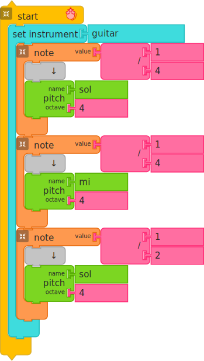
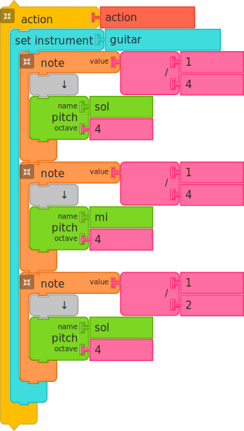
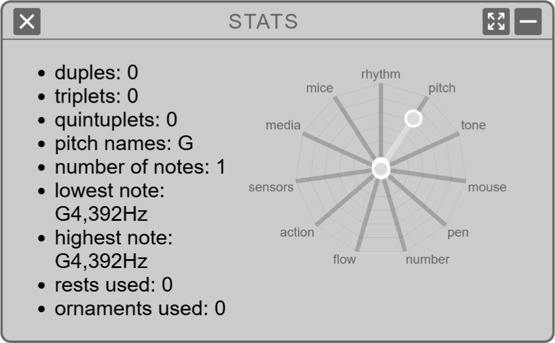

Using Music Blocks
==================

Music Blocks is a fork of [Turtle
Blocks](href="https://turtle.sugarlabs.org). It has extensions for
exploring music: pitch and rhythm.

Music Blocks is designed to run in a browser. Most of the development
has been done in Chrome.

Browser       | Comments
------------- | -------------
Chrome        | Supported
Safari        | Supported
Firefox       | Supported
Opera         | Supported
IE            | Not supported
Edge	      | Recent versions supported

You can run it from
[https://musicblocks.sugarlabs.org](https://musicblocks.sugarlabs.org).

Getting Started
---------------

When you first launch Music Blocks in your browser, you'll see a stack
of blocks representing the notes: `Sol 4`, `Mi 4`and `Sol 4`. The first two notes are `1/4` note; third note is 
`1/2` note.

Try clicking on the *Start* block or click on the *Play* button. You
should hear the notes play in succession: `Sol` `Mi` `Sol`.

To write your own programs, drag blocks from their respective palettes
on the left side of the screen. Use multiple blocks in stack(s) to
create music and drawings; as the mouse moves under your control,
colorful lines are drawn and music of your creation is played.

Note that blocks either snap together vertically or
horizontally. Vertical connections indicate program (and temporal)
flow. Code is executed from the top to bottom of a stack of
blocks. Horizontal connections are used for parameters and arguments,
e.g., the name of a pitch, the duration of a note, the numerator and
denominator of a division. From the shape of the block, it should be
apparent whether they connect vertically or horizontally.

Some blocks, referred to as "clamp" blocks have an
interior&mdash;child&mdash;flow. This might be code that is run *if* a
condition is true, or, more common, the code that is run over the
duration of a note.

For the most part, any combination of blocks will run (although there
is no guarantee that they will produce music). Illegal combinations
of blocks will be flag by a warning on the screen as the program runs.

You can delete a block by dragging it back into the trash area that
appear at the bottom of the screen.

To maximize screen real estate, Music Blocks overlays the program
elements (stacks of blocks) on top of the canvas. These blocks can be
hidden at any time while running the program.

Toolbars
--------

There are five toolbars:

(1) The *Main* toolbar across the top of the screen. There you will
find the *Play* button, the *Stop* button, the *New Project* button,
buttons for loading and saving projects, the *Planet* button, where
you can access community projects, the *hamburger* button, which opens
the secondary toolbar, and the *help* button.

(2) On the *Secondary* toolbar you will find the buttons *Run slowly*,
*Run step by step*, *Display Statistics*, *beginner/advanced mode*,
etc. and also the button for selecting language.

(3) The *Palette* toolbar is on the left side of the screen. New
blocks are dragged from the palette.

(4) On the upper right of the canvas is a small toolbar for showing
grids, clearing the screen, and toggling the display size.

(5) On the lower right of the canvas is a small toolbar where you will
find the *Home* button, buttons for show/hide blocks, expand/collapse
blocks and decrease/increase block size.

These toolbars are described in detail in the
[Turtle Blocks documentation pages](https://github.com/sugarlabs/turtleblocksjs/tree/master/documentation).

An additional "contextual" menu appears whenever you *right click* on
a block.

Many blocks also incorporate "pie menus" for changing block parameters.

Keyboard shortcuts
------------------

There are several keyboard shortcuts:

*PgUp* and *PgDn* will scroll the screen vertically. This is useful for
creating long stacks of blocks.

You can use the arrow keys to move blocks and the *Delete* key to
remove an individual block from a stack.

*Enter* is the equivalent of clicking the *Run* button.

*Alt-C* is copy and *Alt-V* is paste. Be sure that the cursor is
highlighting the block(s) you want to copy.

You can directly type notes using *d* for `Do`, *r* for `Re`, *m* for
`Mi`, *f* for `Fa`, *s* for `Sol`, *l* for `La`, and *t* for `Ti`.

Block Palettes
--------------

The block palettes are displayed on the left side of the screen. These
palettes contain the blocks used to create programs.

Looking for a block? Find it in the [Palette
Tables](https://github.com/sugarlabs/musicblocks/blob/master/guide/README.md#APPENDIX_1).

See the
[Turtle Blocks Programming Guide](http://github.com/sugarlabs/turtleblocksjs/tree/master/guide/README.md)
for general details on how to use the blocks.

See the
[Music Blocks Programming Guide](http://github.com/sugarlabs/musicblocks/tree/master/guide/README.md)
for details specific to music: *Rhythm*, *Meter*, *Pitch*, *Intervals*,
*Tone*, *Ornament*, *Volume*, *Drum*, and *Widget*.

All of the other palettes are described in the
[Turtle Blocks documentation pages](http://github.com/sugarlabs/turtleblocksjs/tree/master/documentation).

Defining a note
---------------

At the heart of Music Blocks is the concept of a note. A note, defined
by the *Note value* block defines a length of time and a set of
actions to occur in that time. Typically the action is to play a
pitch, or series of pitches (e.g., a chord). Whatever blocks are placed
inside the "clamp" of a *Note value* block are played over the
duration of the note.

The duration of a note is determined by its note value. By default, we
use musical notation, referring to whole notes (`1`), half notes
(`1/2`), quarter notes (`1/4`), etc., but you can use any number as
the note duration. (There are some practical limitations, which you
can discover through experimentation.) The relative length of a
quarter note is half as long as a half note. By default, Music Blocks
will play 90 quarter notes per second, so each quarter note is `2/3`
seconds (`666` microseconds) in duration.

The *Pitch* block (found on the Pitch Palette) is used to specify the
pitch of a note. By default, we use traditional western Solfege, i.e.,
`Do`, `Re`, `Mi`, `Fa`, `Sol`, `La`, `Ti`, where `Do` is mapped to
`C`, `Re` is mapped to `D`, etc. (when the key and mode are `C
Major`). You can also specify pitch by using a note name, e.g.,
`F#`. An octave specification is also required (as an argument for our
pitch block) and changes integers for every cycle of `C` (i.e. `C4` is
higher than B3). When used with the *Pitch-time Matrix* block, a row
is created for each *Pitch* block.

In addition to specifying the note name, you must also specify an
octave. The frequency of a note doubles as the octave increases. `A2` is
`110 Hertz`; `A3` is `220 Hertz`; `A4` is `440 Hertz`; etc.

Two special blocks can be used with a *Pitch* block to specify the
name of the pitch: the *Solfege* block and the *Pitch-Name* block. The
*Solfege* block uses selectors to scroll through `Do`, `Re`, `Mi`,
`Fa`, `Sol`, `La`, and `Ti`. A second selector is used for sharps and
flats: `##`, `#`, `` and ``. The *Pitch-Name* block is similar
in that it lets you scroll through `C`, `D`, `E`, `F`, `G`, `A`,
`B`. It also uses a second selector for sharps and flats.

As noted, and described in more detail in the
[Music Blocks Programming Guide](http://github.com/sugarlabs/musicblocks/tree/master/guide/README.md),
you can put as many *Pitch* blocks inside a note as you'd like. They
will play together as a chord. You can also insert graphics blocks
inside a note in order to create sound-sync animations.

A quick tour of selected blocks
-------------------------------

The *Set instrument* block, found on the *Tone* palette, lets you choose a
timbre for a note. In the above example, a guitar model is used to
make any notes contained within the block's clamp will sound as if
they are being played on a guitar.

The *Set synth volume* block, found on the *Volume* palette, lets you
change the volume, which ranges from `0` (silent) to `100` (full
volume), of any notes contained with the block's clamp.

The *Set drum* block, which is used inside of the clamp of a *Note
value* block is used to add drum sounds to a note. It is found on the
*Drum* palette.

The *Repeat* block, found on the *Flow* palette, is used to create
loops. Whatever stack of blocks are placed inside its clamp will be
repeated. It can be used to repeat individual notes, or entire phrases
of music.

The *Duplicate* block, found on the *Rhythms* palette, is used to
repeat any contained notes. Similar to using a *Repeat* block, but
rather than repeating a sequence of notes multiple times, each note is
repeated in turn, e.g. duplicate x2 of `4 4 8` would result in `4 4 4
4 8 8`, where as repeat x2 of `4 4 8` would result in `4 4 8 4 4 8`.

The *Start* block, found on the *Action* palette, is tied to the *Run*
button. Anything inside of the clamp of the *Start* button will be run
when the button is pressed.

Note that you can have multiple mice and that each mouse is
equivalent to a "voice" in music. It can play notes of various pitches
in sequence, and can even play multiple notes of the same "note
value", but no one mouse can do counterpoint by itself&mdash;just like
one mouse cannot draw two lines at the same time. If you want
counterpoint, pull out an additional *Start* block, which will create
a new mouse that can now perform a new voice.

The *Action* block, also found on the *Action* palette, is used to
create a collection of blocks that can be run as a group. Whenever you
create an *Action* block, a new block corresponding to that action is
added to the palette. The name given to the action is the name
associated with the new block. (It is common practice to use *Action*
blocks to define short phrases of music that can be repeated and
modified.)

Actions are a powerful organizational element for your program and can
be used in many powerful ways, e.g., an action can be associated with
an event, such as an on beat or off beat or mouse click. See
[Music Blocks Programming Guide](http://github.com/sugarlabs/musicblocks/tree/master/guide/README.md),
for further details and examples.

The *Store in* block, found on the *Boxes* palette, is used to store a
value. That value can be retrieved using the *Box* block. The value
can be modified using the *Add one* block. These blocks are the
typical way in which variables are stored and retrieved in Music
Blocks.

The *Forward* block, found on the *Mouse* palette, is used to draw
straight lines. (Note that if this block is used inside of a *Note
value* block&mdash;the line will be drawn as the note plays; otherwise
the line is drawn "instantly".)

The *Right* block, found on the *Mouse* palette, is used to rotate the
mouse heading. (Note that if this block is used inside of a *Note
value* block&mdash;the heading will change as the note plays;
otherwise the heading is changed "instantly".)

The *Pen up* and *Pen down* blocks, found on the *Pen* palette,
determine whether or not the mouse draws as it moves.

The *Set shade* block, also found on the *Pen* palette, is used to set
the lightness or darkness of the "ink" used in the mouse pen. `set
shade 0` is black. `set shade 100` is white.

The *Set color* block, also found on the *Pen* palette, is used to set
the color of the "ink" used in the mouse pen. `set color 0` is
red. `set color 70` is blue.

The *Random* block, found on the *Numbers* palette, is used to
generate a random number, because sometimes being unpredictable is
nice.

The *One of* block, also found on the *Numbers* palette, is used to
generate a binary choice, one of "this" or "that", because sometimes
being unpredictable is nice.

The *Show* block, found on the *Media* palette, is used to display
text and images.

The *Mouse button* block, found on the *Sensors* palette, returns true
if the mouse button is clicked. The mouse button block can be used to
create some interactivity in your program.

The *Cursor x* and *Cursor y* blocks, also found on the *Sensors* palette, return the X and Y coordinates of the cursor. These blocks can also be used to create interactive programs.

Prompting the user for input is done with the *Input* block. This
block will display a messgae with a prompt and open an input form at
the current position of the mouse. Program execution is paused until
the user types into the form and types RETURN (or Enter). The contents
of the input form are then transferred to *Input-value* block.

The *Push* and *Pop* blocks, found on the *Heap* palette, are used to
store and retrieve values on/from a first-in, last-out (FILO) program
heap. There is a separate heap maintained for each *Start* block.

The *Get value* and *Set value* blocks are found on the *Dictionary*
palette. They are used to get and set values in a dictionary
object. You can have as many key/value pairs as you'd like in the
dictionary and you can have as many dictionaries as you'd like as
well. There is also a built-in dictionary associated with each *Start*
block that has key/value pairs for parameters such as x, y, heading,
color, shade, grey, pen size, notes played, current pitch, pitch
number, and note value.

The *Print* block, found on the *Extras* palette, is used to print
messages during program execution. It is very useful as a debugging
tool and also as a means of adding lyrics to your music&mdash;think
karaoke.

Flow Palette
------------

The Flow palette is described in more detail in the Turtle Blocks
documentation. Here we review a few ways to approach taking different
actions on different beats.

The *Switch* block will take the action defined in the *Case* that
matches the argument passed to the *Switch* block. In the figure
below, it will take a different action based on the beat value: "on
case 1 run action1", "on case 2, run action2", ..., "on case 4 run
action4". You can also define a default action.

Another way to do the same thing is with the *Do* block found on the
Action palette. In the figure below, we add the beat count to "action"
to create a series of strings: "action1", "action2", ...,
"action4". We then "do" that action.

Widget Palette
--------------

Music Blocks has various Widgets that can be used within Music Blocks
to enhance your experience. The *Pitch-time matrix* is described here.

Many of the blocks on this palette are used to create a matrix of
"pitch" and "note value". The matrix is a convenient and intuitive way
for generating short musical gestures, which can be regenerated as a
"chunk of notes" that can be played back programmatically. Musicians
may find it helpful to think of the pitches within the pitch-time
matrix as being akin to a bellset in which notes may be added and
removed as desired. The "note value" representation acts as a
"rhythmic tablature" that should be readable by both those familiar
with the concepts of rhythm in music and those unfamiliar (but
familiar with math).

*Pitch-time Matrix* blocks clamp is used to define the matrix:
A row in the matrix is created for each *Pitch* block and columns are
created for individual notes, which are created by using *Rhythm*
blocks, individual note blocks, or the *Tuplet* block.

The *Rhythm* block is used to specify a series of notes of the same
duration (e.g., three quarter notes or seven eighth notes). The number
of notes is the top argument; the bottom argument is the the note
duration, e.g., `1/1` for a whole note, `1/2` for a half note, `1/4`
for a quarter note, etc. (Recall that in traditional Western notation
all note values are (1) in powers of two, and are (2) in relation to
the "whole note", which is in turn (3) defined by tempo, or
beats&mdash;usually quarter notes&mdash;per minute) Each note is
represented by a column in the matrix.

Special ratios of the whole note can be created very easily with the
*Rhythm* block by choosing an integer other than the traditional
"powers of two" that standard Western music notation affords us. For
example, putting a `1/5` into the argument for "note value" will
create a note value equal to "one fifth the durational length of a
whole note". This gives the user endless rhythmic possibilities.

As a convenience, blocks for the most common note values are also
provided (whole note through 64th note). They are automatically
converted into the corresponding *Rhythm* blocks, which can be used to
create columns in the matrix.

If you would like multiple note values in a row, simply use the
*Repeat* block clamp or *Duplicate* block clamp.

The *Tuplet* block is how we create rhythms that do not fit into a
simple "power of two" rhythmic space. A tuplet, mathematically, is a
collection of notes that are scaled to map into a specified
duration. For example, if you would like to script/perform three
unique notes into the duration of a single quarter note you would use
the tuplet block. The *Tuplet* block is able to calculate how many
notes you have inserted into the clamp and will generate the tuplet
accordingly (e.g. if you put three notes in, it will generate a
"triplet". We have designed the tuplet block to allow for any input of
note value, so the triplet can be three quarter notes, three eighth
notes, etc. This design choice allows for maximum flexibility) You can
mix and match *Rhythm* and individual *Note* blocks within a *Tuplet*
block to generate complex rhythms (e.g. two quarter notes plus an
eighth note is possible within the tuplet). Each note is represented
by a column in the matrix.

Note: Each time you open the matrix, it tries to reconstruct the notes
marked from the previous matrix. If you modify the *Pitch* and
*Rhythm* blocks in the *Pitch-time Matrix* clamp, Music Blocks will
try to make a corresponding change in the matrix.

Note: You can construct a matrix from a chuck of blocks by including
the chunk in the clamp of the *Pitch-time Marix* block.

More details about all of the widgets are available in the
[Music Blocks Programming Guide](http://github.com/sugarlabs/musicblocks/tree/master/guide/README.md).

Stats
-----

Project statistics are available from a button the the secondary
toolbar in advanced mode.

Planet View 
-----------

Music Blocks also provides a Planet view to find and share
projects. It has options to load project from file locally and make
new projects from scratch.

There are LOCAL and GLOBAL options to choose from. LOCAL lists the
projects saved on your local machine. GLOBAL lets you explore projects
shared by the community. You can filter these projects by tags such as
Art, Math, Interactive, Design, Game, etc.

Projects are shown with a thumbnail image and a title. To get more
details, click on thumbnail image. A short description is provided.

You can open a project in Music Blocks directly from the Planet or you
can download.

