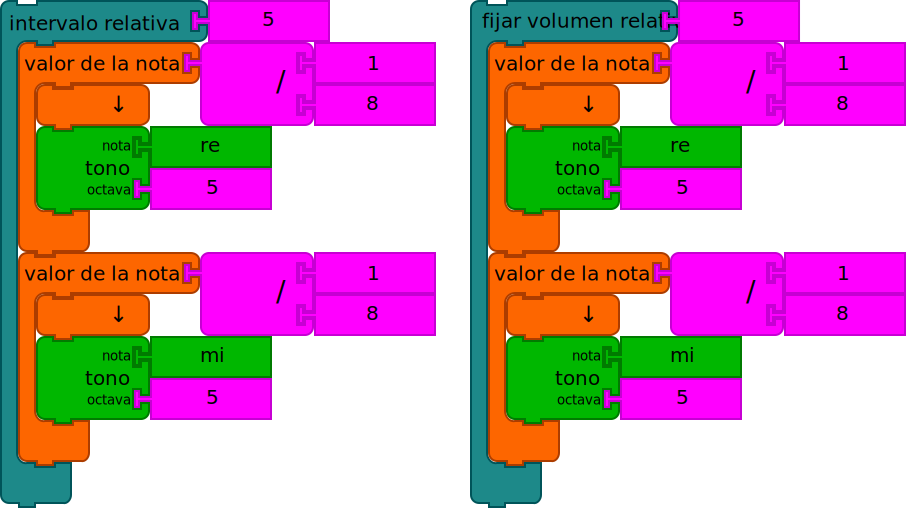

# Guía de Programación con Bloques de Música

Bloques de Música es un entorno de programación para lqs niños
interesados en música y gráficos. Se amplía la Tortugaarte en que
tiene una colección de funciones relacionadas con el tono y el ritmo.

La [guía de la
Tortugaarte](https://github.com/sugarlabs/turtleblocksjs/blob/master/guide-es/README.md)
es un buen lugar para comenzar a aprender acerca de la lo esencial. En
esta guía, se ilustran las características de la música que recorren
la lector a través de numerosos ejemplos.

## Empezando

Bloques de Música está diseñado para ejecutarse en un navegador. La
mayor parte del desarrollo se ha hecho en Cromo, pero también debería
funcionar en Firefox. Se puede ejecutar desde [Bloques de Música]
(https://musicblocks.sugarlabs.org) o por la descarga de una
copia del código y se ejecuta directamente desde el archivo sistema de
su computadora.

Para más detalles sobre el uso de Bloques de Música, ver [Uso de
Bloques de Música]
(http://github.com/sugarlabs/musicblocks/tree/master/documentation)
y para más detalles sobre cómo utilizar los bloques de la tortuga, ver
[Uso de la tortuga bloques

## ACERCA DE ESTA GUÍA

Esta guía se divide en cuatro secciones: (i) una descripción general
de la _Nota_ estructura; (ii) una guía de programación; (iii) los
widgets que proporcionan alguna andamio para el programador; y (iv)
una sección sobre la exportación de tu trabajar en otros sistemas de
música.

Muchos de los ejemplos dados en la guía tienen enlaces a código que puede
correr. Busque vínculos EJECUTAR EN VIVO.

## I. NOTAS

Bloques musicales expuestos los elementos comunes de la música: el
tono, el ritmo y la calidad de sonido, por ejemplo, el volumen y la
suavidad, y en cierto grado, timbre y la textura.

En el corazón de los bloques de música es el bloque de _Valores de
Nota_. El bloque de _Valores de Nota_ es un contenedor para un campo
que especifica la duración (valor de nota) del terreno de juego. (El
bloque de _Tono_ se detalla a continuación.)


En la parte superior del ejemplo anterior, un único _Valores de
Nota_ es mostrado. El `1 / 8` es el valor de la nota, en este caso,
una corchea. los terreno de juego, a que el bloque de _Tono_, contiene
un lanzamiento, `La` en `4'Octave. En la parte inferior, dos notas que
se tocan son consecutivamente mostrado.


En este ejemplo, se muestran diferentes valores de las notas. De
arriba a abajo, `1 / 4'para un cuarto de nota,` 1 / 16`de una semicorchea, y`1/2` por una media Nota.


Como hemos visto, bloques de _Tono_ se utilizan dentro del bloques de
_Valor de la Nota_. El bloque _Tono_ especifica un nombre de brea y
octava que en combinación determinar la frecuencia con la que se toca
una nota.

Puede conectar diferentes valores en el _Tono_ nombre del bloque y
la octava ranuras. Algunos ejemplos se muestran arriba. A partir de la
parte superior, el terreno de juego nombre del bloque se especifica el
uso de un bloque de _Solfeo_ ( `Sol` en `Octava 6`); el nombre de tono
se especifica el uso de un bloque _Tono-nombre_ ( `B en flat`
`Octava 4`); el terreno de juego se especifica utilizando el bloque de
_Hertz_ y una bloque de _Número_ ( `440` Hertz).

La octava se especifica mediante un bloque de número y se limita a
todos los números. En el caso en que el nombre de pitch se especifica
por la frecuencia, la octava se ignora.

Tenga en cuenta que el nombre de tono también se puede especificar el
uso de un bloque de _Texto_.

También tenga en cuenta que cualquier operación matemática se puede
utilizar como entrada para el _Valor de Nota_.


Un acorde (múltiples, campos simultáneos) puede ser especificado por
complemento _Tono_ múltiples bloques a un _valor de Nota_ contenedor.


Un resto de valor de la nota duración se puede construir usando un
bloque de _Silencio_.

## Using drums


Anywhere you can use a _Pitch_ block--e.g., inside of the matrix or a
_Note value_ block--you can also specify a drum sample. Currently there
about two dozen different samples from which to choose. The default
drum is a kick drum.


Just as in the chord example above, you can use multiple _Drum_ blocks
within a single _Note value_ block and combine them with _Pitch_
blocks.

## II. PROGRAMMING WITH MUSIC

This section of the guide discusses how to use chunks of notes to
program music. Note that you can program with chunks you create by
hand or use the _Pitch-time Matrix_ widget described in Section III.

1. A chunk of notes

---


Every time you create a new _Action_ stack, Music Blocks creates a new
block specific to that stack. (The new block is found at the top of
the _Block_ palette, found on the left edge of the screen.) Clicking
on this block is the same as clicking on your stack. By default, the
new blocks are named `chunk`, `chunk1`, `chunk2`... but you can rename
them by editing the labels on the _Action_ blocks.

In the example above, the _Chunk_ block is inside of a _Start_ block,
which ties it to the _Run_ button in the upper-left corner of the
screen (the "rabbit"). Try clicking on the _Run_ button. Also try the
_Run Slow_ button (the "turtle") and the _Step_ button (the "snail"),
which steps through the program one block per button press. There are
also buttons for playing the music back slowly and for stepping one
note per button press.


You can repeat chunks either by using multiple _Chunk_ blocks or using a
_Repeat_ block.


You can also mix and match chunks. Here we play chunk, followed by
chunk1 twice, and then chunk again.


A few more chunks and we can make a song. (Can you read the block
notation in order to guess what song we've programmed?)

2. Transformations

---

There are many ways to transform pitch, rhythm, and other qualities of
the sound.


The _Step Pitch_ block will move up or down notes in a scale from the
current note. In the example above, _Step Pitch_ blocks are used inside
of _Repeat_ blocks to play up and down a scale.

[EJECUTAR EN VIVO](https://musicblocks.sugarlabs.org/index.html?id=1523032034365533&run=True)


The _Sharp_ and _Flat_ blocks can be wrapped around _Pitch_
blocks, _Note value_ blocks, or chunks. A sharp will raise the pitch by
one half step. A flat will lower by one half step. In the example, on
the left, just the _Pitch_ block `Mi` is lowered by one half step;
on the right, both pitch blocks are raised by one half step.


The _Adjust-transposition_ block can be used to make larger shifts in
pitch. To shift an entire octave, transpose by 12 half-steps up. -12
will shift an octave down.


In the example above, we take the song we programmed previously and
raise it by one octave.


You can "dot" notes using the _Dot_ block. A dotted note extends by
50%. E.g., a dotted quarter note will play for 3/8 (1/4 + 1/8) of a
beat. A dotted eighth note will play for 3/16 (1/8 + 1/16) of a beat.


You can also multiply (or divide) the beat value, which will speed up
or slowdown the notes. Multiplying the beat value of an `1/8` note by
`2` is the equivalent of playing a `1/16` note. Dividing the beat
value of an `1/8` note by '2' is the equivalent of playing a `1/4`
note.


There are several ways to repeat notes. The _Repeat_ block will play a
sequence of notes multiple times; the _Duplicate_ block will repeat each
note in a sequence.

In the example, on the left, the result would be `Sol, Re, Sol, Sol, Re, Sol, Sol, Re, Sol, Sol, Re, Sol`; on the right the result would be
`Sol, Sol, Sol, Sol, Re, Re, Re, Re, Sol, Sol, Sol, Sol`.


The _Swing_ block works on pairs of notes (specified by note value),
adding some duration (specified by swing value) to the first note and
taking the same amount from the second note. Notes that do not match
note value are unchanged.

In the example, `re5` would be played as a `1/6` note and `me5` would
be played as a `1/12` note (`1/8 + 1/24 === 1/6' and `1/8 - 1/24 ===
1/12`). Observe that the total duration of the pair of notes is
unchanged.

Tie also works on pairs of notes, combining them into one note. (The
notes must be identical in pitch, but can vary in rhythm.)


The _Set volume_ block will change the volume of the notes. The
default is 50; the range is 0 (silence) to 100 (full volume).

The _Crescendo_ block will increase (or decrease) the volume of the
contained notes by an amount specified.

The _Staccato_ block will play back notes in tight bursts while
maintaining the specified rhymic value of the notes.

The _Slur_ block will run a note past its noted duration, blending
it into the next note.



The _Interval_ block calculates a relative interval, e.g., a fifth, and adds
the additional pitches to a note. In the figure, we add `Sol` to `Do` and
`Do` to `Fa`.

The _Articulation_ block changes the volume of a group of notes.


The _Augmented_ block calculates an absolute interval, e.g., an
augmented fifth, and adds the additional pitches to a note. Similarly,
the _Minor_ block calculates an absolute interval, e.g., a minor
third. Other absolute intervals include _Perfect_, _Diminished_, and
_Major_.

In the augmented fifth example above, a chord of D5 and A5 are played,
followed by a chord of E5 and C5. In the minor third example, which
includes a shift of one octave, first a chord of D5 and F5 is played,
followed by chord of E5 and G6.


The _Invert_ block will invert a series of notes around a target
note. There are two different versions of the _Invert_ block: _odd_
and _even_, the latter shifts the point of rotation up by a `1/4`
step, enabling rotation around a point between two notes.

In the _invert (even)_ example, `D4` is inverted around `G4`,
resulting in a `C5`. In the _invert (odd)_ example, `D4` is inverted
around a point midway between `G4` and `G♯4` resulting in a `C♯5`


The _Backward_ block will play the contained notes in reverse order
(retrograde). In the example above, the notes in _Chunk_ are played as
`Sol`, `Ti`, `La`, `Sol`, i.e., from the bottom to the top of the
stack.

[EJECUTAR EN VIVO](https://musicblocks.sugarlabs.org/index.html?id=1522885752309944&run=True)

Note that all of the blocks inside a _Backward_ block are reverse, so
use this feature with caution if you include logic intermixed with
notes.


The _Set Voice_ block selected a voice for the synthesizer for any
contained blocks, e.g., violin or cello.


The _Set Key_ block will change the key and mode of the mapping
between solfege, e.g., `Do`, `Re`, `Mi`, to note names, e.g., `C`,
`D`, `E`, when in C Major. Modes include Major and Minor, Chromatic,
and a number of more exotic modes, such as Bebop, Geez, Maqam, et al.


In the above example, the sequence of drum beats is increased over time.

[EJECUTAR EN VIVO](https://musicblocks.sugarlabs.org/index.html?id=1523106271018484&run=True)

3. Voices

---

Each _Start_ block runs as a separate voice in Music Blocks. (When
you click on the Run button, all of the _Start_ blocks are run
concurrently.)


If we put our song into an action...


...we can run it from multiple _Start_ blocks.


It gets more interesting if we shift up and down octaves.


And even more interesting if we bring the various voices offset in time.

[EJECUTAR EN VIVO](https://musicblocks.sugarlabs.org/index.html?id=1523026536194324&run=True)


A special "drum" version of the _Start_ block is available for laying
down a drum track. Any pitch blocks encounted while starting from a
drum will be played as `C2` with the default drum sample. In the
example above, all of the notes in `chunk` will be played with a kick
drum.

4. Adding graphics

---


Turtle graphics can be combined with the music blocks. By placing
graphics blocks, e.g., _Forward_ and _Right_, inside of _Note value_
blocks, the graphics stay in sync with the music. In this example, the
turtle moves forward each time a quarter note is played. It turns
right during the eighth note. The pitch is raised by one half step,
the pen size decreases, and the pen color increases at each step in
the inner repeat loop.


In this example, the graphics are synchronized to the music by placing
the graphics commands inside of _Note value_ blocks.

[EJECUTAR EN VIVO](https://musicblocks.sugarlabs.org/index.html?id=1523106271018484&run=True)


In this example, because the computation and graphics are more
complex, a _Free-time_ block is used to decouple the graphics from
the master clock.


5. Interaction

---

There are many ways to interactive with Music Blocks, including
tracking the mouse position to impact some aspect of the music.


For example, we can launch the phrases (chunks) interactively. When
the mouse is in the lower-left quadrant, `chunk` is played;
lower-right quadrant, `chunk1`; upper-left quadrant, `chunk2`; and
upper-right quadrant, `chunk3`.

[EJECUTAR EN VIVO](https://musicblocks.sugarlabs.org/index.html?id=1523028011868930&run=True)


In the example above, a simple two-key piano is created by associating
_click_ events on two different turtles with individual notes. Can you
make an 8-key piano?

[EJECUTAR EN VIVO](https://musicblocks.sugarlabs.org/index.html?id=1523107390715125&run=True)


You can also add a bit of randomness to your music. In the top example
above, the _One-of_ block is used to randomly assign either `Do` or
`Re` each time the _Note value_ block is played. In the bottom example
above, the _One-of_ block is used to randomly select between `chunk1`
and `chunk2`.

## III. WIDGETS

1. Status

---


The _Status widget_ is a tool for inspecting the status of Music
Blocks as it is running. By default, the key, BPM, and volume are
displayed. Also, each note is displayed as it is played. There is one
row per voice in the status table.

Additional _Print_ blocks can be added to the _Status_ widget to
display additional music factors, e.g., duplicate, transposition,
skip, staccato, slur, and graphics factors, e.g., x, y, heading,
color, shade, grey, and pensize.


You can do additional programming within the status block. In the
example above, the volume is divided by 10 before being displayed.

2. The Pitch-Time Matrix

---


Music Blocks provides a widget, the _Pitch-time Matrix_, as a scaffold
for getting started.

Once you've launched Music Blocks in your browser, start by clicking
on the _Pitch-time Matrix_ stack that appears in the middle of the
screen. (For the moment, ignore the _Start_ block.) You'll see a grid
organized vertically by pitch and horizontally by rhythm.


The matrix in the figure above has three _Pitch_ blocks and one
_Rhythm_ block, which is used to create a 3 x 3 grid of pitch and
time.

Note that the default matrix has five _Pitch_ blocks, hence, you will
see five rows, one for each pitch. (A sixth row at the bottom is used
for specifying the rhythms associated with each note.) Also by
default, there are two _Rhythm_ blocks, which specifies six quarter
notes followed by one half note. Since the _Rhythm_ blocks are inside
of a _Repeat_ block, there are fourteen (2 x 7) columns for selecting
notes.


By clicking on individual cells in the grid, you should hear
individual notes (or chords if you click on more than one cell in a
column). In the figure, three quarter notes are selected (black
cells). First `Re 4`, followed by `Mi 4`, followed by `Sol 4`.


If you click on the _Play_ button (found in the top row of the grid),
you will hear a sequence of notes played (from left to right): `Re 4`,
`Mi 4`, `Sol 4`.


Once you have a group of notes (a "chunk") that you like, click on the
_Save_ button (just to the right of the _Play_ button). This will
create a stack of blocks that can used to play these same notes
programmatically. (More on that below.)

You can rearrange the selected notes in the grid and safe other chunks
as well.


The _Sort_ button will reorder the pitches in the matrix from highest
to lowest and eliminate any duplicate _Pitch_ blocks.


Or hide the matrix by clicking on the _Close_ button (the right-most
button in the top row of the grid.)


There is also an Erase button that will clear the grid.

Don't worry. You can reopen the matrix at anytime (it will remember
its previous state) and since you can define as many chunks as you
want, feel free to experiment.

Tip: You can put a chunk inside a _Pitch-time Matrix_ block to generate
the matrix to corresponds to that chunk.


The chunk created when you click on the matrix is a stack of
blocks. The blocks are nested: an _Action_ block contains three _Note value_
blocks, each of which contains a _Pitch_ block. The _Action_ block has a
name automatically generated by the matrix, in this case, chunk. (You
can rename the action by clicking on the name.). Each note has a
duration (in this case 4, which represents a quarter note). Try
putting different numbers in and see (hear) what happens. Each note
block also has a pitch block (if it were a chord, there would be
multiple _Pitch_ blocks nested inside the Note block's clamp). Each
pitch block has a pitch name (`Re`, `Mi`, and `Sol`), and a pitch octave; in
this example, the octave is 4 for each pitch. (Try changing the pitch
names and the pitch octaves.)

To play the chuck, simply click on the action block (on the word
action). You should hear the notes play, ordered from top to bottom.

## About the Rhythm Block


_Rhythm_ blocks are used to generate rhythm patterns in the
_Pitch-time Matrix_ block. The top argument to the _Rhythm_ block
*is the number of notes. The bottom argument is the duration of the
*note. In the top example above, three columns for quarter notes
*would be generated in the matrix. In the middle example, one column
*for an eighth note would be generated. In the bottom example, seven
\*columns for 16th notes would be generated.


You can use as many _Rhythm_ blocks as you'd like inside the
_Pitch-time Matrix_ block. In the above example, two _Rhythm_
blocks are used, resulting in three quarter notes and six eighth
notes.

## Creating Tuplets


Tuplets are a collection of notes that get scaled to a specific
duration. Using tuplets makes it easy to create groups of notes that
are not based on a power of 2. In the example above, three quarter
notes--defined in the _Rhythm_ block--are played in the time of a
single quarter note. The result is three twelfth notes.

You can mix and match _Rhythm_ blocks and _Tuplet_ blocks when
defining your matrix.

## Using individual notes in the matrix


You can also use individual notes when defining the grid. These blocks
will expand into _Rhythm_ blocks with corresponding values.

3. Generating Rhythms

---

The _Rhythm Ruler_ block is used to launch a widget similar to the
_Pitch-time Matrix_ block, which can be used to generate rhythmic
patterns.


The argument to the _Rhythm Ruler_ block specifies the duration that
will be subdivided to generate a rhythmic pattern. By default, it is 1
/ 1, e.g., a whole note.

The _Set Drum_ blocks contained in the clamp of the _Rhythm Ruler_
block define the number of rhythms to be defined simultaneously. By
default, two rhythms are defined. The embedded _Rhythm_ blocks define
the initial subdivision of the of each rhythm ruler.


When the _Rhythm Ruler_ block is clicked, the _Rhythm Ruler_ widget is
opened. It contains a row for each rhythm ruler. An input in the top
row of the widget is used to specify how many subdivisions will be
created within a cell when it is clicked. By default, 2 subdivisions
are created.


As shown in the above figure, the top rhythm ruler has been divided
into two half-notes and the bottom rhythm ruler has been divided into
three third-notes. Clicking on the _Play_ button to the left of each row
will playback the rhythm using a drum for each beat. The _Play-all_
button on the upper-left of the widget will play back all rhythms
simultaneously.


The rhythm can be further subdivided by clicking in individual
cells. In the example above, two quarter-notes have been created by
clicking on one of the half-notes.


The _Save stack_ button will export rhythm stacks.


These stacks of rhythms can be used to define rhythmic patterns used
with the _Pitch-time Matrix_ block.


The _Save drum machine_ button will export _Start_ stacks that will
play the rhythms as drum machines.

4. Musical Modes

---

Musical modes are used to specify the relationship between intervals
(or steps) in a scale. Since Western music is based on 12 half-steps
per octave, modes speficy how many half steps there are between each
note in a scale.

By default, Music Blocks uses the _Major_ mode, which, in the Key of
C, maps to the white keys on a piano. The intervals in the _Major_
mode are `2, 2, 1, 2, 2, 2, 1`. Many other common modes are
built into Music Blocks, including, of course, _Minor_ mode, which
uses `2, 1, 2, 2, 1, 2, 2` as its intervals.

Note that not every mode uses 7 intervals per octave. For example, the
_Chromatic_ mode uses 11 intervals: `1, 1, 1, 1, 1, 1, 1, 1, 1, 1, 1, 1`. The _Japanese_ mode uses only 5 intervals: `1, 4, 2, 3, 2],`. What is important is that the sum of the intervals
in an octave is 12 half-steps.


The _Mode_ widget lets you explore modes and generate custom
modes. You invoke the widget with the _Custom mode_ block. The mode
specified in the _Set key_ block will be the default mode when the
widget launches.


In the above example, the widget has been launched with _Major_ mode
(the default). Note that the notes included the mode are indicated by
the black boxes, which are arrayed in a circular pattern of tweleve
half-steps to complete the octave.

Since the intervals in the _Major_ mode are `2, 2, 1, 2, 2, 2, 1`, the
notes are `0`, `2`, `4`, `5`, `7`, `9`,`11`, and `12` (one octave
above `0`).

The widget controls run along the toolbar at the top. From left to
right are:

_Play all_, which will play a scale using the current mode;

_Save_, which will save the current mode as the _Custom_ mode and save
a stack of _Pitch_ blocks that can be used with the _Pitch-time
Matrix_ block;

_Rotate counter-clockwise_, which will rotate the mode
counter-clockwise (See the example below);

_Rotate clockwise_, which will rotate the mode clockwise (See the
example below);

_Invert_, which will invert the mode (See the example below);

_Undo_, which will restore the mode to the previous version; and

_Close_, which will close the widget.

You can also click on individual notes to activate or deactivate them.

Note that the mode inside the _Custom mode_ block is updated whenever
the mode is changed inside the widget.


In the above example, the _Major_ mode has been rotated clockwise,
transforming it into _Dorian_.


In the above example, the _Major_ mode has been rotated
counter-clockwise, transforming it into _Locrian_.


In the above example, the _Major_ mode has been inverted, transforming
it into _Phrygian_.

Note: The build-in modes in Music Blocks can be found in (musicutils.js)[https://github.com/sugarlabs/musicblocks/blob/master/js/musicutils.js#L68].


The _Save_ button exports a stack of blocks representing the mode that
can be used inside the _Pitch-time Matrix_ block.

5. The Pitch-Drum Matrix

---


The _Set Drum_ block is used to map the enclosed pitches into drum
sounds. Drum sounds are played in a monopitch using the specified drum
sample. In the example above, a `kick drum` will be substitued for
each occurance of a `Re` `4`.


As an expedience for creating mapping with the _Set Drum_ block, we
provide the _Drum-Pitch_ Matrix. You use it to map between pitches and
drums. The output is a stack of _Set Dum_ blocks.

6. Generating Pitches using Musical Proportions

---

The _Pitch Staircase_ block is used to launch a widget similar to the
_Pitch-time Matrix_, which can be used to generate different pitches
using a given pitch and musical proportion.

The _Pitch_ blocks contained in the clamp of the _Pitch Staircase_
block define the pitches to be initialized simultaneously. By default,
one pitch is defined and it have default note "la" and octave "3".


When _Pitch Staircase_ block is clicked, _Pitch Staircase_ widget is
initialized. The widget contains row for every _Pitch_ block contained
in the clamp of the _Pitch Staircase_ block. Input fields in the top
row of the widget specify the musical proportion to used to create new
pitches in the staircase. The inputs correspond to the numerator and
denominator in the proportion resectively. By default the proportion
is 3:2.


Clicking on the _Play_ button to the left of each row will playback
the note associated with that step in the stairs. The _Play-all_
button on the upper-left of the widget will play back all the pitch
steps simultaneously. A second _Play-all_ button to its right the
stair first in increasing order of the frequency and than in the
decreasing order of the frequency.

The _Save stack_ button will export pitch stacks. For example, in the
configuration, the output is as shown below:


These stacks can be used with the _Pitch-tim Matrix_ block to define
the rows in the matrix.


7. Understanding Tempo

---

The _Tempo_ block is used to launch a widget that enables us to
visualize Tempo, defined as beats per minute (BPM). When _Tempo_ block
is clicked, the _Tempo_ widget is initialized.

The _Master Beats per Minute_ block contained in the clamp of the
_Tempo_ block sets the initial tempo used by the widget. This
determines the speed at which the ball in the widget moves back and
forth. If BPM is 60, then it will take one second for the ball to move
across the widget. A round-trip would take two seconds.


The top row of the widget holds the _Play/pause_ button, the _Speed
up_ and _Slow down_ buttons, and an input field for updating the
Tempo.


You can also update the tempo by clicking twice in succession in the
widget: the new BPM is determined from the time between clicks. For
example, if there 1/2 second between clicks, the new BPM is 120.

8. Creating Pitches with continuously varying frequencies

---

The _Pitch Slider_ block is used to launch a widget that is used to
generate arbitray pitches. It differs from _Pitch Staircase_ widget in
that it is used to create frequencies that vary continuously within
the range of a specified octave.

Each _Sine_ block contained within the clamp of the _Pitch Slider_ block defines the initial pitch
for an ocatve.


When the _Pitch Slider_ block is clicked, the _Pitch Slider_ widget is
initialized. The widget will have one column for each _Sine_ block in
the clamp. Every column has a slider that can be used to move go up or
down in frequency, continuously or in intervals of 1/12th of the
starting frequency. For continuous case mouse is used. Buttons are
used for intervals. Arrow keys can also be used to move up and down,
or between columns.


CLicking in a column will extact corresponding _Note_ blocks, for example:


## IV. BEYOND MUSIC BLOCKS

Music Blocks is a waypoint, not a destination. One of the goals is to
point the learner towards other powerful tools. One such tool is
[Lilypond](http://lilypond.org), a music engraving program.


The _Save as Lilypond_ block will transcribe your composition. The
output of the program above is saved to `Downloads/hotdog.ly`. There is
also a _Save as Lilypond_ button on the secondary toolbar.


```
\version "2.18.2"

mouse = {
c'8 c'8 c'8 c'8 c'4 c'4 g'8 g'8 g'8 g'8 g'4 g'4 a'8 a'8 a'8 a'8 a'4
a'4 g'8 g'8 g'8 g'8 g'4 g'4 f'8 f'8 f'8 f'8 f'4 f'4 e'8 e'8 e'8 e'8
e'4 e'4 d'8 d'8 d'8 d'8 d'4 d'4 c'8 c'8 c'8 c'8 c'4 c'4
}

\score {
<<
\new Staff = "treble" {
\clef "treble"
\set Staff.instrumentName = #"mouse" \mouse
}
>>
\layout { }
}
```


[EJECUTAR EN VIVO](https://musicblocks.sugarlabs.org/index.html?id=1523043053377623&run=True)
