# Guide to Programming with Music Blocks
  
Music Blocks is a programming environment for children interested in
music and graphics. It expands upon Turtle Blocks by adding a
collection of features relating to pitch and rhythm.

The [Turtle Blocks
guide](https://github.com/sugarlabs/turtleblocksjs/blob/master/guide/README.md)
is a good place to start learning about the basics. In this guide, we
illustrate the musical features by walking the reader through numerous
examples.

A short [Guide to
Debugging](http://github.com/sugarlabs/musicblocks/tree/master/Debugging.md). is
also available.

## <a name="TOC"></a> Table of Contents

1. [Getting Started](#GETTING-STARTED)
2. [Making Sounds](#NOTES)
   1. [Note Value Blocks](#NOTE-VALUE)
   2. [Pitch Blocks](#PITCH)
   3. [Chords](#CHORDS)
   4. [Rests](#RESTS)
   5. [Drums](#DRUMS)
3. [Programming with Music](#PROGRAMMING-WITH-MUSIC)
   1. [Actions](#ACTIONS)
   2. [Musical Transformations](#TRANSFORMATION)
      1. [Step Pitch Block](#STEP-PITCH)
      2. [Sharps and Flats](#SHARPS-AND-FLATS)
      3. [Adjusting Transposition](#ADJUST-TRANSPOSITION)
      4. [Summary of Pitch Movements](#PITCH-MOVEMENT)
      5. [Set Key](#SET-KEY)
      6. [Fixed and Movable Pitch Systems](#FIXED-AND-MOVABLE-PITCH-SYSTEMS)
      7. [Dotted Notes](#DOTTED)
      8. [Speeding Up and Slowing Down Notes via Mathematical Operations](#MULTIPLY-AND-DIVIDE)
      9. [Repeating Notes](#REPETITION)
      10. [Swinging Notes and Tied Notes](#SWINGING)
      11. [Set Volume, Crescendo, Staccato, and Slur Blocks](#MORE-TRANSFORMATIONS)
      12. [Intervals](#INTERVALS)
      13. [Inversion](#INVERSION)
      14. [Backwards](#BACKWARDS)
      15. [Setting Voice](#SETTINGVOICE)
      16. [Setting Key and Mode](#SETTINGKEY)
      17. [Vibrato, Tremelo, et al.](#VIBRATO)
   3. [Voices](#VOICES)
   4. [Graphics](#GRAPHICS)
   5. [Beat](#BEAT)
   6. [Interactions](#INTERACTIONS)
   7. [Ensemble](#ENSEMBLE)
   8. [Converters](#CONVERTERS)
4. [Widgets](#WIDGETS)
    1. [Monitoring Status](#status)
    2. [Generating groups of Notes](#pitch-time)
       1. [Phrase Maker](#pitch-time) 
       2. [The Rhythm Block](#THE-RHYTHM-BLOCK) 
       3. [Creating Tuplets](#CREATING-TUPLETS)
       4. [What is a Tuplet?](#WHAT-IS-TUPLET)
       5. [Using Individual Notes in the Phrase Maker](#INDIVIDUAL-NOTES)
       6. [Using a Scale of Pitches in the Phrase Maker](#USING-A-SCALE)
    3. [Generating Rhythms](#rhythms)
    4. [Musical Modes](#modes)
    5. [Meters](#meters)
    6. [The Pitch-Drum Matrix](#pitch-drum)
    7. [Exploring Musical Proportions](#stairs)
    8. [Generating Arbitrary Pitches](#slider)
    9. [Changing Tempo](#tempo)
    10. [Custom Timbres](#timbre)
    11. [Music Keyboard](#keyboard)
    12. [Changing Temperament](#temperament)
    13. [Oscilloscope](#oscilloscope)
    14. [Sampler](#sampler)
5. [Beyond Music Blocks](#BEYOND-MUSIC-BLOCKS)
    1. [LilyPond](#LILYPOND)
    2. [Other exports](#EXPORTS)
    3. [JavaScript](#JAVASCRIPT)

[APPENDIX: Palette Tables](#APPENDIX_1)

Many of the examples given in the guide have links to code you can
run. Look for `RUN LIVE` links.

## <a name="GETTING-STARTED"></a>1. Getting Started

[Back to Table of Contents](#TOC) | [Next Section (2. Making Sounds)](#NOTES)

Music Blocks is designed to run in a browser. Most of the development
has been done in Chrome, but it should also work in Firefox, Opera,
and some versions of Safari. You can run it from
[musicblocks.sugarlabs.org](https://musicblocks.sugarlabs.org), from
[github io](https://musicblocks.sugarlabs.org), or by
downloading a copy of the code and running a local copy directly from
the file system of your computer. (Note that when running locally, you
may have to use a local server to expose all of the features.)

This guide details the music-specific features of Music Blocks.  You
may also be interested in the [Turtle Blocks
Guide](http://github.com/sugarlabs/turtleblocksjs/tree/master/guide),
which reviews many programming features common to both projects.

For more details on how to use Music Blocks, see [Using Music
Blocks](http://github.com/sugarlabs/musicblocks/tree/master/documentation).
For more details on how to use Turtle Blocks, see [Using Turtle Blocks
JS](http://github.com/sugarlabs/turtleblocksjs/tree/master/documentation).

## <a name="NOTES"></a>2. Making Sounds

[Previous Section (1. Getting Started)](#GETTING-STARTED) | [Back to
Table of Contents](#TOC) | [Next Section (3. Programming with
Music)](#PROGRAMMING-WITH-MUSIC)

Music Blocks incorporates many common elements of music, such as
[pitch](#PITCH), [rhythm](#rhythms), [volume](#MORE-TRANSFORMATIONS),
and, to some degree, [timbre and texture](#VOICES).

### <a name="NOTE-VALUE"></a>2.1 Note Value Blocks

At the heart of Music Blocks is the *Note value* block. The *Note
value* block is a container for a [*Pitch* block](#PITCH) that
specifies the duration (note value) of the pitch.

 and two consecutive Note valueblocks (bottom)")

At the top of the example above, a single (detached) *Note value*
block is shown. The `1/8` is value of the note, which is, in this
case, an eighth note.

At the bottom, two notes that are played consecutively are shown. They
are both `1/8` notes, making the duration of the entire sequence
`1/4`.

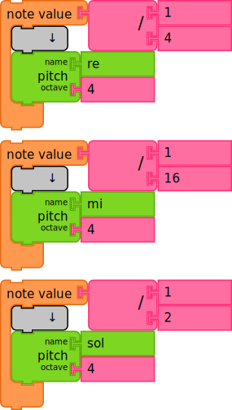

In this example, different note values are shown. From top to bottom,
they are: `1/4` for an quarter note, `1/16` for a sixteenth note, and
`1/2` for a half note.

Note that any mathematical operations can be used as input to the
*Note value*.

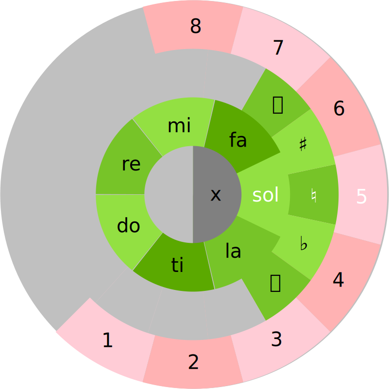

As a convenience, a pie menu is used for selecting common note values.


Please refer to the above picture for a visual representation of note
values.

### <a name="PITCH"></a>2.2 Pitch Blocks

As we have seen, *Pitch* blocks are used inside the
[*Note value*](#NOTE-VALUE) blocks. The *Pitch* block specifies the
pitch name and pitch octave of a note that in combination determines
the frequency (and therefore pitch) at which the note is played.

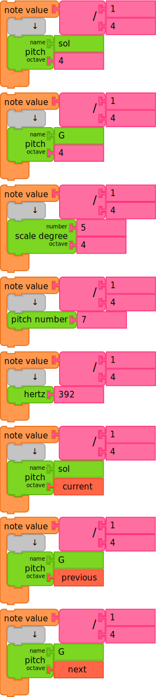

There are many systems you can use to specify a *pitch* block's name
and octave. Some examples are shown above.

The top *Pitch* block is specified using a *Solfege* block (`Sol` in
`Octave 4`), which contains the notes `Do Re Me Fa Sol La Ti `.

The pitch of the next block is specified using a *Pitch-name* block
(`G` in `Octave 4`), which contains the notes `C D E F G A B`.

The next block is specified using a *Scale-degree* block (the `5th note`
in the scale, 'G', also in 'Octave 4'), `C == 1, D == 2, ...`. The
*Scale-Degree* block has numbers like the *Number* block, but also has 
an accidental so that the user may play pitches outside a given key.

The next blocks is specified using a *Nth Modal Pitch* block. This
block takes a number argument and turns it into the "nth pitch of 
a given scale" with an index of 0 (i.e. C for C major is 0). Therefore
in order to get `G`, we input the number 4. The octave argument will
force the octave up or down; otherwise the user may just keep going up
or down in either direction to go through scalar pitches of any mode.

The next block is specified using a *Pitch-number* block (the `7th
semi-tone` above `C` in `Octave 4` is `G`). The offset for the pitch
number can be modified using the *Set-pitch-number-offset* block.

The pitch of the next block is specified using the *Hertz* block in
conjunction with a *Number* block (`392` Hertz is `G` in `Octave 4`),
which corresponds to the frequency of the sound made.

The octave is specified using a number block and is restricted to
whole numbers. In the case where the pitch name is specified by
frequency, the octave is ignored.The octave argument can also be
specified using a *Text* block with values *current*, *previous*,
*next* which does as 0, -1, 1 respectively.

The octave of the next block is specified using a *current* text block
(`Sol` in `Octave 4`).

The octave of the next block is specified using a *previous* text
block (`G` in `Octave 3`).

The octave of the last block is specified using a *next* text block
(`G` in `Octave 5`).

Note that the pitch name can also be specified using a *Text* block. 

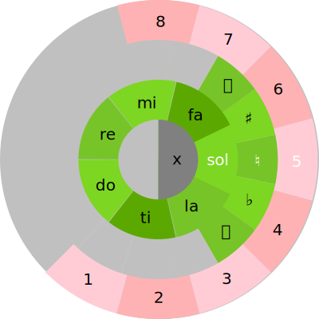

As a convenience, a pie menu is used for selecting pitch, accidental,
and octave.


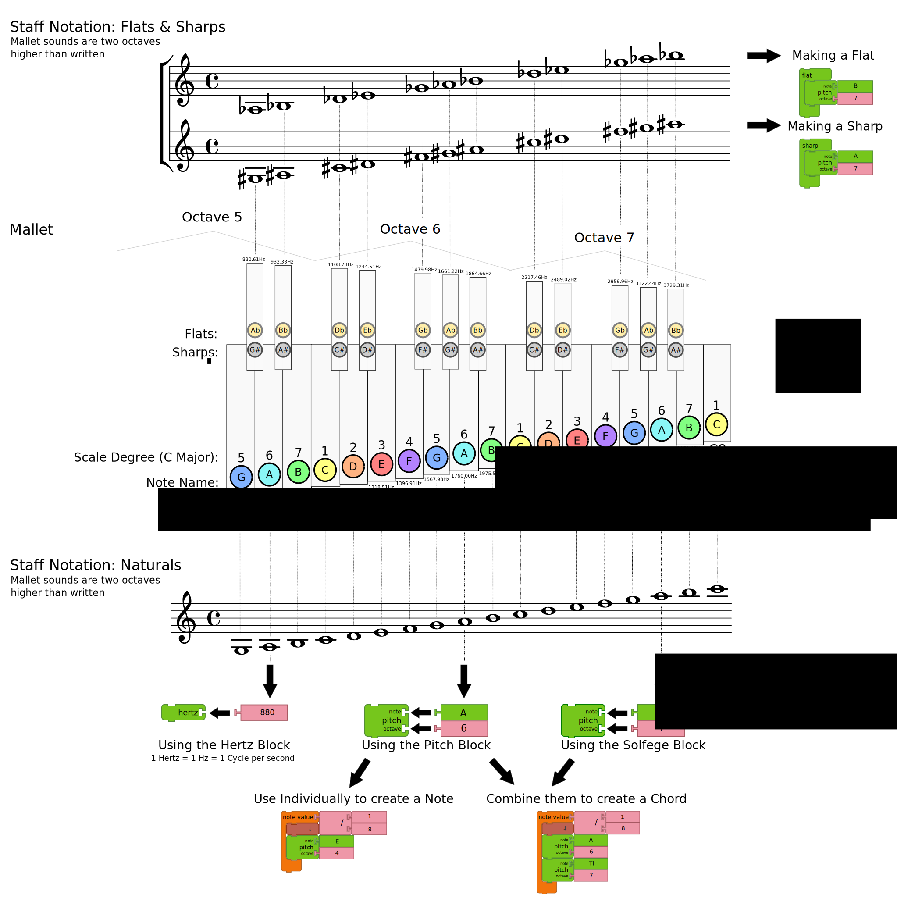

Please refer to the above charts for a visual representation of where
notes are located on a keyboard or staff.

### <a name="CHORDS"></a>2.3 Chords

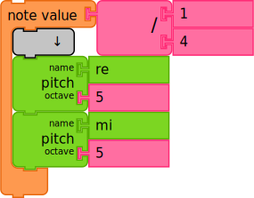

A chord (multiple, simultaneous pitches) can be specified by adding
multiple *Pitch* blocks into a single *Note value* block, like the
above example.

### <a name="RESTS"></a>2.4 Rests

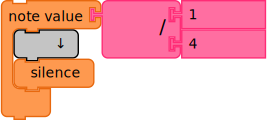

A rest of the specified note value duration can be constructed using a
*Silence* block in place of a *Pitch* block.

### <a name="DRUMS"></a>2.5 Drums

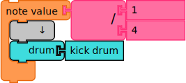

Anywhere a *Pitch* block can be used&mdash;e.g., inside of the matrix
or a *Note value* block&mdash;a *Drum Sample* block can also be used
instead. Currently there about two dozen different samples from which
to choose. The default drum is a kick drum.

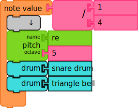

Just as in the [chord](#CHORD) example above, you can use multiple
*Drum* blocks within a single *Note value* blocks, and combine them
with *Pitch* blocks as well.

## <a name="PROGRAMMING-WITH-MUSIC"></a>3. Programming with Music

[Previous Section (2. Making Sounds)](#NOTES) | [Back to Table of
Contents](#TOC) | [Next Section (4. Widgets)](#WIDGETS)

This section of the guide discusses how to use chunks of notes to
program music. Note that you can program with chunks you create by
hand or use the [*Phrase maker*](#pitch-time) widget to help you
get started.

### <a name="ACTIONS"></a>3.1 Actions

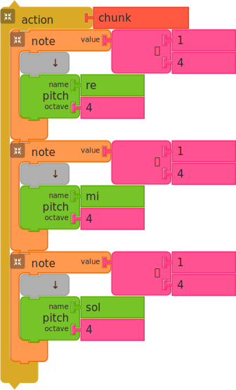

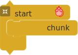

Every time you create a new *Action* stack, Music Blocks creates a new
block specific to, and linked with, that stack. (The new block is
found at the top of the *Block* palette, found on the left edge of the
screen.) Clicking on and running this block is the same as clicking on
your stack. By default, the new blocks are named `chunk`, `chunk1`,
`chunk2`... but you can rename them by editing the labels on the
*Action* blocks.

An *Action* block contains a sequence of actions that will only be
executed when the block is referred to by something else, such as a
start block. This is useful in orchestrating more complex programs of
music.

A *Start* Block is a *Action* that will automatically be executed once
the start button is pressed.  This is where most of your programs will
begin at.  There are many ways to *Run* a program: you can click on
the *Run* button at the upper-left corner of the screen to run the
music at a fast speed; a long press on the *Run* button will run it
slower (useful for debugging); and the *Step* button can be used to
step through the program one block per button press. (An extra-long
press of the *Run* button will play back the music slowly. A long
press of the *Step* button will step through the program note by
note.)

In the example above, the *Action* block named "chunk" is inside of a
*Start* block, which means that when any of the start buttons is
pressed, the code inside the *Start* block (the *Action* block) will be
executed. You can add more chunks after this one inside the *Start*
block to execute them sequentially.

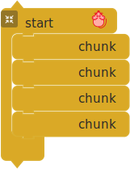

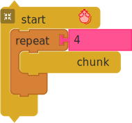

You can [repeat](#REPETITION) actions either by using multiple *Action*
blocks or using a *Repeat* block.

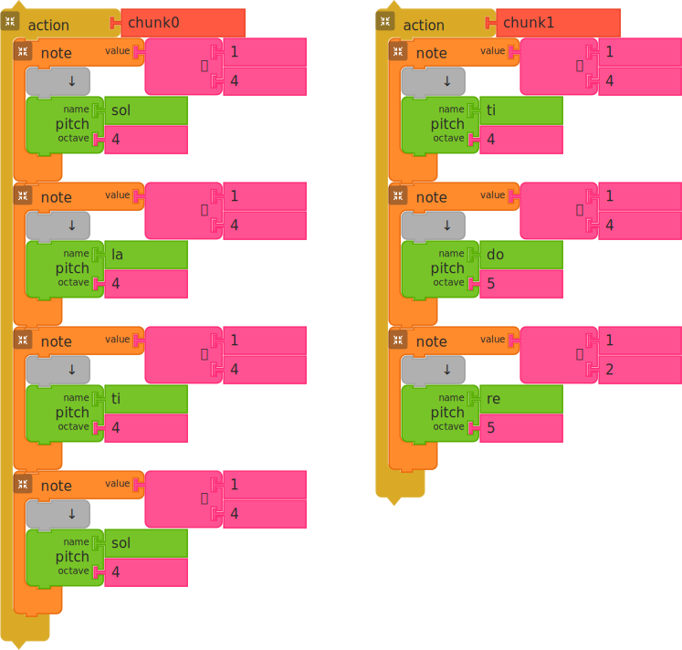

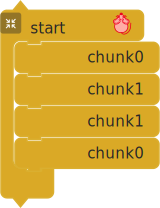

You can also mix and match actions. Here we play the *Action* block with
name `chunk0`, followed by `chunk1` twice, and then `chunk0` again.

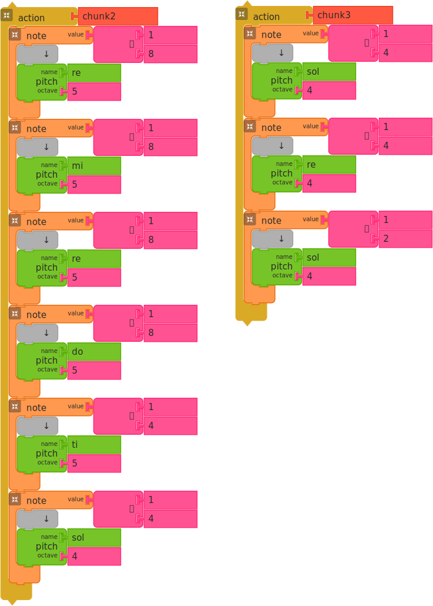

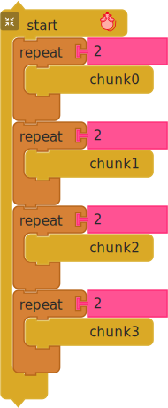

A few more chunks and we can make a song. (Can you read the block
notation well enough to guess the outcome? Are you familiar with the
song we created?)

### <a name="TRANSFORMATION"></a>3.2 Musical Transformations

There are many ways to transform pitch, rhythm, and other sonic qualities.

#### <a name="STEP-PITCH"></a>3.2.1 Step Pitch Block

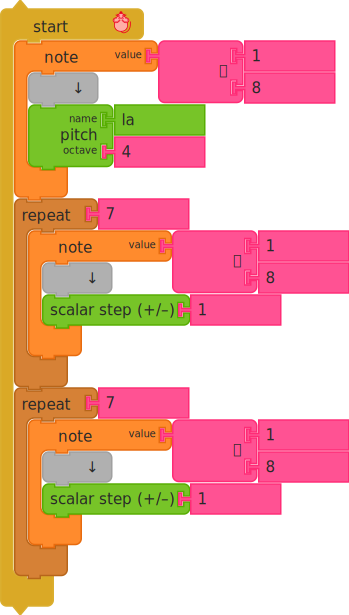

The *Step Pitch* block will move up or down notes in a scale from the
last played note. In the example above, *Step Pitch* blocks are used
inside of *Repeat* blocks to repeat the code `7` times, playing up and
down a scale.

[RUN
LIVE](https://musicblocks.sugarlabs.org/index.html?id=1523032034365533&run=True)


Another way to move up and down notes in a scale is to use the *Scalar
Step Up* and *Scalar Step Down* blocks. These blocks calculate the
number of half-steps to the next note in the current mode. (You can
read more about [Musical Modes](#modes) below.) Note that the *Mouse
Pitch Number* block returns the pitch number of the most recent note
played.

In this example, we are using the *Mode length* block, which returns
the number of scalar steps in the current mode (7 for Major and Minor
modes).

#### <a name="SHARPS-AND-FLATS"></a>3.2.2 Sharps And Flats

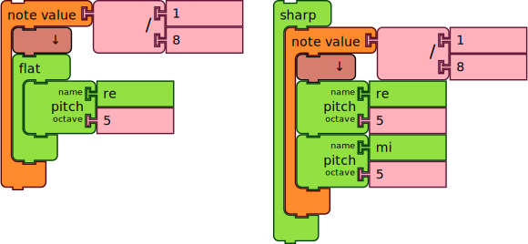

The *Accidental* block can be wrapped around *Pitch* blocks, *Note
value* blocks, or [chunks](#CHUNKS). A sharp will raise the pitch by
one half step. A flat will lower by one half step. In the example, on
the left, just the *Pitch* block `Mi` is lowered by one half step; on
the right, both *Pitch* blocks are raised by one half step. (You can
also use a double-sharp or double-flat accidental.)

#### <a name="ADJUST-TRANSPOSITION"></a>3.2.3 Adjusting Transposition

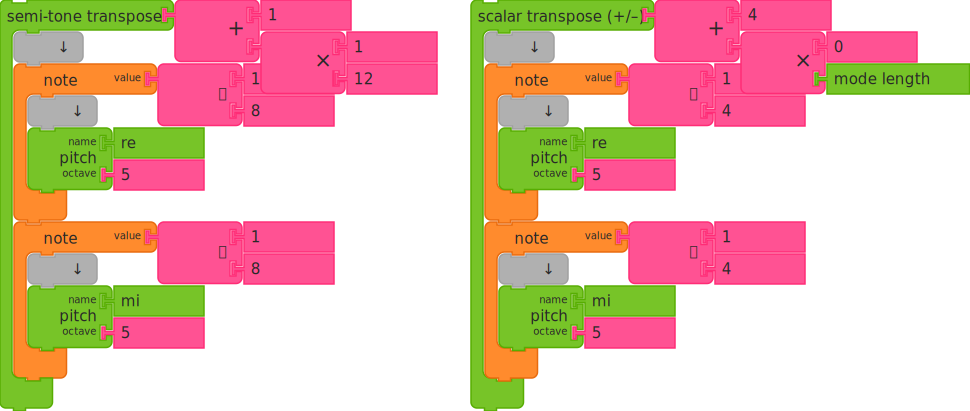

There are several ways to transpose a pitch: by semi-tone or scalar
steps. The *Semi-tone-transposition* block (above left) can be used to
make larger shifts in pitch in half-step units. A positive number
shifts the pitch up and a negative number shifts the pitch down. The
input must be a whole number. To shift up an entire octave, transpose
by `12` half-steps. `-12` will shift down an entire octave.

The *Scalar-transposition* block (above right) shifts a pitch based on
the current key and mode. For example, in `C Major`, a scalar
transposition of `1` would transpose `C` to `D` (even though it is a
transposition of `2` half steps). To transpose `E` to `F` is `1`
scalar step (or `1` half step). To shift an entire octave, scalar
transpose by the mode length up or down. (In major scales, the mode
length is `7`.)

As a convenience, a number of standard scalar transpositions are
provided: *Unison*, *Second*, *Third*, ..., *Seventh*, *Down third*,
and *Down sixth*, as well as a transposition for *Octave*.


In the example above, we take the song we programmed previously and
raise it by one octave.


The *Register* block provides an easy way to modify the register
(octave) of the notes that follow it. In the example above it is first
used to bump the `Mi 4` note up by one octave and then to bump the
`Sol 4` note down by one octave.

#### <a name="PITCH-MOVEMENT"></a>3.2.4 Summary of Pitch Movements

| Representation | Pitch Movement | Properties |
| --- | --- | --- |
| Scalar Step | scalar | 0=no change |
| | | 1=next scalar pitch in current key and mode |
| | | -1=previous scalar pitch in current key and mode |
| | | If the argument to scalar step is positive, it moves up the scale; if it is negative, it moves down the scale. |

| Music Blocks Code for Scalar Step |
| --- |
| 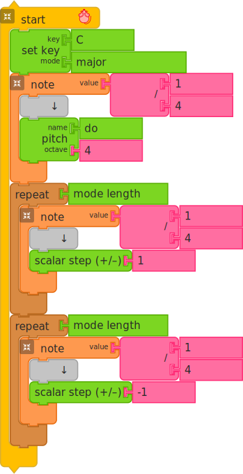 |
| The example above demonstrates traveling up and down the major scale by moving an octave up from the starting note, do, one note at a time and then back down the same way. |

| Standard Notation with Scalar Step |
| --- |
| 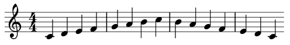 |

| Representation | Pitch Movement | Properties |
| --- | --- | --- |
| Transposition | Semi-tone | Creates shifts in pitch by half-steps |
| | | If the argument to transpose is positive, it will shift upwards in pitch; if it is negative, there will be a downwards shift. |
| | | There are 12 half-steps shifts per octave. |
| | | An argument of -12 will shift down one octave. |
| | | An argument of zero will not change the pitch. |

| Music Blocks Code with Scalar Transpose |
| --- |
| 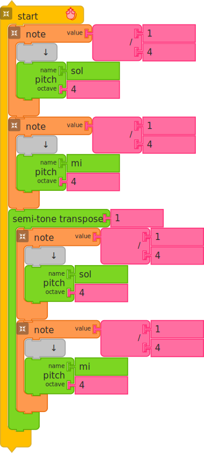 |

| Standard Notation for Scalar Transpose |
| --- |
| 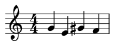 |

| Representation | Pitch Movement | Properties |
| --- | --- | --- |
| Transposition | Scalar | Shifts the pitch based on the current key and mode |
| | | Each number represents a scalar step. |
| | | Scalar transposition can transform your original key to a new key by counting the notes between the keys. |
| | | For example: Transposing C-D-E-F by 4 (fifth) will give us G-A-B-C
| | | To transpose an octave: shift by the mode length (7 in major scales) up or down. |

#### <a name="SET-KEY"></a>3.2.5 Set Key

The *Set key* block is used to change both the mode and key of the
current scale. (The current scale is used to define the mapping of
Solfege [when set Movable Do = True] to notes and also the number of half steps take by the the
*Scalar step* block.) For example, by setting the key to C Major, the
scale is defined by starting at C (or Do) and applying the pattern of half
steps defined by a Major mode. In this case, the pattern of steps
skips past all of the sharps and flats. (On a piano, C Major is just
the white keys).

When using the *Set key* block, the mode argument is used to define
the pattern of half steps and the key argument is used to define the
starting position of the pattern. For example, when mode = "major" and
key = "C", the pattern of half steps is 2 2 1 2 2 2 1 and the first
note in the scale from which the pattern is applied is "C".

| Set Key Example |
| --- |
| 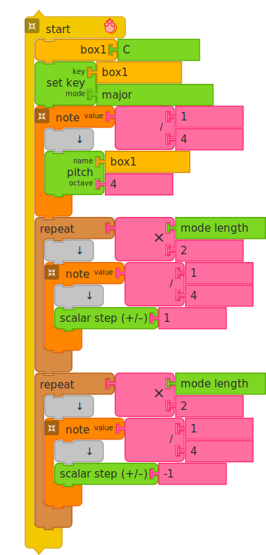 |

Using the example above, one can modify the arguments to *Set key* in
order to move up and down one octave in a scale. The example shows G
Major scale, which has an F#, but it could be used for any combination
of key and mode.

| Standard Notation for Set Key Example |
| --- |
| 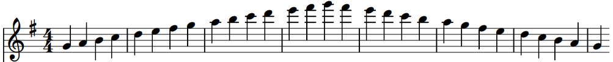 |

[RUN LIVE](https://musicblocks.sugarlabs.org/index.html?id=1662103714150464&run=True)

Various examples for Major modes are shown in the following table.

| Key | Mode | Mode Pattern in Half Steps | Pitch Pattern |
| --- | --- | --- | --- |
| C  | Major | 2 2 1 2 2 2 1 | C, D, E, F, G, A, B, C |
| G  | Major | 2 2 1 2 2 2 1 | G, A, B, C, D, E, F#, G |
| D  | Major | 2 2 1 2 2 2 1 | D, E, F#, G, A, B, C#, D |
| F  | Major | 2 2 1 2 2 2 1 | F, G, A, B♭, C, D, E, F |
| B♭ | Major | 2 2 1 2 2 2 1 | B♭, C, D, E♭, F, G, A, B♭ |

The next table is the same sets of various keys (starting pitches),
but the mode is set to "Dorian" instead of Major.

| Key | Mode | Mode Pattern in Half Steps | Pitch Pattern |
| --- | --- | --- | --- |
| C  | Dorian | 2 1 2 2 2 1 2 | C, D, E♭, F, G, A, B♭, C |
| G  | Dorian | 2 1 2 2 2 1 2 | G, A, B♭, C, D, E, F, G |
| D  | Dorian | 2 1 2 2 2 1 2 | D, E, F, G, A, B, C, D |
| F  | Dorian | 2 1 2 2 2 1 2 | F, G, A♭, B♭, C, D, E♭, F |
| B♭ | Dorian | 2 1 2 2 2 1 2 | B♭, C, D♭, E♭, F, G, A♭, B♭ |

This last table is the same set of keys as the above two tables, but
the mode is set to "Phrygian".

| Key | Mode | Mode Pattern in Half Steps | Pitch Pattern |
| --- | --- | --- | --- |
| C  | Phrygian | 1 2 2 2 1 2 2 | C, D♭, E♭, F, G, A♭, B♭, C |
| G  | Phrygian | 1 2 2 2 1 2 2 | G, A♭, B♭, C, D, E♭, F, G |
| D  | Phrygian | 1 2 2 2 1 2 2 | D, E♭, F, G, A, B♭, C, D |
| F  | Phrygian | 1 2 2 2 1 2 2 | F, G♭, A♭, B♭, C, D♭, E♭, F |
| B♭ | Phrygian | 1 2 2 2 1 2 2 | B♭, C♭, D♭, E♭, F, G♭, A♭, B♭ |

Notice how in all the examples, the sets with the same mode results in
the same "Mode Pattern of Half Steps", but the resultant "Pitch
Pattern" is different. Also, notice how G Dorian and F Major have the
same set of pitches in "Pitch Pattern" (they both have B♭ and no other
sharps or flats). C Dorian, D Phrygian, and B♭ Major all have the same
set of pitches as well (all three have B♭ and E♭).

If these lists were expanded further, there would be many more such
examples. These are because these modes (Major, Dorian, and Phrygian)
all have essentially the same modal pattern; the starting point is
just shifted slightly for each: Dorian could be thought of starting
from the second scale degree of Major and Phrygian from the third, for
example. Not all modes have this relationship to Major. The ones that
do are: Ionian (Major), Dorian, Phrygian, Lydian, Myxolydian, Aeolian
(Minor), and Locrian.

**Set Key & Scalar Step**

The *Set key* block is used to select a subset of notes in the given
temperament. (By default, Music Blocks uses equal temperament of 12
equal divisions of the octave. The key and mode determine which of
these notes will be used.)

**Set Key & Movable Do**

The *Set Key* block will change the key and mode of the mapping
between solfege, e.g., `Do`, `Re`, `Mi`, to note names, e.g., `F#`,
`G#`, `A#`, when in F# Major.  It only impacts the mapping of solfege 
when the *movable Do* block is set to True.

You can find the *Set key* block on the *Intervals* palette.

| Music Blocks for Set Key and Movable Do | 
| --- |
| 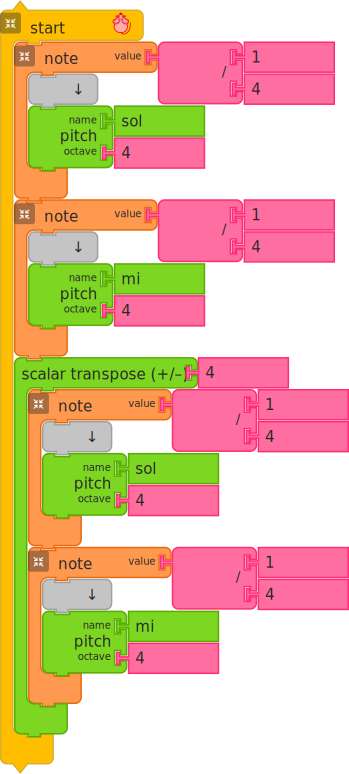 |

| Standard Notation for Set Key and Movable Do |
| --- |
|  |

| Representation | Pitch Movement | Properties |
| --- | --- | --- |
| Scale Degree | Scalar | The key block sets the key and mode. |
| | | The scale degree blocks indicate which position the pitch is taking in the scale relative to the tonic which is "scale degree 1". |

| Music Blocks Code with Scale Degrees 1-5 |
| --- |
| 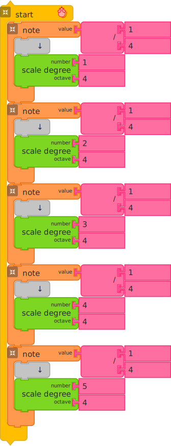 |

| Standard Notation for Scale Degrees 1-5 |
| --- |
|  |

| Representation | Pitch Movement | Properties |
| --- | --- | --- |
| Movable “Do” | Advanced transposition by mode | Movable Do in combination with the Scale/Mode blocks will transpose sections of music in a nuanced way. |
| | | The Set-key block allows you to  change both the mode and key of how solfege is mapped to the notes. |
| | | For example, in C major - Do is C, Re is D, Mi is E, etc. |
| | | In F major - Do is F, Re is G, Mi is A |

| Music Blocks Code with Set Key and Movable Do |
| --- |
| 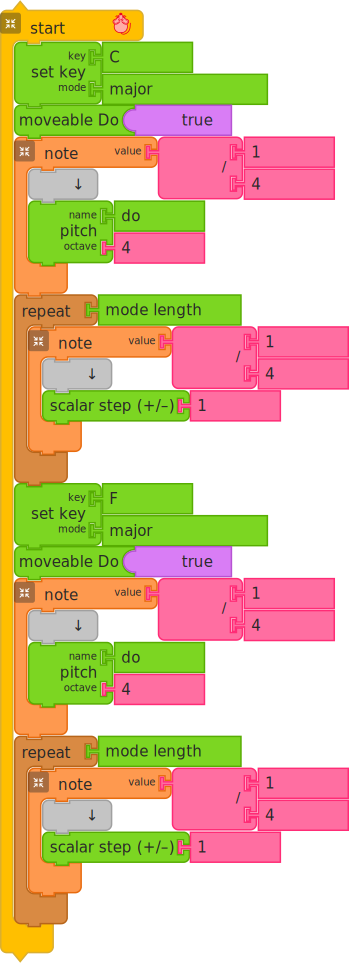 |

| Standard Notation Code for Set Key and Movable Do |
| --- |
| 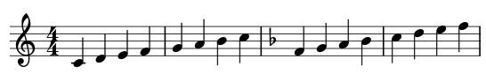 |

| Representation | Pitch Movement | Properties |
| --- | --- | --- |
| Movable “Do” | Advanced transposition by mode | You also have the option of changing the mode to Minor, Major, Chromatic, and many other exotic modes like hirajoshi, as shown in the example below. |

| Music Blocks for Set Key and Scalar Step |
| --- |
| 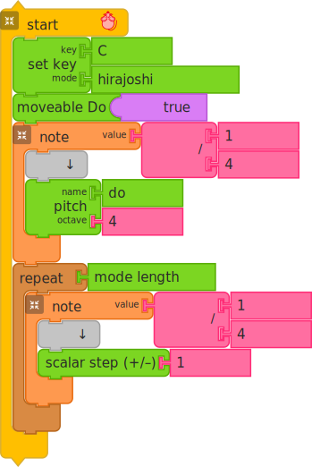 |

| Standard Notation with Set Key and Scalar Step |
| --- |
| 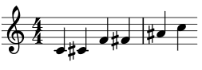 |

#### <a name="FIXED-AND-MOVABLE-PITCH-SYSTEMS"></a>3.2.6 Pitch Systems: Fixed and Movable and Subsystems

Music Blocks allows users to express and explore musical ideas in a
variety of different systems. The main systems of expression are fixed
and movable.

**Fixed and Movable Systems**

Fixed pitch systems represent pitches in an absolute way. Pitches in a
fixed system do not change, regardless of a tonal context (such as key
or mode). Movable systems, on the other hand, represent pitches in a
relative way based on their tonal context.

An example of a fixed system is Alphabet Notation. Pitches are
expressed as `A`, `B`, `C`, `D`, `E`, `F`, and `G`. Regardless of
whether the key is C major or G minor, the pitch of `G` is the
same. In Alphabet Notation, pitches are the same ("fixed") regardless
of the context.

 System")

An example of a movable system is Scale Degree. Pitches are expressed
as `1`, `2`, `3`, `4`, `5`, `6`, and `7`. For C major, these pitches
are `C`, `D`, `E`, `F`, `G`, `A`, and `B`. For G (natural) minor,
these pitches are `G`, `A`, `B♭`, `C`, `D`, `E♭`, and `F`. For D
dorian, these pitches are `D`, `E`, `F`, `G`, `A`, `B`, and `C`. In
all three examples, the pitches are determined by the tonal context.

 System")

Solfege is an example of a system that can be either fixed or movable;
it can either be a fixed system (Fixed Solfege) or a movable system
(Movable Solfege).

Fixed Solfege works like the alphabet system; `La` is `A`, `Ti` is
`B`, `Do` is `C`, etc. Context does not affect the sounding
pitch. Movable Solfege works like the Scale Degree system; for any
major, `Do` is 1st scale degree, `Re` is 2nd, `Mi` is 3rd, `Fa` is
4th, etc. Hence, in Movable Solfege in the key of G (natural) minor,
`Do` is `G`, `Re` is `A`, et al.


Music Blocks users can create and preview code in both Fixed Solfege
and Movable Solfege. Teachers and learners may use either system (or
both) to express their musical ideas as well as deepen their
understanding of music.

**Using Tonal Context with Movable Systems**

For movable systems an important point of context is its key and
mode. For "C Major", the key is "C" and the mode is "Major" (also
called Ionian). Key and mode are important as they define the tonal
framework, i.e., which pitches are "in" and which are "out". It also
defines the function of the pitches within the framework. This is why
for scale degrees `1`, `2`, `3`, `4`, and `5`, the expected result for
C major is `C`, `D`, `E`, `F`, and `G` (skipping any sharps/flats),
while those same scale degrees for D major are `D`, `E`, `F#`, `G`,
and `A`. The set of pitches that make up C major have no sharps or
flats, so they are skipped. D major has two sharps, `F#` and `C#`. The
`F#` is the 3rd scale degree for D major.

Scale Degree with *Set Key* is a very powerful tool for expression. It
is also very common in music pedagogy. However, because the number
values 1-7 are hard wired into this system, it is a tool that works
best to express seven-pitch tonal frameworks (e.g. major, minor, and
other common seven pitch scales). For musical ideas where a more
purely mathematical form of expression is required, Music Blocks
offers the user the *nth Modal Pitch* block.

*nth Modal Pitch* is similar to *Scale Degree* in that it is a movable
system that uses numbers to express pitches. However, unlike *Scale
Degree*, *nth Modal Pitch* starts at `0`, allows for negative
numbers, and is not restricted to a seven-pitch tonal framework. `0`
is the first pitch of the mode, `1` is the next pitch, `2` is the
pitch above that, etc. `-1` is the pitch before the first pitch of
the mode. This tool is expecially helpful for expressing a musical
idea that requires computation as you can run computations directly
on the number value. It is also helpful if you are, for example,
creating music in a whole tone (six note) pitch space. In the case of
*Set Key* set to "whole tone", `6` would be the octave above.

**Pitch Number, MIDI, and Set Pitch Number Offset**

*Pitch Number* is similar to *nth Modal Pitch* in that it is a
zero-based, mathematical system to express pitches. However, unlike
*nth Modal Pitch*, *Pitch Number* disregards any tonal framework. It
is also chromatic by default, meaning that its pitch space includes
the sharp/flat pitches (black keys on piano) as well as the natural
pitches (white keys on piano). By default, middle C (C_4) is `0`. The
C major scale in the 4th octave is `0`, `2`, `4`, `5`, `7`, `9`, and
`11`. `12` is the C an octave above middle C (C_5). This system is
useful mathematically, but because it disregards key, it is difficult
to control when creating music. That being said, fretted instruments
such as ukulele and guitar use this system to express pitch, so it is
a good system for expressing how these instruments work.

MIDI also uses a similar system to *Pitch Number* to express pitches,
but the 0 is offset from Music Blocks' default. In order to change the
sounding pitch of `0` for *Pitch Number*, use *set pitch number
offset*. This makes *Pitch Number* blocks behave as a relative system
as it transposes the pitches up or down accordingly (but has no effect
on key).

**Two Subsystems for Movable**

For Movable Do, there exists yet two more systems. One system, which
we call `Movable=Do`, allows the user to express solfege syllables in
relation to the Major mode. Therefore, if a user were to specify A
minor, then La would be A, the first scale degree in A Minor. The
other system, which we call `Movable=La` allows the user to express
solfege in relation to the particular mode specified. Therefore, if a
user were to specify A Minor, then Do would be A. *Scale Degree* works
like `Movable=La` by default such that `1` is always the first pitch
of a given mode.

Because some users may want to explicitly spell out all of the pitches
regardless of the chosen key, we allow them to use Scale Degree with
the *Movable Do* block (remember, Scale Degree works like Movable=La
by default). Please see [this
code](https://rawgithub.com/sugarlabs/musicblocks/master/examples/2-spelling-systems-for-Scale-Degree.html)
as an example.

The following chart describes the behavior of different blocks
depending on whether or not a *Movable Do* block is present.

| Block(s) | Fixed or Movable? (Do or La?) | Set Key Transformation? |
| --- | --- | --- |
| Alphabet Pitch | Fixed | No effect. |
| Solfege | Fixed by default  | No effect. |
| Solfege and Movable=Do | Specified via "movable" block set to Do | Yes. |
| Solfege and Movable=La | Specified via "movable" block set to La | Yes. Works like Scale Degree. |
| n^th modal pitch | Movable | Yes. Good for modes of any length. |
| Scale Degree | Movable | Yes. Most useful for 7 note systems. Works just like Movable=La for Solfege by default. |
| Scale Degree and Movable=Do | Movable | Yes. When preceded by Movable=Do, the user can be explicit in their spelling. |
| Scalar Step | Movable | Yes. Navigates up/down within *nth modal pitch* space. |
| Scalar Interval | Movable | Yes. Adds above/under within *nth modal pitch* space. |
| Scalar Inversion | Movable | Yes. Inversion around a specified axis within *nth modal pitch* space. |
| Pitch Number | Movable | No effect. Pitches can be transformed via Set Pitch Number Offset. |

Illustrative example:

The following example demonstrates how the Scale Degree functionality
combines math and musical modifiers. When combining numbers and
accidentals, it recreates the same functionality as the *Scale Degree*
block.


[Scale Degree Improv](https://rawgit.com/sugarlabs/musicblocks/master/examples/Scale-Degree-Improv.html)

#### <a name="DOTTED"></a>3.2.7 Dotted Notes

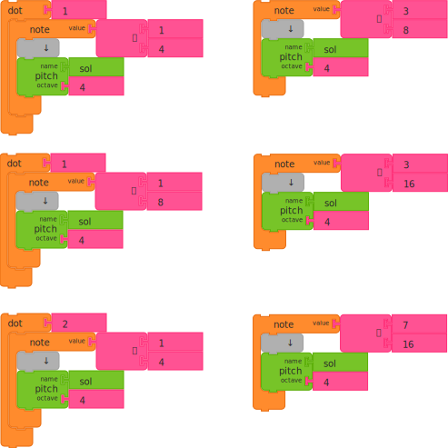

You can "dot" notes using the *Dot* block. A dotted note extends the
rhythmic duration of a note by 50%. E.g., a dotted quarter note will
play for `3/8` `(i.e. 1/4 + 1/8)` of a beat. A dotted eighth note will
play for `3/16` `(i.e. 1/8 + 1/16)` of a beat. A double dot extends
the duration by `75%` `(i.e. 50% + [50% of 50%])`. For example, a
double-dotted quarter note will play for `7/16` `(i.e. 1/4 + 1/8 +
1/16)` of a beat (which is the same as `4/16 + 2/16 + 1/16 = 7/16`).

The dot block is useful as an expression of musical rhythm--it is
convenient and helps to organize musical ideas (e.g. many melodies use
dots as the basis of their rhythmic motifs), however you can achieve
the same rhythmic result as dot by putting the calculation directly
into note value as well. For example, indicating `3/8` instead of
`1/4` will result in a dotted quarter note.

The chart below shows two common examples, dotted quarter and dotted
eighth, and how to achieve them with either the dot block or by direct
calculation into a note's note value.


#### <a name="MULTIPLY-AND-DIVIDE"></a>3.2.8 Changing Note(s) duration via Mathematical Operations

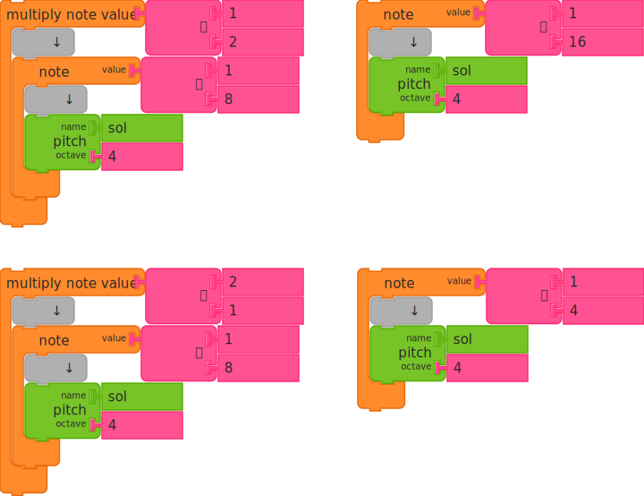

You can also multiply (or divide) the note value, which will change
the duration of the notes by changing their note values. Multiplying
the note value of an `1/8` note by `1/2` is the equivalent of playing
a `1/16` note (i.e. `1/2 * 1/8 = 1/16`) . Multiplying the note value
of an `1/8` note by `2/1` (which has the effect of dividing by `1/2`)
will result in the equivalent of a `1/4` note.

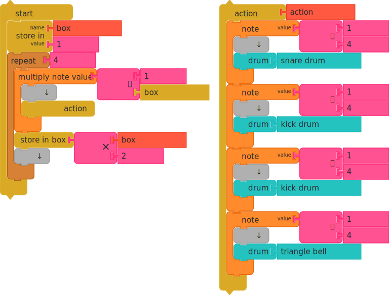

In the above example, the sequence of [drum](#DRUMS) note values is
decreased over time, at each repetition.

[RUN LIVE](https://musicblocks.sugarlabs.org/index.html?id=1523106271018484&run=True)

#### <a name="REPETITION"></a>3.2.9 Repeating Notes

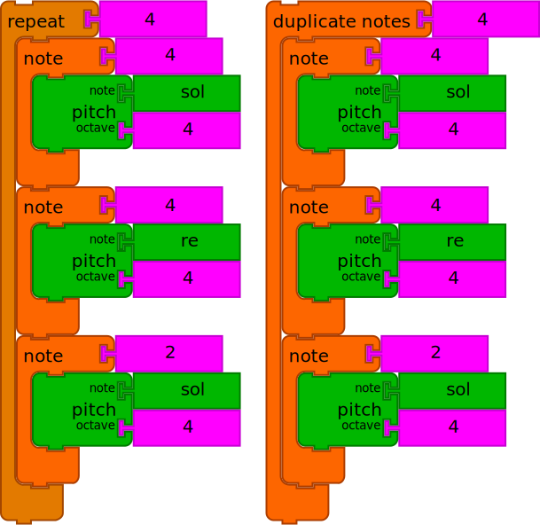

There are several ways to repeat notes. The *Repeat* block will play a
sequence of notes multiple times; the *Duplicate* block will repeat each
note in a sequence.

In the example, on the left, the result would be `Sol, Re, Sol, Sol,
Re, Sol, Sol, Re, Sol, Sol, Re, Sol`; on the right the result would be
`Sol, Sol, Sol, Sol, Re, Re, Re, Re, Sol, Sol, Sol, Sol`.

#### <a name="SWINGING"></a>3.2.10 Swinging Notes and Tied Notes

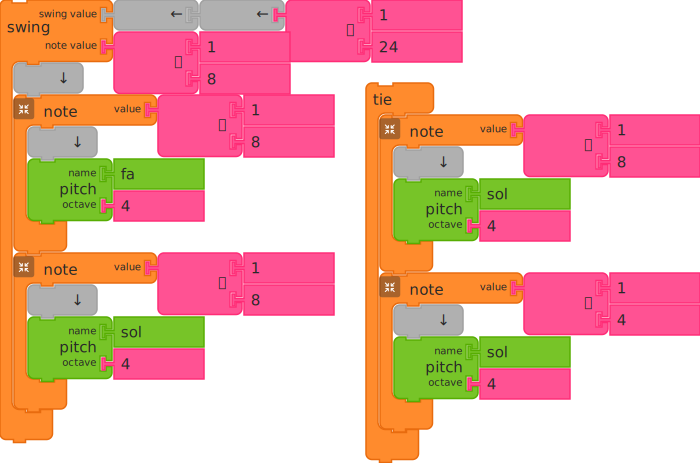

The *Swing* block works on pairs of notes (specified by note value),
adding some duration (specified by swing value) to the first note and
taking the same amount from the second note. Notes that do not match
note value are unchanged.

In the example, `re5` would be played as a `1/6` note and `mi5` would
be played as a `1/12` note (`1/8 + 1/24 === 1/6` and `1/8 - 1/24 ===
1/12`). Observe that the total duration of the pair of notes is
unchanged.

Tie also works on pairs of notes, combining them into one note. (The
notes must be identical in pitch, but can vary in rhythm.)

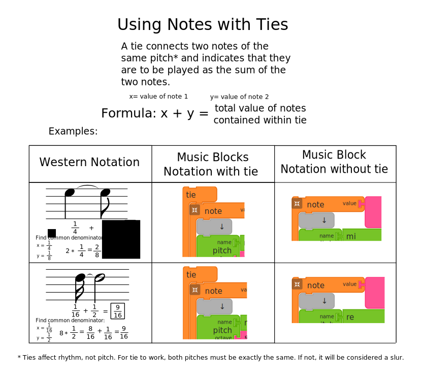

#### <a name="MORE-TRANSFORMATIONS"></a>3.2.11 Set Volume, Crescendo, Staccato, and Slur

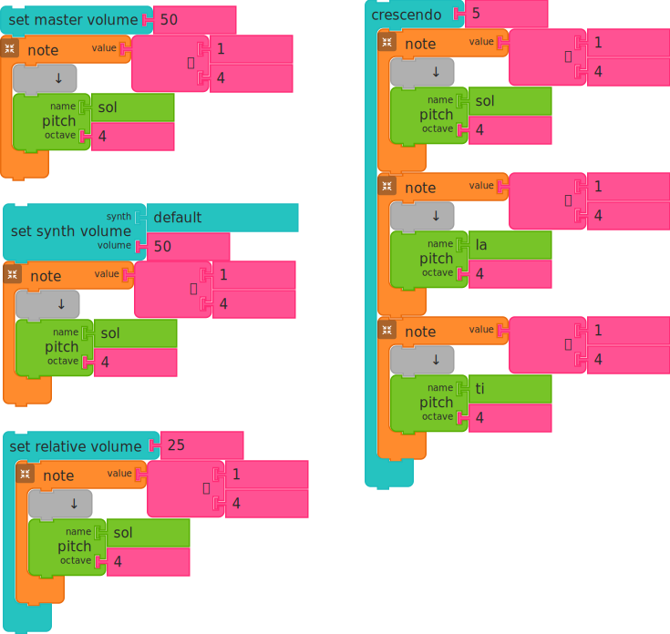

The *Set master volume* block will change the master volume. The
default is `50`; the range is `0` (silence) to `100` (full volume).

The *Set synth volume* block will change the volume of a particular
synth, e.g., `violin`, `snare drum`, etc. The default volume is `50`;
the range is `0` (silence) to `100` (full volume). In the example, the
*synth name* block is used to select the current synth.

As a convenience, a number of standard volume blocks are provided:
from loudest to quietest, there is *fff*, *ff* *f*, *mf*, *mp*, *p*,
*pp*, and *ppp*. In musical terms "f" means "forte" or loud, "p" means
"piano" or soft, and "m" means "mezzo" or middle.

The *Set Relative Volume* block modifies the clamped note's volume
according to the input value of the block in an added (or subtracted
when negative) percentage with respect to the original volume. For
example, `100` would mean doubling the current volume.

The *Crescendo* block will increase (or decrease) the volume of the
contained notes by a specified amount for every note played. For
example, if you have 3 notes in sequence contained in a *Crescendo*
block with a value of `5`, the final note will be at 15% more 
than the original value for volume.

NOTE: The *Crescendo* block does not alter the volume of a note as it
is being played. Music Blocks does not yet have this functionality.

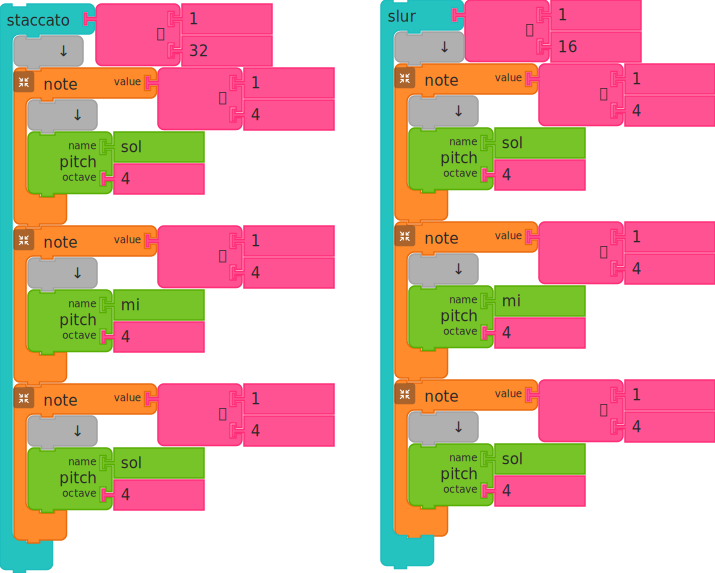

The *Staccato* block shortens the length of the actual
note&mdash;making them tighter bursts&mdash;while maintaining the
specified rhythmic value of the notes.

The *Slur* block lengthens the sustain of notes&mdash;running longer than
the noted duration and blending it into the next note&mdash;while
maintaining the specified rhythmic value of the notes.

#### <a name="INTERVALS"></a>3.2.12 Intervals

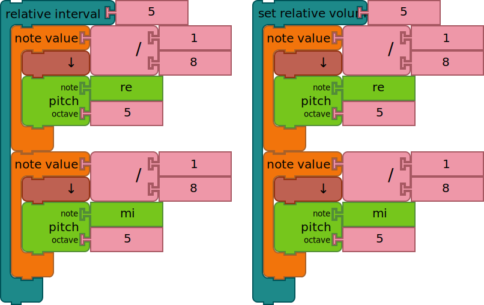

The *Scalar interval* block calculates a relative interval based on
the current mode, skipping all notes outside of the mode. For example,
a *fifth*, and adds the additional pitches to a note's playback. In
the figure, we add `La` to `Re` and `Ti` to `Mi`.

As a convenience, a number of standard scalar intervals are provided
on the *Intervals* palette: *Unison*, *Second*, *Third*, ...,
*Seventh*, *Down third*, and *Down sixth*.

The *Scalar interval measure* block can be used to measure the number
of scalar steps between two pitched.

#### <a name= "ABSOLUTE-INTERVALS"></a>Absolute Intervals

Absolute (or semi-tone) intervals are based on half-steps.

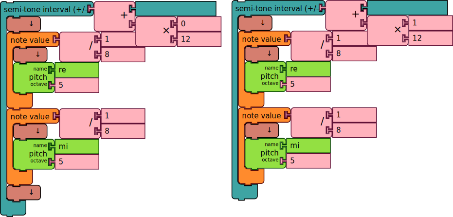

The *Augmented* block calculates an absolute interval (in half-steps),
e.g., an augmented fifth, and adds the additional pitches to a
note. Similarly, the *Minor* block calculates an absolute interval,
e.g., a minor third. Other absolute intervals include *Perfect*,
*Diminished*, and *Major*.

In the augmented fifth example above, a chord of `D5` and `A5` are
played, followed by a chord of `E5` and `C5`. In the minor third
example, which includes a shift of one octave, first a chord of `D5`
and `F5` is played, followed by chord of `E5` and `G6`.

As a convenience, a number of standard absolute intervals are provided
on the *Intervals* palette: *Major 2*, *Minor 3*, *Perfect 4*,
*Augmented 6*, *Diminished 8*, et al.

The *Doubly* block can be used to create a double augmentation or
double diminishment.

The *Semi-tone interval measure* block can be used to measure the
number of half-steps between two pitched.

#### <a name= "CHORDS"></a>Chords

A chord is a group of notes that are played together (often used for
harmony in music). There are triads (three notes), tetrachords (four
notes), and even five-, six-, and seven-note chords.

The *Chord* block builds a chord from a base note.


We support many basic chords:

| chord | intervals | example |
| :---: | :-------: | :-----: |
| major | 1 4 7 | C major C - E - G |
| minor | 1 3 7 | C minor C - E♭ - G |
| dominant 7 | 1 4 7 10 | C7 C - E - G - B♭ |
| minor 7 | 1 3 7 10 | Cmin7 C - E♭ - G - B♭ |
| major 7 | 1 4 7 11 | Cmaj7 C - E - G - B |

#### <a name= "INVERSION"></a>3.2.13 Inversion

The *Invert* block will rotate a series of notes around a target
note. There are three different modes of the *Invert* block: *even*,
*odd*, and *scalar*. In *even* and *odd* modes, the rotation is based
on half-steps. In *even* and *scalar* mode, the point of rotation is
the given note. In *odd* mode, the point of rotation is shifted up by
a `1/4` step, enabling rotation around a point between two notes. In
"scalar" mode, the scalar interval is preserved around the point of
rotation.

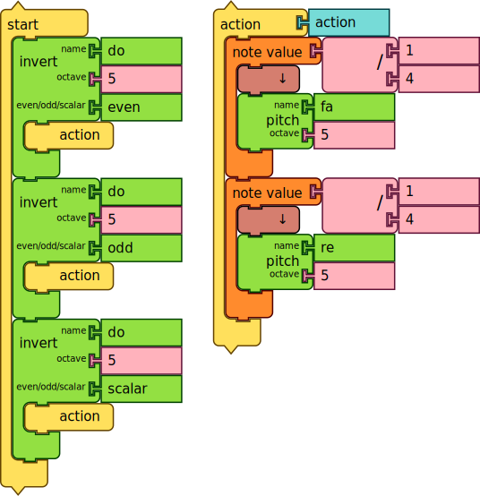

NOTE: The initial `C5` pitch (as a half note) remains unchanged (in
all of the examples) as it is outside of the invert block.

The above example code has an *even* inversion for two notes `F5` and
`D5` around the reference pitch of `C5`. We would expect the following
results:

Even inversion

| Starting pitch | Distance from `C5`    | Inverse distance from `C5` | Ending pitch |
| :------------: | :-------------------: | :------------------------: | :----------: |
| `F5`           | 5 half steps *above*  | 5 half steps *below*       | `G4`         |
| `D5`           | 2 half steps *above*  | 2 half steps *below*       | `B♭4`        |

This operation can also be visualized on a pitch clock. The arrows on
the following diagram point from the starting pitch, around the axis
of the reference pitch, to its destination ending pitch.

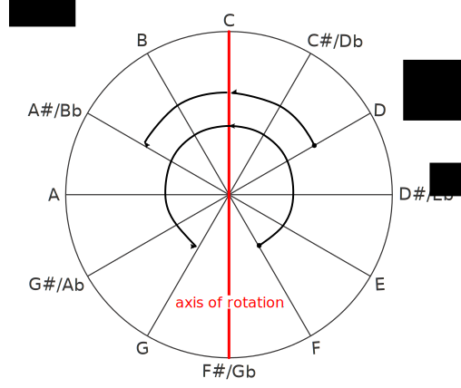

In standard notation the result of this *even* inversion operation is
depicted in the second measure of the following example. The first
measure is the original reference.

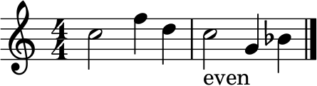

Underneath the *even* inversion in the example code is an *odd*
inversion for the same two notes of `F5` and `D5` around the same
reference pitch of `C5`. We would expect the following results:

Odd inversion

| Starting pitch | Distance from midway-point between `C5` and `C♯5` | Inverse distance from midway-point between `C5` and `C♯5` | Ending pitch |
| :------------: | :-----------------------------------------------: | :-------------------------------------------------------: | :----------: |
| `F5`           | 4.5 half steps *above*                            | 4.5 half steps *below*                                    | `A♭4`        |
| `D5`           | 1.5 half steps *below*                            | 1.5 half steps *above*                                    | `B4`         |

This operation can be visualized on a pitch clock similar to *even*
inversion except offset in-between `C5` and `C♯5` (i.e. quarter step
*above* `C5`).

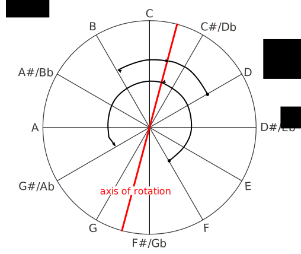

In standard notation the result of this *odd* inversion operation is
depicted in second measure of the following example. The first measure
is the original reference. NOTE: The `C5` pitch remains unchanged as
it is not operated upon in the example block code (above). If it were
contained in the operation it would be changed to `C♯5` (i.e. `C5` is
0.5 half steps *below* the axis of rotation, so the result of an
inversion around `C5` and `odd` would be 0.5 half steps *above* the
axis of rotation).


Scalar inversion

Underneath the *even* and *odd* inversion blocks in the example code
is an inversion block set to *scalar*. We would expect the following
results:

| Starting pitch | Scalar distance from `C5` (in steps) | Inverse scalar distance from `C5` (in steps) | Ending pitch |
| :------------: | :----------------------------------: | :------------------------------------------: | :----------: |
| `F5`           | 3 above (C5 --> D5 --> E5 --> F5)    | 3 below (C5 --> B4 --> A4 --> G4)            | `G4`         |
| `D5`           | 1 above (C5 --> D5)                  | 1 below (C5 --> B4)                          | `B4`         |

This operation can be visualized on a pitch clock similar to *odd* and
*even* except that all non-scalar pitches (i.e. pitches outside the
chosen key) are skipped. NOTE: The scalar pitches are shown in bold in
the following pitch clock diagram.

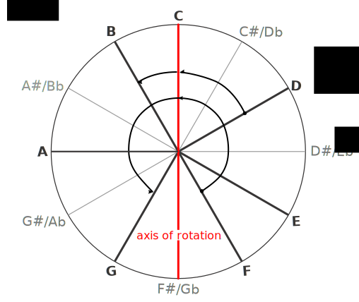

In standard notation the result of *scalar* inversion operation is
depicted in the second measure of the following example. The first
measure is the original reference.

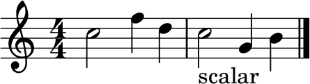

In the *invert (even)* example above, notes are inverted around `C5`.
In the *invert (odd)* example, notes are inverted around a point
midway between `C5` and `C♯5`.  In the *invert (scalar)* example,
notes are inverted around `C5`, by scalar steps rather than
half-steps.

#### <a name="BACKWARDS"></a>3.2.14 Backwards

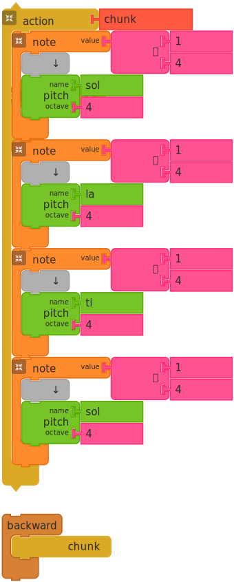

The *Backward* block will play the contained notes in reverse order
(retrograde). In the example above, the notes in `chunk` are played as
`Sol`, `Ti`, `La`, `Sol`, i.e., from the bottom to the top of the
stack.

An example from Bach is provided. In the example, there are two
voices, one which plays the composition forward and one that plays the
same composition backward. [RUN
LIVE](https://musicblocks.sugarlabs.org/index.html?id=1522885752309944&run=True)

Note that all of the blocks inside a *Backward* block are reverse, so
use this feature with caution if you include logic intermixed with
notes.

#### <a name= "SETTINGVOICE"></a>3.2.15 Setting Instrument

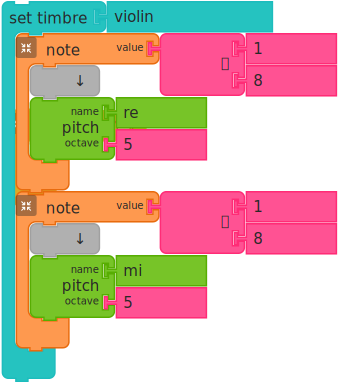

The default instrument is an electronic synthesizer, so by default,
that is the instrument used when playing notes. You can override this
default for a group of notes by using the *Set Instrument* block. It
will select a [voice](#VOICES) for the synthesizer for any contained
blocks, e.g., violin.

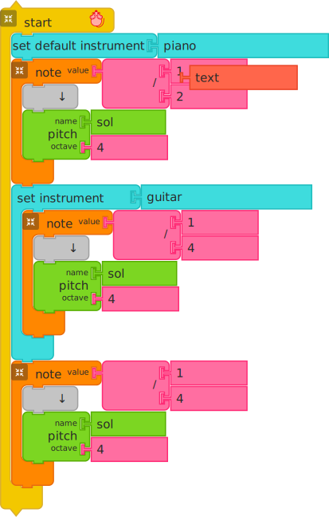

You can also override the default using the *Set default instrument*
block. In the example above, the default instrument is set to piano,
so any note that is not inside of a *Set instrument* block will be
played using the piano synthesizer. The first note in this example is
piano; the second note is guitar; and the thrid is piano.

#### <a name= "SETTINGKEY"></a>3.2.16 Setting Key and Mode

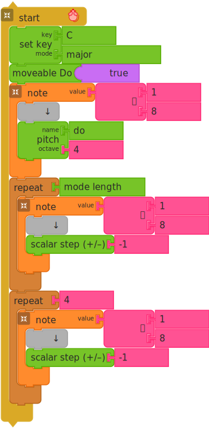

The *Set Key* block will change the key and mode of the mapping
between solfege, e.g., `Do`, `Re`, `Mi`, to note names, e.g., `C`,
`D`, `E`, when in C Major. Modes include Major and Minor, Chromatic,
and a number of more exotic modes, such as Bebop, Geez, Maqam, etc.
This block allows users to access "movable Do" within Music Blocks,
where the mapping of solfege to particular pitch changes depending on
the user's specified tonality.

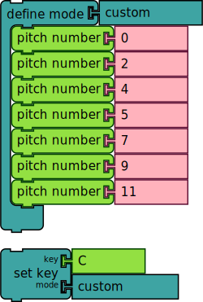

The *Define mode* block can be used to define a custom mode by
defining the number and size of the steps within an octave. You can
use your custom mode with the *Set key* block.

#### <a name="VIBRATO"></a>3.2.17 Vibrato, Tremelo, et al.

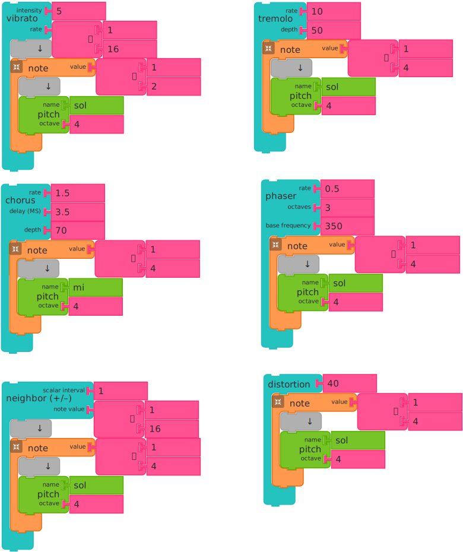

The *Vibrato* Block adds a rapid variation in pitch to any contained
notes. The intensity of the variation ranges from `1` to `100` (cents),
e.g. plus or minus up to one half step. The rate argument determines
the rate of the variation.

The other effects blocks also modulate pitch over time. Give them a try.

### <a name="VOICES"></a>3.3 Voices

Each *Start* block runs as a separate voice in Music Blocks. (When
you click on the Run button, all of the *Start* blocks are run
concurrently.)

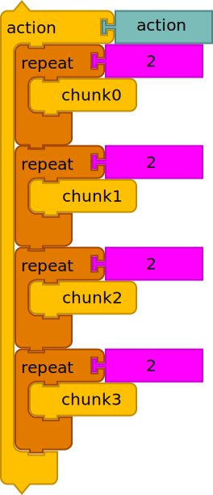

If we put our song into an action...

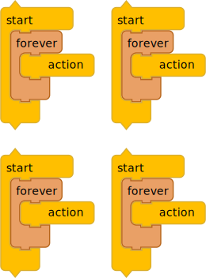

...we can run it from multiple *Start* blocks.

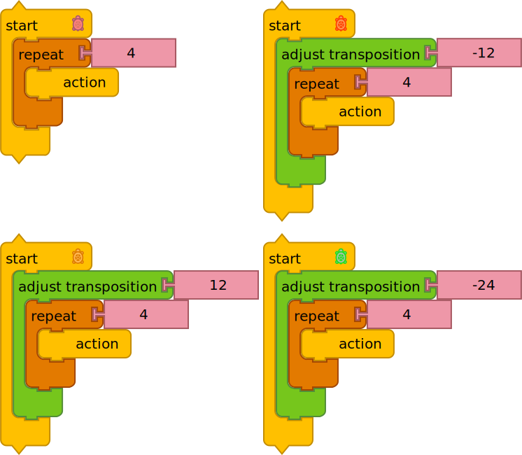

It gets more interesting if we shift up and down octaves.


And even more interesting if we bring the various voices offset in time.

[RUN
LIVE](https://musicblocks.sugarlabs.org/index.html?id=1523026536194324&run=True)

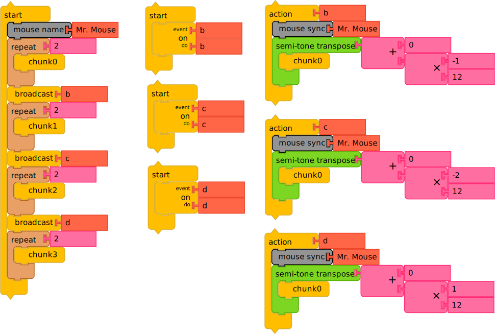

An alternative to use a preprogrammed delay is to use the *Broadcast*
block to bring in multiple voices. In the example above, after each
section of the song is played, a new event is broadcasted, bringing in
a new voice. Note the use of the *Mouse Sync* block. This ensures that
the multiple voices are synced to the same master clock.

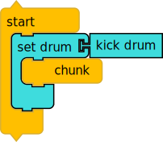

A special *Start drum* version of the *Start* block is available for
laying down a drum track. Any *Pitch* blocks encounted while starting
from a drum will be played as `C2` with the default drum sample. In
the example above, all of the notes in `chunk` will be played with a
kick drum.

### <a name="GRAPHICS"></a>3.4 Adding graphics

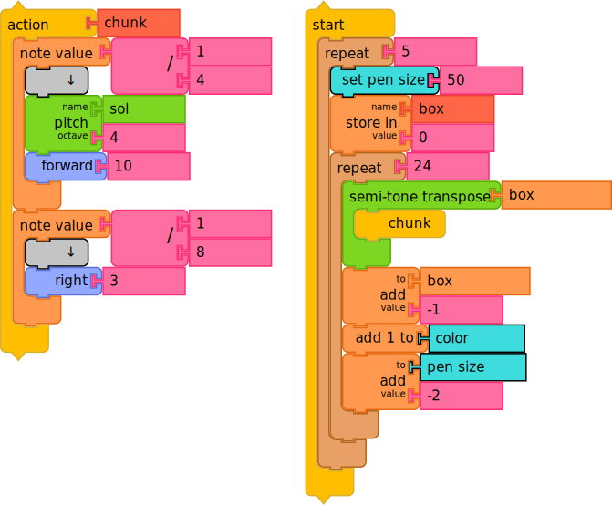


Turtle graphics can be combined with the music blocks. By placing
graphics blocks, e.g., *Forward* and *Right*, inside of *Note value*
blocks, the graphics stay in sync with the music. In this example, the
turtle moves forward each time a quarter note is played. It turns
right during the eighth note. The pitch is decreased by one half step,
the pen size decreases, and the pen color increases at each step in
the inner repeat loop.

[RUN
LIVE](https://musicblocks.sugarlabs.org/index.html?id=1523494709674021&run=True)

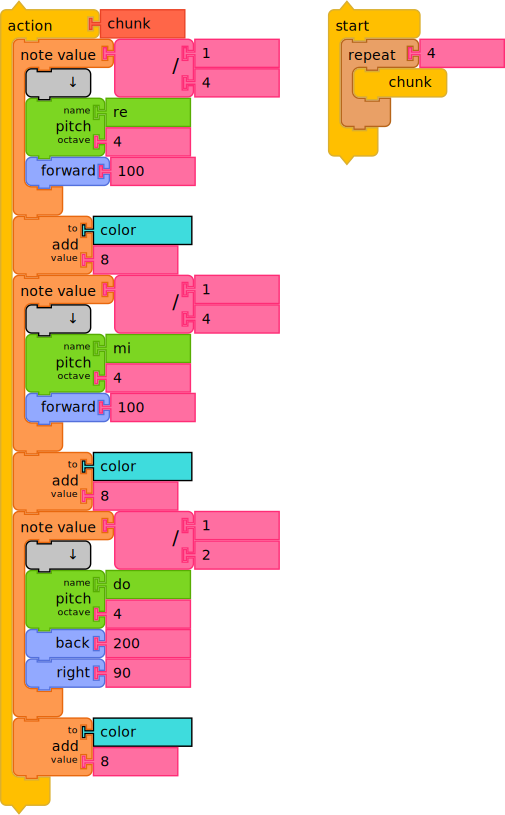

Another example of graphics synchronized to the music by placing the
graphics commands inside of *Note value* blocks

[RUN
LIVE](https://musicblocks.sugarlabs.org/index.html?id=1523106271018484&run=True)


Music Blocks has an internal "conductor" maintaining the beat.  When
the Run button is clicked, the program begins and an internal master
(or "conductor") clock starts up. All of the music tries to stay
synced to that clock.

For example, if you have multiple voices (mice), they all share the
same conductor in order to keep on the same beat. If a voice (mouse)
is falling behind, Music Blocks tries to catch up on the next note by
truncating it. If it is an 1/8 note behind and the next note is a 1/2
note, then only an 3/8 note would be played, so as to catch up. That
is a somewhat extreme example—usually the timing errors are only
very very small differences.

But in some situations, the timing errors can be very large. This is
when the *No-clock* block is used.

A typical problem is when the music is not played
continuously. Imagine an interactive game where a hero is battling a
monster. Our hero plays theme music whenever the monster is
defeated. But that might occur at any time, hence it is not going to
be in sync with the conductor. The offset could be tens of
seconds. This would mean that all of the notes in the theme music
might be consumed by trying to catch up with the conductor. The
*No-clock* block essentially says, do your own thing and don't worry
about the conductor.

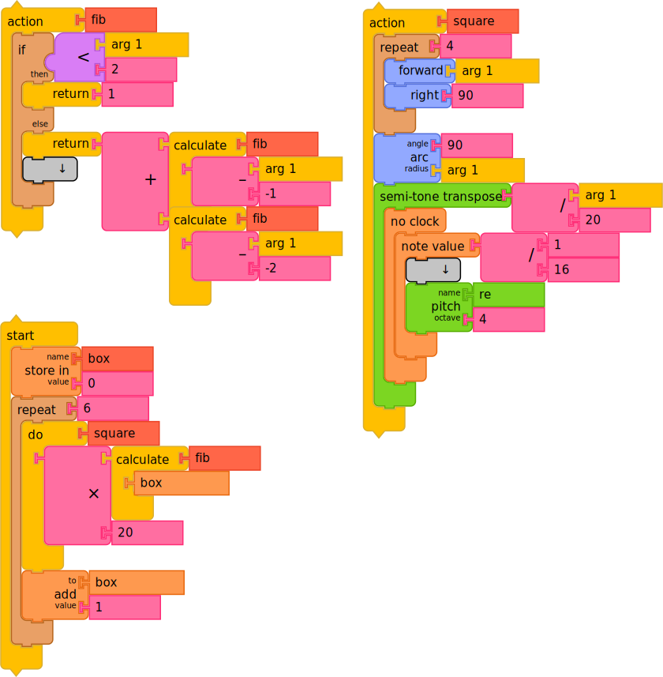

In this example, because the computation and graphics are more
complex, a *No-clock* block is used to decouple the graphics from the
master clock. The "No-clock* block prioritizes the sequence of
actions over the specified rhythm.

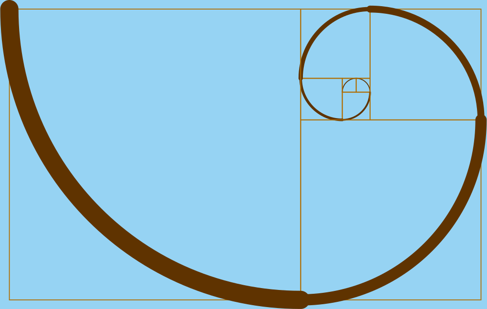

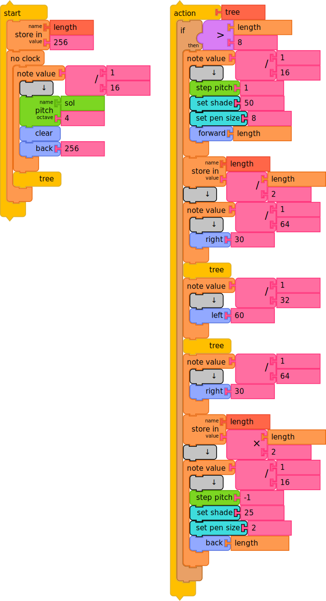

Another example of embedding graphics into notes: in case, a recursive
tree drawing, where the pitch goes up as the branches assend.


[RUN LIVE](https://musicblocks.sugarlabs.org/index.html?id=1523029986215035&run=True)

### <a name="BEAT"></a>3.5 Beat

The beat of the music is determined by the *Meter* block (by default,
it is set to 4:4).

The *Pickup* block can be used to accommodate any notes that come in
before the beat.


The Beat count block is the number of the current beat, eg 1, 2, 3, or 4. 
In the figure, it is used to take an action on the first beat of each measure.


The Measure count block returns the current measure.


Specifying beat is useful in that you can have the character of a note
vary depending upon the beat. In the example below, the volume of
notes on Beat `1` and Beat `3` are increased, while the volume of off
beats is decreased.

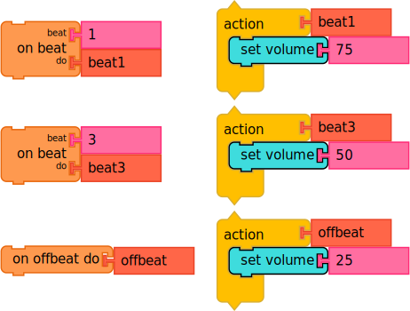

The *On-Beat-Do* and *Off-Beat-Do* blocks let you specify actions to
take on specific beats. (Note that the action is run before any blocks
inside the note block associated with the beat are run.)

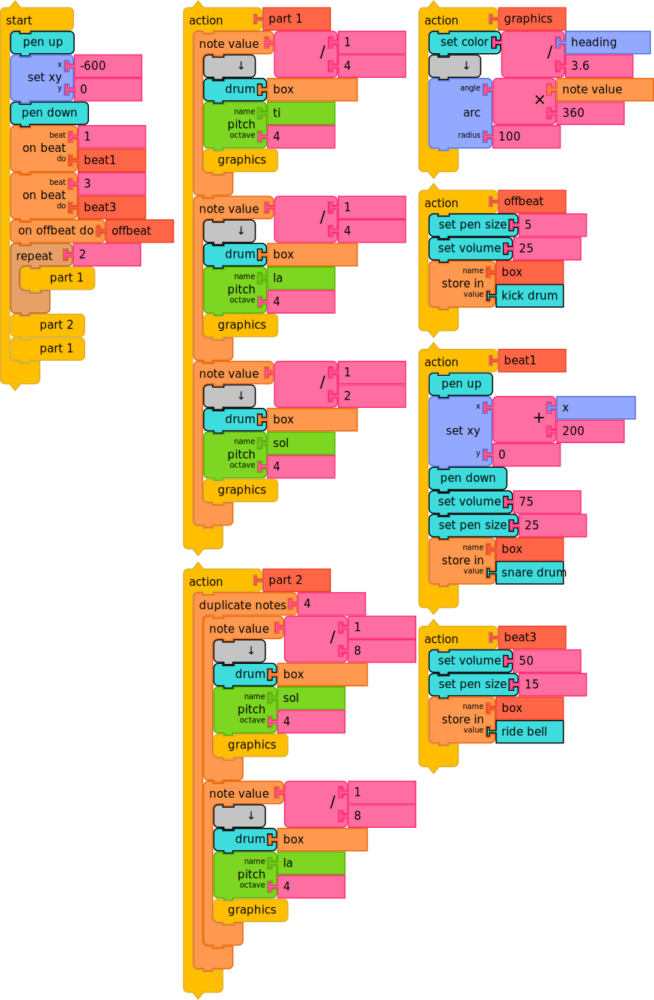

Another approach to graphics is to use modulate them based on the
beat. In the example above, we call the same graphics action for each
note, but the parameters associated with the action, such as pen
width, are dependent upon which beat we are on. On Beat 1, the pen
size is set to `50` and the volume to `75`. On Beat `3`, the pen size is set
to `25` and the volume to `50`. On off beats, the pen size is set to `5` and
the volumne to `5`. The resultant graphic is shown below.


### <a name="INTERACTIONS"></a>3.6 Interactions

There are many ways to interactive with Music Blocks, including
tracking the mouse position to impact some aspect of the music.

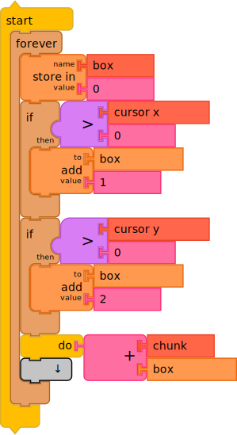

For example, we can launch the phrases (chunks) interactively. We use
the mouse position to generate a suffix: `0`, `1`, `2`, or `3`,
depending on the quadrant. When the mouse is in the lower-left
quadrant, `chunk0` is played; lower-right quadrant, `chunk1`;
upper-left quadrant, `chunk2`; and upper-right quadrant, `chunk3`.

[RUN LIVE](https://musicblocks.sugarlabs.org/index.html?id=1523028011868930&run=True)

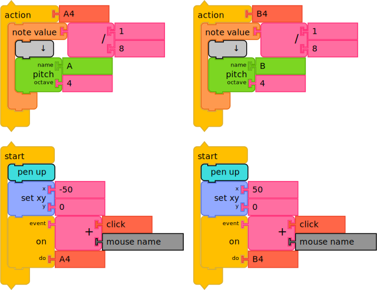

In the example above, a simple two-key piano is created by associating
*click* events on two different turtles with individual notes. Can you
make an 8-key piano?

[RUN LIVE](https://musicblocks.sugarlabs.org/index.html?id=1523107390715125&run=True)

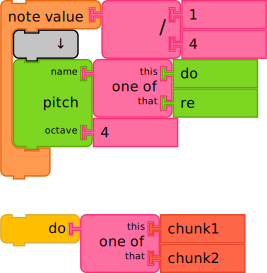

You can also add a bit of randomness to your music. In the top example
above, the *One-of* block is used to randomly assign either `Do` or
`Re` each time the *Note value* block is played. In the bottom example
above, the *One-of* block is used to randomly select between `chunk1`
and `chunk2`.

Musical Paint has been a popular activity dating back to programs such
as Dan Franzblau's *Vidsizer* (1979) or Morwaread Farbood's
*Hyperscore* (2002). Music Blocks can be used to create musical paint
as well. In the somewhat ambitious example below, we go a step further
than the typical paint program in that you can not only paint music (a
la Vidsizer) and playback your painting as a composition (a la
Hyperscore), but also generate *Note* blocks from your composition.

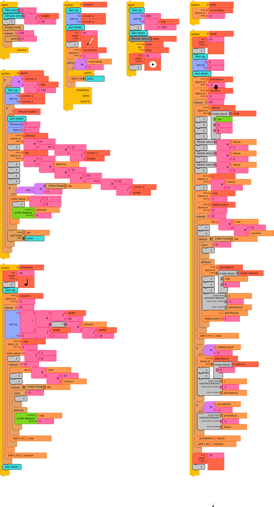

The program works by first creating an array from the heap that
corresponds to a 20x12 grid of notes on the screen: 20 columns,
representing time from left to right; and 12 rows, corresponding to
scalar pitch values, which increase in value from the bottom to the
top.

The *record* action repeatedly calls the *paint* action until the
*playback* button is clicked.

The *paint* action tracks the mouse (*Set XY* to *cursor x* and
*cursor y*) and, if the mouse button is pressed, marks an entry in the
array corresponding to that note, plays the note, and leaves behind a
"drop of paint".

The *playback* action is invoked by clicking on the *play* mouse,
which sets *recording* to `0`, thus breaking out of the paint "while
loop". Playback scans each column in the array from left to right for
pitches to play and generates a chord of pitches for each column.

Once the *playback* action is complete, the *save* action is
invoked. Again each column in the array is scanned, but this time,
instead of playing notes, the *Make Block* block is called in order to
generate a stack of notes that correspond to the composition. This
stack can be copied and pasted into another composition.

While a bit fanciful, this example, which can be run by clicking on
the link below, takes musical paint in a novel direction.

[RUN
LIVE](https://walterbender.github.io/musicblocks/index.html?id=1523896294964170&run=True&run=True)

## <a name="ENSEMBLE"></a>3.7 Ensemble

Much of music involves multiple instruments (voices or "mice" in Music
Blocks) playing together. There are a number of special blocks that
can be used to coordinate the actions of an ensemble of mice.

This section will guide about different ensemble blocks, which
communicate the status of mice by name, including notes played,
current pen color, pitch number, etc.

To use the ensemble blocks, you must assign a name to each mouse, as
we will reference each mouse by its name.

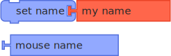

Use the *Mouse count* block in combination with the *Nth mouse name*
block to iterate through all of the mice.

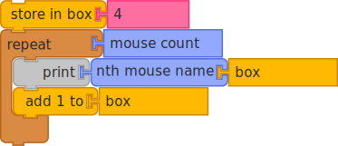

The *Mouse sync* block aligns the beat count between mice.


The *Mouse index heap* block returns a value in the heap at a specified
location for a specified mouse.


You can use the dictionary entries to data between mice. The *Get
value* block lets you specify a mouse name and the value you want to
access. For example, you can access a mouse's pen attributes, such as
color, shade, and grey values.


You can also access the mouse's graphics attributes, such as x, y, and
heading. You can also set attributes of a mouse using the *Set value*
block. In the example, a mouse's heading is set to 90.

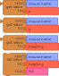

Some music status is also available through the dictionary. You can
access a mouse's "current pitch", "pitch number", "note value", the
number of "notes played".


The dictionary can be used to share other things too. Just set a
*key/value* pair with one mouse and access it from another.


Other Ensemble blocks include:

The *Found mouse* block will return true if the specified mouse can be found.


The *Set mouse* block sends a stack of blocks to be run by the specified mouse.


## <a name="CONVERTERS"></a>3.8 Converters

Converters are used to transform one form of inputs into other, more usable form of outputs. This section of the guide will talk about the various conversion options Music Blocks has to offer.

Generalized shape of a converter is:


where the right argument is converted accordingly, and output is received on the left side.

**Note:** Before an introduction of the different types of converters, a little intoduction on Y staff in Music Blocks. Staff is a set of horizontal lines and spaces and different positions along Y axis represents different notes. [C, D, E, F, G, A, B]


### <a name="y-to-pitch"></a>3.8.1 Y to Pitch


This converter takes input in the form of a number that represents Staff Y position in pixels, and processes the value such that it can be used with certain pitch blocks (pitch number, nth modal pitch, pitch) to produce notes corresponding to given Staff Y position as an argument.  

Additionally, the block can be plugged into a print block to view the converted note value.

### <a name="pitch-converter"></a>3.8.2 Pitch converter

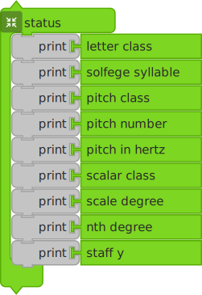

Pitch converter offers a range of options through a pie-menu based interface and it can potentially convert or extract info out of the current playing pitch using the current pitch block as an input. 
It can also take custom input in form or solfege, hertz, pitch number etc.

All these options are provided in the form of a pie-menu which can be accessed simply by clicking on the converter.


Below explained is the utility of every conversion option:

#### **1. Letter class:**
Prints the alphabet data of the note being played e.g A, B, C, D, E, F, G. It doesn't print any info regarding accidentals.

#### **2. Solfege Syllable:**
Similar to Letter class, returns the data in form of solfege e.g do, re, mi.
It too, gives no info regarding accidentals.

#### **3. Pitch class:**
Returns a number between 0 to 11, corresponding to the note played, where C is 0 and B is 11. Each increase in the number signifies an increase by one semitone.

#### **4. Scalar class:**
Returns a number between 1-7 corresponding to the scale degree of the note being played, with reference to the chosen mode. Provides no info regarding accidentals.

#### **5. Scale Degree:**
Intuitively, returns the scale degree of the note being played with reference to the chosen mode. It can also be thought of as Scalar class with accidentals.

#### **6. N^th Degree:**
Zero-based index of the degree of note being played in the chosen mode.

#### **7. Pitch in Hertz:**
Returns the value in hertz of the pitch of the note being currently played.

#### **8. Pitch Number:**
Value of the pitch of the note currently being played. It is different from Pitch class in the way that it can go below 0 and above 11 depending upon the octave.

#### **9. Staff Y:**
Returns the Y staff position of the note being played according to staff dimensions. It takes into account only the letter class, no accidental info is processed.

### <a name="number-2-octave"></a>3.8.3 Number to Octave  
  


This converter takes a numeric value which denotes pitch number and returns the octave corresponding to that pitch number.

### <a name="number-2-pitch"></a>3.8.4 Number to Pitch


This converter takes a numeric value which denotes pitch number and returns the pitch name corresponding to that pitch number. No octave is inferred.

| Converter Name | Description |
| --- | --- |
| letter class | Converts pitch to letter (as defined above). G maps to G. G♯ maps to G. |
| solfege syllable | Converts pitch to solfege (as defined above). G maps to sol. |
| solfege class | Converts pitch to solfege class (as defined above). G maps to sol. G♯ maps to sol.|
| pitch class | Converts pitch to pitch class (as defined above). G maps to 7. |
| scalar class | Converts pitch to scalar class (as defined above). G maps to 5. |
| scale degree | Converts pitch to scale degree (as defined above). G maps to 5. |
| nth degree | Converts pitch to nth degree (as defined above). G maps to 4. |
| staff y | Maps the current pitch to a y value that corresponds to a position on the staff. G4 maps to 50. |
| pitch number | Converts pitch to pitch number (as defined above). G maps to 7. |
| pitch in hertz | Converts pitch to hertz. G4 maps to 392Hz. |
| pitch to color | Converts pitch to a color value (0-100). C maps to 0, G maps to 58.3, etc. |
| pitch to shade | Coverts the octave value of the current pitch to a shade. Octave 4 maps to 50. |

## <a name="WIDGETS"></a>Widgets

[Previous Section (3. Programming with Music)](#PROGRAMMING-WITH-MUSIC) | [Back to Table of Contents](#TOC) | [Next Section (5. Beyond Music Blocks)](#BEYOND-MUSIC-BLOCKS)

This section of the guide will talk about the various Widgets that can
be used within Music Blocks to enhance your experience.

Every widget has a menu with at least two buttons.


You can hide the widget by clicking on the *Close* button.


You can move the widget by dragging it by the *Drag* handle.

### <a name="status"></a>4.1 Status

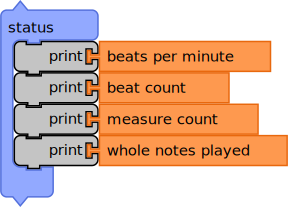

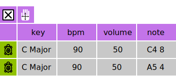

The *Status widget* is a tool for inspecting the status of Music
Blocks as it is running. By default, the key, BPM, and volume are
displayed. Also, each note is displayed as it is played. There is one
row per voice in the status table.

Additional *Print* blocks can be added to the *Status* widget to
display additional music factors, e.g., duplicate, transposition,
skip, [staccato](#MORE-TRANSFORMATIONS),
[slur](#MORE-TRANSFORMATIONS), and [graphics](#GRAPHICS) factors,
e.g., x, y, heading, color, shade, grey, and pensize.


You can do additional programming within the status block. In the
example above, `whole notes played` is multiplied by `4` (to calculate
quarter notes played) before being displayed.

### <a name="GENERATION"></a>4.2 Generating Chunks of Notes 

Using the Phrase Maker, it is possible to generate chunks of
notes at a much faster speed.

#### <a name="pitch-time"></a>4.2.1 The Phrase Maker

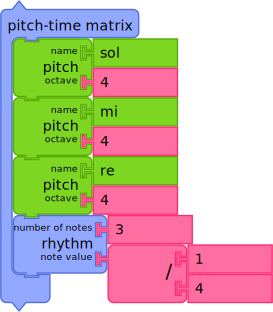

Music Blocks provides a widget, the *Phrase maker*, as a scaffold
for getting started.

Once you've launched Music Blocks in your browser, start by clicking
on the *Phrase maker* stack that appears in the middle of the
screen. (For the moment, ignore the *Start* block.) You'll see a grid
organized vertically by pitch and horizontally by rhythm.

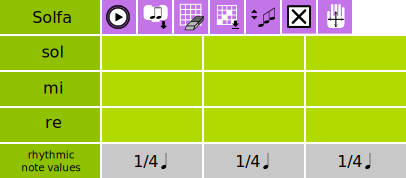

The matrix in the figure above has three *Pitch* blocks and one
*Rhythm* block, which is used to create a 3 x 3 grid of pitch and
time.

Note that the default matrix has five *Pitch* blocks, one *Drum*
block, and two *Mouse* (movement) blocks. Hence, you will see eight
rows, one for each pitch, drum, and mouse (movement). (A ninth row at
the bottom is used for specifying the rhythms associated with each
note.) Also by default, there are two *Rhythm* blocks, which specifies
six quarter `(1/4)` notes followed by one half `(1/2)` note.

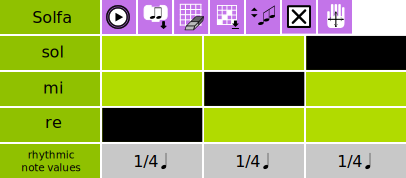

By clicking on individual cells in the grid, you should hear
individual notes (or chords if you click on more than one cell in a
column). In the figure, three quarter notes are selected (black
cells). First `Re 4`, followed by `Mi 4`, followed by `Sol 4`.


If you click on the *Play* button (found in the top row of the grid),
you will hear a sequence of notes played (from left to right): `Re 4`,
`Mi 4`, `Sol 4`.


Once you have a group of notes (a "chunk") that you like, click on the
*Save* button (just to the right of the *Play* button). This will
create a stack of blocks that can used to play these same notes
programmatically. (More on that below.)

You can rearrange the selected notes in the grid and save other chunks
as well.


The *Sort* button will reorder the pitches in the matrix from highest
to lowest and eliminate any duplicate *Pitch* blocks.


There is also an Erase button that will clear the grid.

Don't worry. You can reopen the matrix at anytime (it will remember
its previous state) and since you can define as many chunks as you
want, feel free to experiment.

Tip: You can put a chunk inside a *Phrase maker* block to generate
the matrix to corresponds to that chunk.

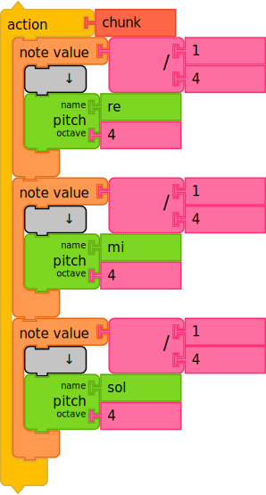

The chunk created when you click on the matrix is a stack of
blocks. The blocks are nested: an *Action* block contains three *Note
value* blocks, each of which contains a *Pitch* block. The *Action*
block has a name automatically generated by the matrix, in this case,
chunk. (You can rename the action by clicking on the name.). Each note
has a duration (in this case 4, which represents a quarter note). Try
putting different numbers in and see (hear) what happens. Each note
block also has a pitch block (if it were a chord, there would be
multiple *Pitch* blocks nested inside the Note block's clamp). Each
pitch block has a pitch name (`Re`, `Mi`, and `Sol`), and a pitch
octave; in this example, the octave is 4 for each pitch. (Try changing
the pitch names and the pitch octaves.)

To play the chuck, simply click on the action block (on the word
action). You should hear the notes play, ordered from top to bottom.

#### <a name="THE-RHYTHM-BLOCK"></a>4.2.2 The Rhythm Block

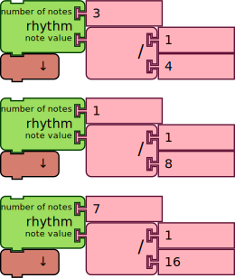

*Rhythm* blocks are used to generate rhythm patterns in the
*Phrase maker* block. The top argument to the *Rhythm* block
is the number of notes. The bottom argument is the duration of the
note. In the top example above, three columns for quarter notes
would be generated in the matrix. In the middle example, one column
for an eighth note would be generated. In the bottom example, seven
columns for 16th notes would be generated.

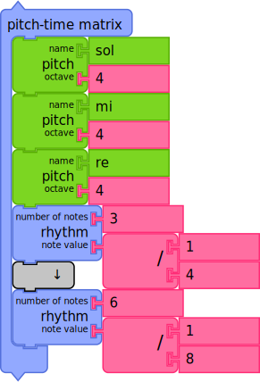

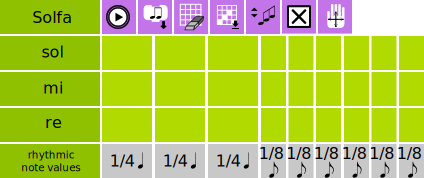

You can use as many *Rhythm* blocks as you'd like inside the
*Phrase maker* block. In the above example, two *Rhythm*
blocks are used, resulting in three quarter notes and six eighth
notes.

#### <a name="CREATING-TUPLETS"></a>4.2.3 Creating Tuplets

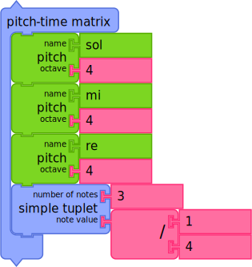

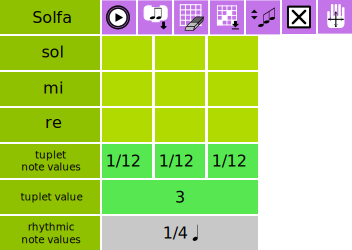

Tuplets are a collection of notes that get scaled to a specific
duration. Using tuplets makes it easy to create groups of notes that
are not based on a power of 2.

In the example above, three quarter notes&mdash;defined in the *Simple
Tuplet* block&mdash;are played in the time of a single quarter
note. The result is three twelfth notes. (This form, which is quite
common in music, is called a *triplet*. Other common tuplets include a
*quintuplet* and a *septuplet*.)

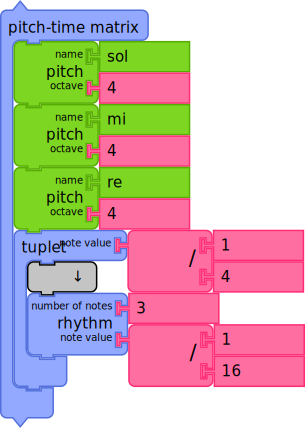

In the example above, the three quarter notes are defined in the
*Rhythm* block embedded in the *Tuplet* block. As with the *Simple
Tuplet* example, they are played in the time of a single quarter
note. The result is three twelfth notes. This more complex form allows
for intermixing multiple rhythms within single tuplet.

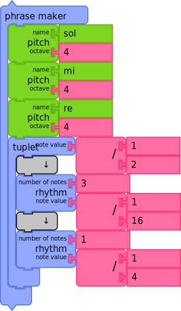

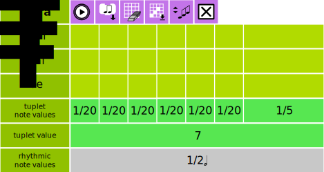

In the example above, the two *Rhythm* blocks are embedded in the
*Tuplet* block, resulting in a more complex rhythm.

Note: You can mix and match *Rhythm* blocks and *Tuplet* blocks when
defining your matrix.

#### <a name="WHAT-IS-TUPLET"></a>4.2.4 What is a Tuplet?

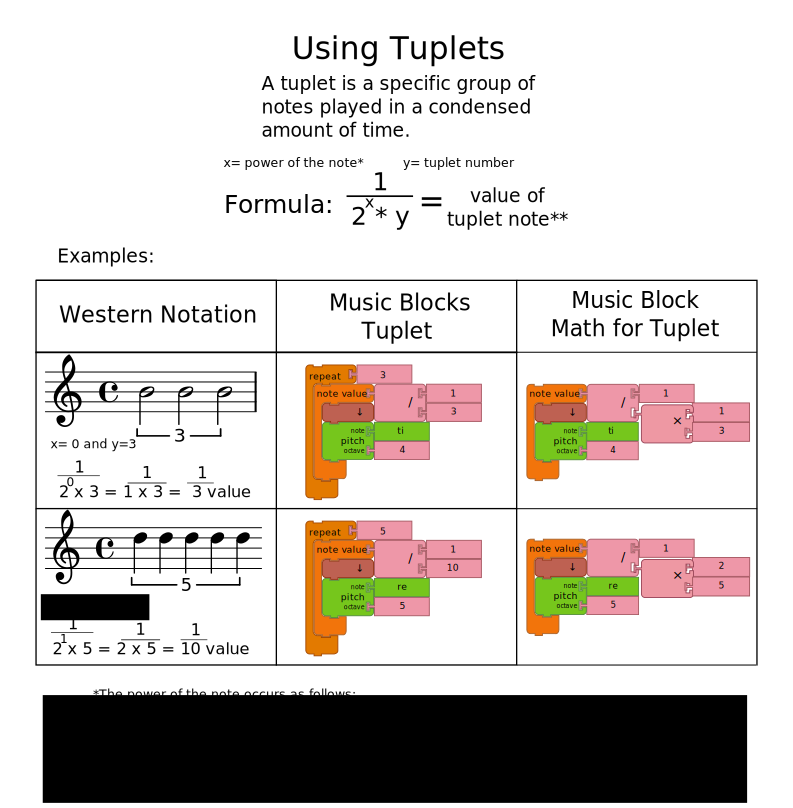

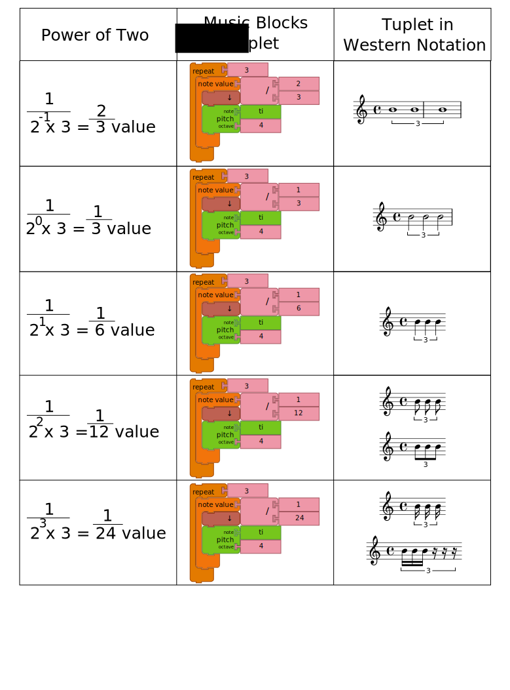

#### <a name="INDIVIDUAL-NOTES"></a>4.2.5 Using Individual Notes in the Phrase Maker

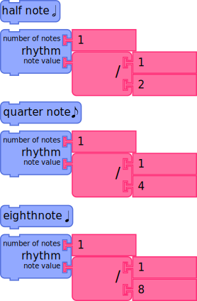

You can also use individual notes when defining the grid. These blocks
will expand into *Rhythm* blocks with the corresponding values.

#### <a name="USING-A-SCALE"></a>4.2.6 Using a Scale of Pitches in the Phrase Maker

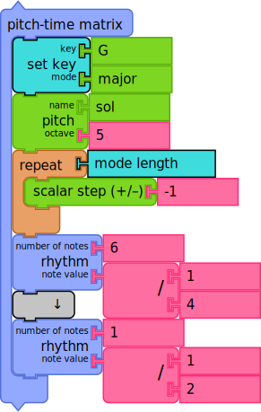

You can use the *Scalar step* block to generate a scale of pitches in
the matrix. In the example above, the pitches comprising the G major
scale in the 4th octave are added to the grid. Note that in order to
put the highest note on top, the first pitch is the `Sol` in `Octave
5`. From there, we use `-1` as the argument to the *Scalar step* block
inside the *Repeat*, working our way down to `Sol` in `Octave
4`. Another detail to note is the use of the *Mode length* block.

### <a name="rhythms"></a>4.3 Generating Rhythms

The *Rhythm Maker* block is used to launch a widget similar to the
*Phrase maker* block. The widget can be used to generate rhythmic
patterns.

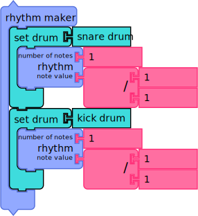

The argument to the *Rhythm Maker* block specifies the duration that
will be subdivided to generate a rhythmic pattern. By default, it is 1
/ 1, e.g., a whole note.

The *Set Drum* blocks contained in the clamp of the *Rhythm Maker*
block indicates the number of rhythms to be defined simultaneously. By
default, two rhythm "rulers" are defined. The embedded *Rhythm* blocks define
the initial subdivision of each rhythm ruler.

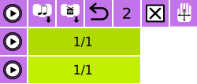

When the *Rhythm Maker* block is clicked, the *Rhythm Maker* widget is
opened. It contains a row for each rhythm ruler. An input in the top
row of the widget is used to specify how many subdivisions will be
created within a cell when it is clicked. By default, 2 subdivisions
are created.

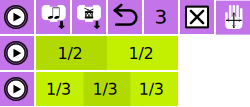

As shown in the above figure, the top rhythm ruler has been divided
into two half-notes and the bottom rhythm ruler has been divided into
three third-notes. Clicking on the *Play* button to the left of each row
will playback the rhythm using a drum for each beat. The *Play-all*
button on the upper-left of the widget will play back all rhythms
simultaneously.

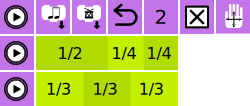

The rhythm can be further subdivided by clicking in individual
cells. In the example above, two quarter-notes have been created by
clicking on one of the half-notes.

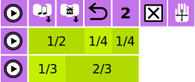

By dragging across multiple cells, they become tied. In the example
above, two third-notes have been tied into one two-thirds-note.

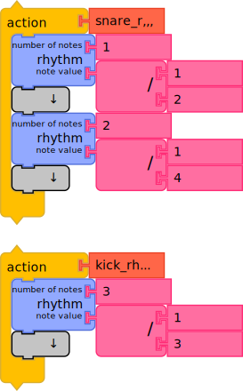

The *Save stack* button will export rhythm stacks.


These stacks of rhythms can be used to define rhythmic patterns used
with the *Phrase maker* block.

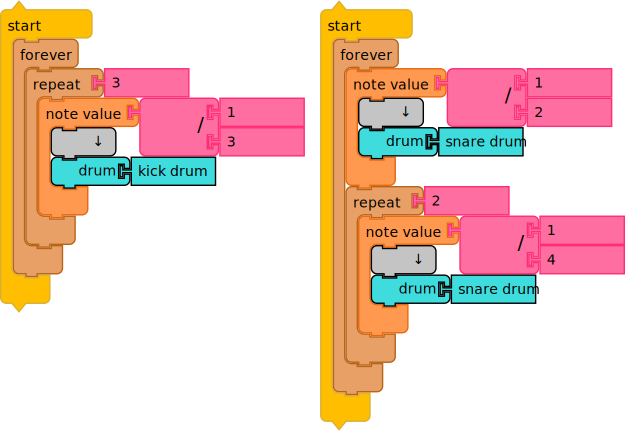

The *Save drum machine* button will export *Start* stacks that will
play the rhythms as drum machines.

Another feature of the *Rhythm Maker* wigdet is the ability to tap out
a rhythm. By clicking on the *Tap* button and then clicking on a cell
inside one of the rhythm rulers, you will be prompted (by four tones)
to begin tapping the mouse button to divide the cell into
sub-cells. Once the fourth tone has sounded, a progress bar will run
from left to right across the screen. Each click of the mouse will
define another beat within the cell. If you don't like your rhythm,
use the *Undo* button and try again.

### <a name="modes"></a>4.4 Musical Modes

Musical modes are used to specify the relationship between
[intervals](#INTERVALS-AND-ARTICULATION) (or steps) in a scale. Since
Western music is based on 12 half-steps per octave, modes speficy how
many half steps there are between each note in a scale.

By default, Music Blocks uses the *Major* mode, which, in the
[Key](#SETTING) of C, maps to the white keys on a piano. The intervals
in the *Major* mode are `2, 2, 1, 2, 2, 2, 1`. Many other common modes
are built into Music Blocks, including, of course, *Minor* mode, which
uses `2, 1, 2, 2, 1, 2, 2` as its intervals.

Note that not every mode uses 7 intervals per octave. For example, the
*Chromatic* mode uses 11 intervals: `1, 1, 1, 1, 1, 1, 1, 1, 1,
1, 1, 1`. The *Japanese* mode uses only 5 intervals: `1, 4,
2, 3, 2],`. What is important is that the sum of the intervals
in an octave is 12 half-steps.

The *Mode length* block will return the number of intervals (scalar
steps) in the current mode.

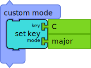

The *Mode* widget lets you explore modes and generate custom
modes. You invoke the widget with the *Custom mode* block. The mode
specified in the *Set key* block will be the default mode when the
widget launches.

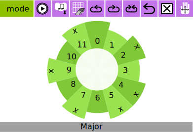

In the above example, the widget has been launched with *Major* mode
(the default). Note that the notes included in the mode are indicated
by the protuding sectors with 'X's, which are arrayed in a circular
pattern of tweleve half-steps to complete the octave.

Since the intervals in the *Major* mode are `2, 2, 1, 2, 2, 2, 1`, the
notes are `0`, `2`, `4`, `5`, `7`, `9`,`11`, and `12` (one octave
above `0`).

The widget controls run along the toolbar at the top. From left to
right are:

*Play all*, which will play a scale using the current mode;

*Save*, which will save the current mode as the *Custom* mode and save
a stack of *Pitch* blocks that can be used with the *Phrase Maker* block;

*Rotate counter-clockwise*, which will rotate the mode
counter-clockwise (See the example below);

*Rotate clockwise*, which will rotate the mode clockwise (See the
example below);

*Invert*, which will invert the mode (See the example below);

*Undo*, which will restore the mode to the previous version; and

*Close*, which will close the widget.

You can also click on individual notes to activate or deactivate them.

Note that the mode inside the *Custom mode* block is updated whenever
the mode is changed inside the widget.

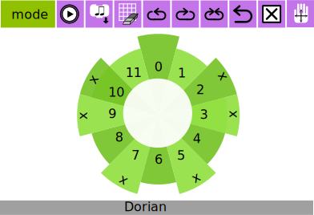

In the above example, the *Major* mode has been rotated counter-clockwise,
transforming it into *Dorian*.

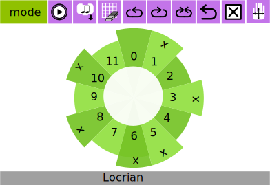

In the above example, the *Major* mode has been rotated
clockwise, transforming it into *Locrian*.

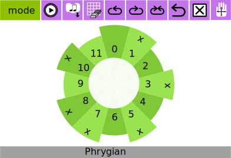

In the above example, the *Major* mode has been inverted, transforming
it into *Phrygian*.

Note: The build-in modes in Music Blocks can be found in [musicutils.js](https://github.com/sugarlabs/musicblocks/blob/master/js/musicutils.js#L68).

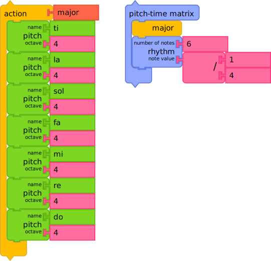

The *Save* button exports a stack of blocks representing the mode that
can be used inside the *Phrase maker* block.

### <a name="meters"></a>4.5 Meters


The *Meter Widget* block is used to explore strong and weak
beats. Launch the widget with the meter you want to explore. (In the
example, the meter is 4 beats per measure, where each beat is one
quarter note.)

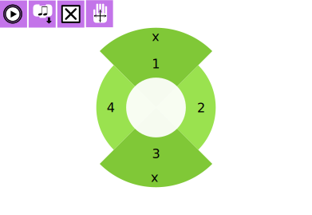

Inside the widget, you can click on a sector to indicate a strong
beat. (Clicking on the *X* will revert the beat to a weak beat.) In
the figure, the first and third beats are strong.

The *Play* button will play the beat, using a snare drum for strong
beats and a kick drum for weak beats.


The *Save* button will export *On strong beat do* blocks for each strong beat.

### <a name="pitch-drum"></a>4.6 The Pitch-Drum Matrix


The *Set Drum* block is used to map the enclosed pitches into drum
sounds. Drum sounds are played in a monopitch using the specified drum
sample. In the example above, a `kick drum` will be substitued for
each occurance of a `Re` `4`.


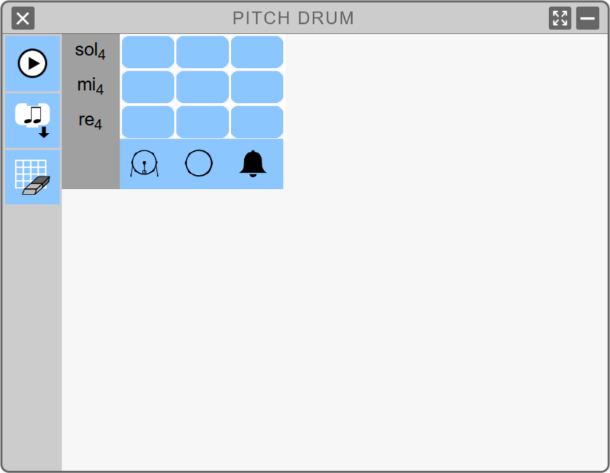

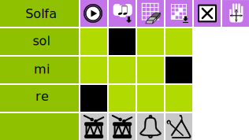

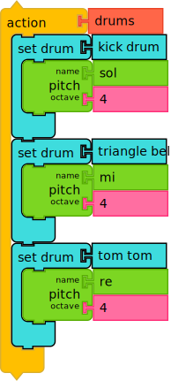

As an experience for creating mapping with the *Set Drum* block, we
provide the *Drum-Pitch* Matrix. You use it to map between pitches and
drums. The output is a stack of *Set Dum* blocks.

### <a name="stairs"></a>4.7 Exploring Musical Proportions

The *Pitch Staircase* block is used to launch a widget similar to the
*Phrase maker*, which can be used to generate different pitches
using a given pitch and musical proportion.

The *Pitch* blocks contained in the clamp of the *Pitch Staircase*
block define the pitches to be initialized simultaneously. By default,
one pitch is defined and it have default note "la" and octave "3".

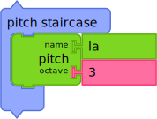

When *Pitch Staircase* block is clicked, the *Pitch Staircase* widget is
initialized. The widget contains row for every *Pitch* block contained
in the clamp of the *Pitch Staircase* block. The input fields in the top
row of the widget specify the musical proportions used to create new
pitches in the staircase. The inputs correspond to the numerator and
denominator in the proportion resectively. By default the proportion
is 3:2.


Clicking on the *Play* button to the left of each row will playback
the notes associated with that step in the stairs. The *Play-all*
button on the upper-left of the widget will play back all the pitch
steps simultaneously. A second *Play-all* button to the right of the
stair plays in increasing order of frequency first, then in 
decreasing order of frequency as well, completing a scale.

The *Save stack* button will export pitch stacks. For example, in the
above configuration, the output from pressing the *Save stack* button
is shown below:

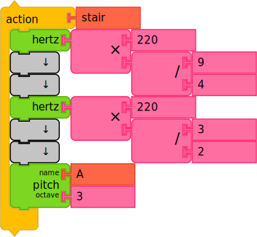

These stacks can be used with the *Phrase maker* block to define
the rows in the matrix.

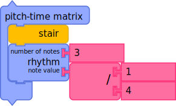

### <a name="slider"></a>4.8 Generating Arbritary Pitches

The *Pitch Slider* block is used to launch a widget that is used to
generate arbitrary pitches. It differs from the *Pitch Staircase*
widget in that it is used to create frequencies that vary continuously
within the range of a specified octave.

Each *Sine* block contained within the clamp of the *Pitch Slider* block defines the initial pitch
for an ocatve.

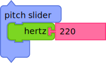


When the *Pitch Slider* block is clicked, the *Pitch Slider* widget is
initialized. The widget will have one column for each *Sine* block in
the clamp. Every column has a slider that can be used to move up or
down in frequency, continuously or in intervals of 1/12th of the
starting frequency. The mouse is used to move the frequency up and
down continuously. Buttons are used for intervals. Arrow keys can also
be used to move up and down, or between columns.

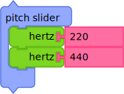

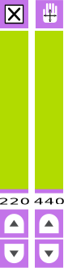

Clicking in a column will extact the corresponding *Note* blocks, for example:

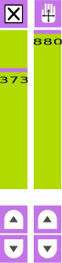

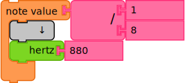


### <a name="tempo"></a>4.9 Changing Tempo

The *Tempo* block is used to launch a widget that enables the user to
visualize Tempo, defined in beats per minute (BPM). When the *Tempo* block
is clicked, the *Tempo* widget is initialized.

The *Master Beats per Minute* block contained in the clamp of the
*Tempo* block sets the initial tempo used by the widget. This
determines the speed at which the ball in the widget moves back and
forth. If BPM is `60`, then it will take one second for the ball to move
across the widget. A round-trip would take two seconds.

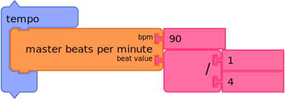

The top row of the widget holds the *Play/pause* button, the *Speed
up* and *Slow down* buttons, and an input field for updating the
Tempo.

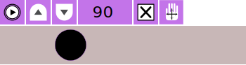

You can also update the tempo by clicking twice in spaced succession
in the widget: the new beats per minute (BPM) is determined as the
time between the two clicks. For example, if there is `1/2` second
between clicks, the new BPM will be set as `120`.

### <a name="timbre"></a>4.10 Custom Timbres

While Music Blocks comes with many built-in instruments, it is also
possible to create custom timbres with unique sound qualities.

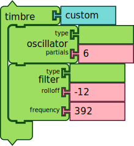

The *Timbre* block can be used to launch the *Timbre* widget, which
lets you add synthesizers, oscillators, effects, and filters to create
a custom timbre, which can be used in your Music Blocks programs.

The name of the custom timbre is defined by the argment passed to the
block (by default, `custom`). This name is passed to the *Set timbre*
block in order to use your custom timbre.


The *Timbre* widget has a number of different panels, each of which is
used to set the parameters of the components that define your custom
timbre.

* The *Play* button, which lets you test the sound quality of your
custom timbre. By default, it will play `Sol`, `Mi`, `Sol` using the
combination of filters you define.

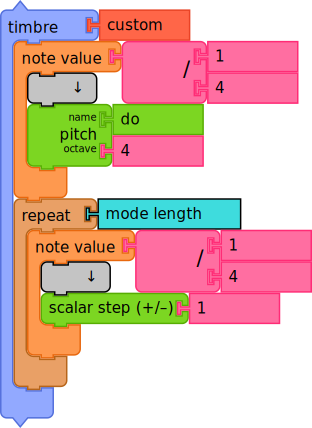

You can also put notes in the *Timbre* block to use for testing your
sound. In the example above, a scale will be used for the test.

* The *Save* button, which will save your custom timbre for use in
your program.

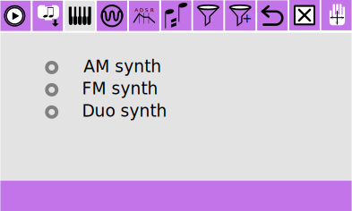

* The *Synth* button, which lets you choose between an AM synth, a PM
synth, or a Duo synth.

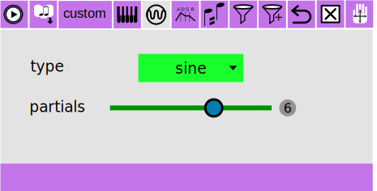

* The *Oscillator* button, which lets you choose between a sine wave,
square wave, triangle wave, or sawtooth wave. You can also change
the number of partials.

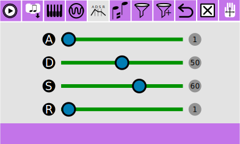

* The *Envelope* button, which lets you change the shape of the sound
envelope, with controls for attack, decay, sustain, and release.

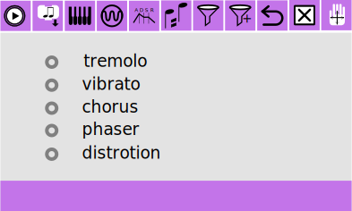


* The *Effects* button, which lets you add effects to your custom
timbre: tremelo, vibrato, chorus, phaser, and distortion. When an
effect is selected, additional controls will appear in the widget.

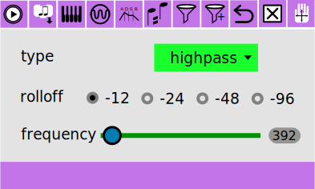

* The *Filter* button, which lets you choose between a number of
different filter types.

* The *Add filter* button, which lets you add addition filters to your
custom timbre.

* The *Undo* button.

As you add synthesizers, effects, and filters with the widget, blocks
corresponding to your choices are added to the *Timbre* block. This
lets you reopen the widget to fine-tune your custom timbre.

### <a name="keyboard"></a>4.11 Music Keyboard

The Music Keyboard is used to generate notes by pressing keys of a virtual
keyboard.

When there are no *Pitch* blocks inside the widget clamp, a keyboard with
all keys between C4 and G5 is created.

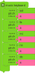

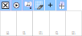

When there are *Pitch* blocks inside the widget clamp, a keyboard with
only those pitches is created.

Click on the keys to hear sounds. Click on the Play button to playback
all of the notes played. Click on the Save button to output code (a
series of *Note* blocks). The Clear button is used to delete all keys
pressed previously in order to start new.

The MIDI input allows for a using a MIDI device to generate notes.

The metronome feature will generate a beat to enable candence.

###  <a name="temperament"></a>4.12 Changing Temperament

*Tempering* is the process of altering the size of an interval by
making it narrower or wider than pure. It is also possible to change
and create different tuning systems.

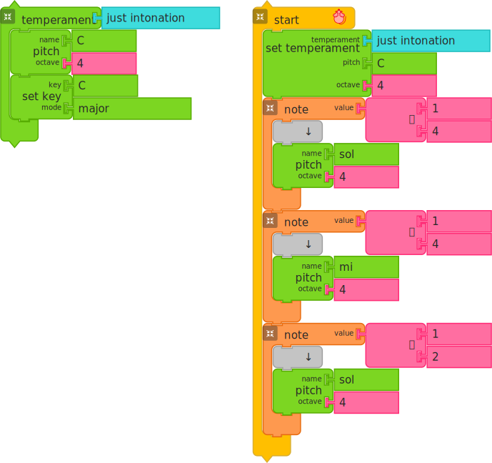

The *Temperament* block is used to launch a widget that enables the
user to visualize and edit notes within an octave.

You can select a temperament system from the pie menu which is passed
as an argument to the block. This name is passed to the *Set
temperament* block in order to play the notes in selected temperament
system. *Starting Pitch* is the argument of pitch block inside
temperament block. In the above example, starting pitch is `C4`.

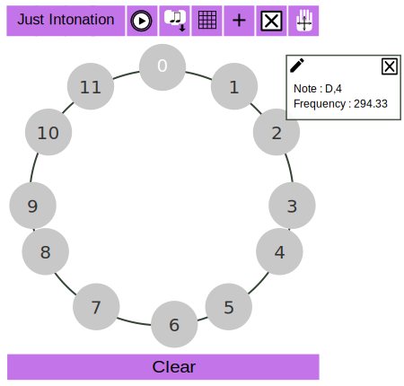

In the above example, selected temperament is *Just Intonation*. Notes
within an octave can be viewed in the form of circle. These circles
represent *pitch numbers*. Note that the pitches that are closer
together in selected temperament system are visually closer and
pitches that are farther apart looks farther.

The information regarding any note can be viewed by clicking on the
respective circle. In the above example, circle (pitch number) `2` is
`D4`. The frequency of note can be changed through edit button (left
hand side corner of note information popup).

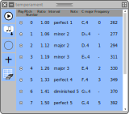

Information regarding notes can also be viewed in the form of a
*table* as shown in the above example. The table will show all the
information about pitches that lie within an octave. This information
includes *pitch number*, *interval*, *ratio*, *note*, *frequency* and
*mode*.

The frequency of any note is calculated by `Starting Pitch Frequency`
x `Ratio`.

The widget controls are as follows:

The *Clear* button at the bottom of the widget will clear all pitches
except for a single `0` from which the user may add pitches.

The *Play all* button will play through all the pitches in an octave
and then it will play backwards down the pitches.

The *Save* button will save custom temperament for use in your
program. It will create a *set temperament* block. This block will
tune the notes attached to it according to the selected temperament.

The *Table* button is used to toggle between circular and tabular
representation of notes.

The *Add* button is used to edit notes through different tools:

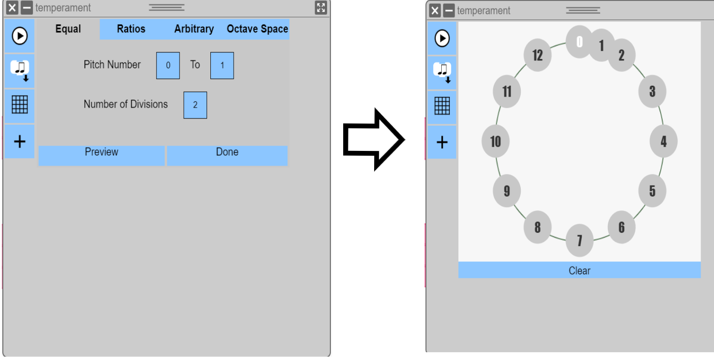

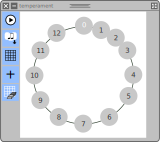

The `Equal` edit tool is used to make *equal divisions* between two
pitch numbers.  In the above example, two equal divisions are made
between pitch numbers `0` and `1` and the resultant number of notes
within an octave are changed from 12 to 13.


The `Ratio` tool is used to add notes of specified ratios in such a
way that the resultant pitches wrap inside a single octave. Recursion
represents the number of times notes ratio calculation is repeated. In
the above example, 2 notes are added in pitch space and the resultant
number of notes within an octave are changed from 12 to 14. Frequency
of first pitch is (Starting Pitch Frequency) * (16/13) and second
pitch is (Starting Pitch Frequency) * (16/13)².

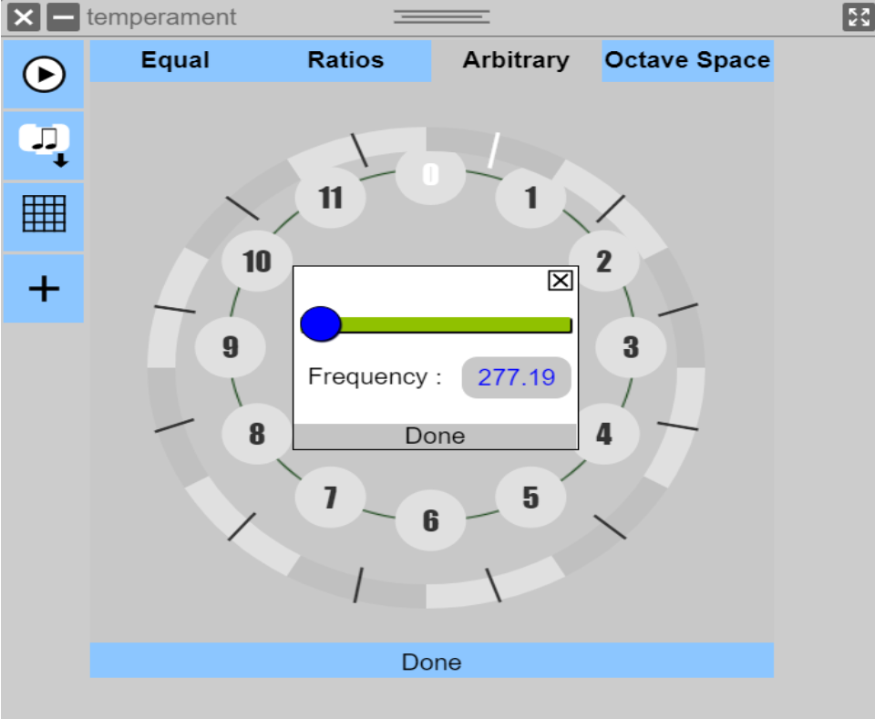

The `Arbitrary` edit tool is used to add a note in an arbitrary
position. In this panel, whenever the user hovers over the outer
circle, a frequency-slider window pops up, allowing the user to add a
note according to a chosen frequency. In the above example, a new note
will be added somewhere between pitch numbers `2` and `3` by adjusting
the frequency slider.

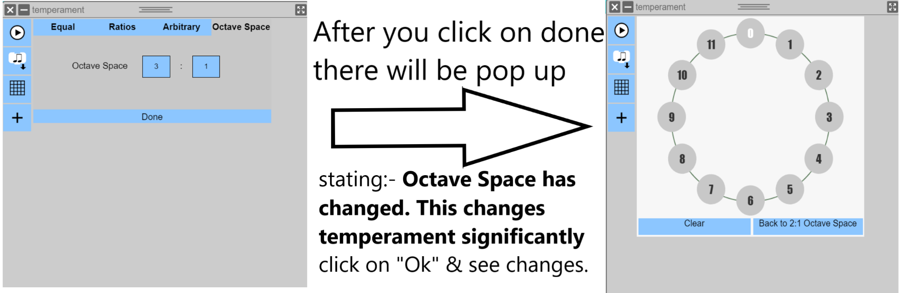

The `Octave Space` tool is used to edit the octave ratio. The standard
octave space is 2:1. In the above example, octave space will be
changed to 3:1 after clicking on `Done`.

The *Drag* button will drag the widget.

The *Close* button will close the widget.

###  <a name="oscilloscope"></a>4.13 Oscilloscope

Music Blocks has an Oscillosope Widget to visualize the music as it plays.


A separate wave will be displayed for each mouse.

###  <a name="sampler"></a>4.14 Sampler

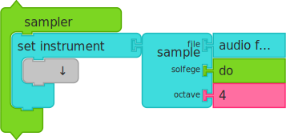
 
You can import sound samples (.WAV files) and use them with the *Set Instrument" block. The *Sampler* widget lets you set the center pitch of your sample so that it can be tuned.

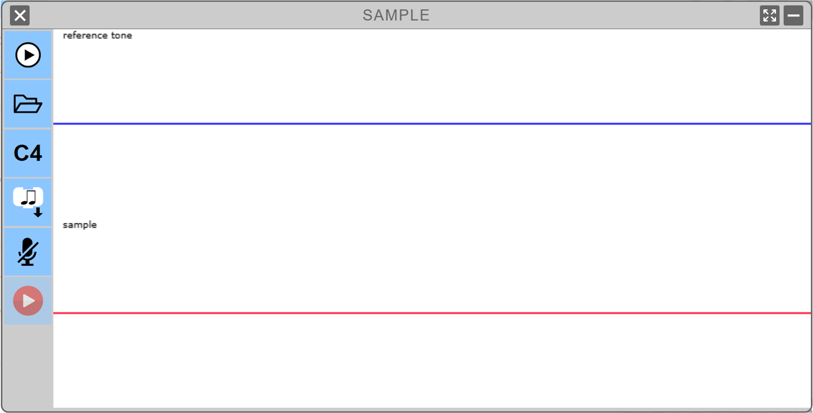

You can then use the *Sample* block as you would any input to the *Set
Instrument* block.


## <a name="BEYOND-MUSIC-BLOCKS"></a>5. Beyond Music Blocks

[Previous Section (4. Widgets)](#WIDGETS) | [Back to Table of Contents](#TOC)

Music Blocks is a waypoint, not a destination. One of the goals is to
point the learner towards other powerful tools.

## <a name="LILYPOND"></a>5.1 Lilypond

One such tool is [Lilypond](http://lilypond.org), a music engraving program.

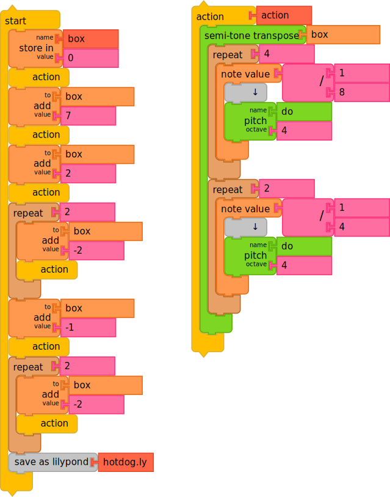

The *Save as Lilypond* option from the Save menu will transcribe your
composition (Only available in Advanced Mode).

Note that if you use a *Print* block inside of a note, Lilypond will
create a "markup" or annotation for that note. It is a simple way to
add lyrics to your score.


```
\version "2.18.2"

mouse = {
c'8 c'8 c'8 c'8 c'4 c'4 g'8 g'8 g'8 g'8 g'4 g'4 a'8 a'8 a'8 a'8 a'4
a'4 g'8 g'8 g'8 g'8 g'4 g'4 f'8 f'8 f'8 f'8 f'4 f'4 e'8 e'8 e'8 e'8
e'4 e'4 d'8 d'8 d'8 d'8 d'4 d'4 c'8 c'8 c'8 c'8 c'4 c'4
}

\score {
<<
\new Staff = "treble" {
\clef "treble"
\set Staff.instrumentName = #"mouse" \mouse
}
>>
\layout { }
}
```


[RUN LIVE](https://musicblocks.sugarlabs.org/index.html?id=1523043053377623&run=True)

## <a name="EXPORTS"></a>5.2 Other Exports

In addition to Lilypond, there are several other export formats
supported, including ABC, MusicXML, WAV, SVG, and PNG.

**ABC** notation is a shorthand form of musical notation. In basic
form it uses the letters A through G, letter notation, to represent
the given notes, with other elements used to place added value on
these – sharp, flat, the length of the note, key, ornamentation (See
https://en.wikipedia.org/wiki/ABC_notation).

**MusicXML** is an XML-based file format for representing Western
musical notation. The format is open, fully documented, and can be
freely used under the W3C Community Final Specification Agreement
(See https://en.wikipedia.org/wiki/MusicXML).

**WAV** (Waveform Audio File Format) is an audio file format standard,
developed by IBM and Microsoft, for storing an audio bitstream on
PCs (See https://en.wikipedia.org/wiki/WAV).

**PNG** (Portable Network Graphics) is a raster-graphics file format
that supports lossless data compression (See
https://en.wikipedia.org/wiki/Portable_Network_Graphics). You can
save your artwork as PNG.

**SVG** (Scalable Vector Graphics) is an Extensible Markup Language
(XML)-based vector image format for two-dimensional graphics with
support for interactivity and animation (See
https://en.wikipedia.org/wiki/Scalable_Vector_Graphics). You can
also save your artwork as SVG.

Note that artwork saved as PNG or SVG can subsequently be imported
into Music Blocks to be used with either the *Show* or *Avatar*
blocks.

## <a name="JAVASCRIPT"></a>5.3 JavaScript

There are practical limits to the size and complexity of Music Blocks
programs. At some point we expect Music Blocks programmers to move on
to text-based programming languages. To facilitate this transition,
there is a JavaScript widget that will convert your Music Blocks
program into JavaScript.

The JavaScript code is written and viewed on the **JavaScript Editor**
widget which can be opened by pressing on the "*Toggle JavaScript
Editor*" (`<>`) button in the auxilliary menu.

### Example code

For the block stacks (and mouse art generated after running),


the following code is generated:

```
let action = async mouse => {
    await mouse.playNote(1 / 4, async () => {
        await mouse.playPitch("do", 4);
        console.log(mouse.NOTEVALUE);
        return mouse.ENDFLOW;
    });
    let box1 = 0;
    let box2 = 360 / mouse.MODELENGTH;
    for (let i0 = 0; i0 < mouse.MODELENGTH * 2; i0++) {
        await mouse.playNote(1 / 4, async () => {
            if (box1 < mouse.MODELENGTH) {
                await mouse.stepPitch(1);
                await mouse.turnRight(box2);
            } else {
                await mouse.stepPitch(-1);
                await mouse.turnLeft(box2);
            }
            await mouse.goForward(100);
            return mouse.ENDFLOW;
        });
        box1 = box1 + 1;
    }
    return mouse.ENDFLOW;
};
new Mouse(async mouse => {
    await mouse.clear();
    await mouse.setInstrument("guitar", async () => {
        await mouse.setColor(50);
        await action(mouse);
        return mouse.ENDFLOW;
    });
    return mouse.ENDMOUSE;
});
MusicBlocks.run();
```

Here's the complete [API](../js/js-export/samples/sample.js) of
methods, getters, setters.

## <a name="APPENDIX_1"></a>Appendix: Palette Tables

[Previous Section (5. Beyond Music Blocks)](#BEYOND-MUSIC-BLOCKS) | [Back to Table of Contents](#TOC)

Looking for a block? The tables below (one for beginner mode and one for advanced mode) list the blocks by the palette where they are found.

### Beginner mode

| Music | | | Programming | | | Graphics | |
| :---: | :---: | :---: | :---: | :---: | :---: | :---: | :---: |
| _Palette_ | _Blocks_ | | _Palette_ | _Blocks_ | | _Palette_ | _Blocks_ |
| **Rhythm** | note | | **Flow** | repeat | | **Graphics** | forward |
| | note value drum | | | forever | | | back |
| | silence | | | if then | | | left 
| | tie | | | if then else | | | right |
| | note value | | | backward | | | set xy |
| **Meter** | meter | | **Action** | action | | | set heading |
| | beats per second | | | start | | | arc |
| | master beats per second | | | broadcast | | | scroll xy |
| | on every note do | | | on event do | | | x |
| | notes played | | | do | | | y |
| | beat count | | **Boxes** | store in box1 | | | heading |
| **Pitch** | pitch | | | box1 | | **Pen** | set color |
| | pitch G4 | | | store in box2 | | | set shade |
| | scalar step (+/-) | | | box2 | | | set pen size |
| | pitch number | | | store in | | | pen down |
| | hertz | | | box | | | pen up |
| | fourth | | | add | | | fill |
| | fifth | | | add 1 to | | | background |
| | pitch in hertz | | **Number** | number | | | color |
| | pitch number | | | random | | **Media** | print |
| | scalar change in pitch | | | one of this or that | | | text |
| | change in pitch | | | + | | | show |
| **Interval** | set key | | | - | | | avatar |
| | mode length | | | x | | | height |
| | movable do | | | / | | | width |
| | third | | **Boolean** | = | | | bottom (screen) |
| | sixth | | | < | | | top (screen) |
| | chord I | | | > | | | left (screen) |
| | chord IV | | | | | | right (screen) |
| | chord V | | | | | **Sensors** | mouse button |
| | set temperament | | | | | | cursor x |
| **Tone** | set instrument | | | | | | cursor y |
| | vibrato | | | | | | click |
| | chorus | | | | | | loudness |
| | tremolo | | | | | **Ensemble** | set name |
| **Ornament** | staccato | | | | | | mouse name |
| | slur | | | | 
| | neighbor (+/-) | | | | 
| **Volume** | crescendo | | | | 
| | decrescendo | | | | 
| | set master volume | | | | 
| | set synth volume | | | | 
| | set drum volume | | | | 
| **Drum** | drum | | | | 
| | sound effect | | | | 
| | set drum | | | | 
| **Widget** | status | | | | 
| | phrase maker |
| | C major scale |
| | G major scale |
| | rhythm maker |
| | music keyboard |
| | pitch slider |
| | tempo |
| | custom mode |
| | rhythm |
| | simple tuplet |

### Advanced mode

| Music | | | Programming | | | Graphics | |
| :---: | :---: | :---: :---: | :---: | :---: | :---: | :---: | :---: |
| _Palette_ | _Blocks_ | | _Palette_ | _Blocks_ | | _Palette_ | _Blocks_ |
| **Rhythm** | note value sol4 | | **Flow** | repeat | | **Graphics** | forward |
| | note value G4 | | | forever | | | back |
| | note value +1 | | | if then | | | left |
| | note value 5 4 | | | if then else | | | right |
| | note value 7 | | | while | | | set xy |
| | note value 392 hertz | | | until | | | set heading |
| | dot | | | wait for | | | arc |
| | multiplicity note value | | | stop | | | bezier |
| | skipnotes | | | switch | | | control point 1 |
| | swings | | | case | | | control point 2 |
| | milliseconds | | | default | | | clear |
| **Meter** | pickup | | | duplicate | | | scroll xy |
| | on strong beat | | | backward | | | wrap |
| | on weak beat do | | **Action** | action | | | x |
| | no clock | | | start | | | y |
| | whole notes played | | | start drum | | | heading |
| | note counter | | | broadcast | | **Pen** | set color |
| | measure count | | | on event do | | | set grey |
| | beat factor | | | do | | | set shade |
| | current meter | | | arg1 | | | set hue |
| **Pitch** | scale degree | | | arg | | | set translucency |
| | sharp flat | | | calculate | | | set pen size |
| | accidental | | | do | | | pen down |
| | unison | | | calculate | | | pen up |
| | second | | | do | | | fill |
| | thirth | | | action | | | hollow line |
| | sixth | | | calculate | | | background |
| | seventh | | | return to URL | | | set font |
| | down third | | | return | | | pen size |
| | down sixth | | **Boxes** | store in box1 | | | color |
| | octave | | | box1 | | | shade |
| | semi-tone transpose | | | store in box2 | | | grey |
| | register | | | box2 | | | black |
| | invert | | | store in | | | white |
| | sol | | | store in box | | | red |
| | G | | | box | | | orange |
| | sargam | | | box | | | yellow |
| | accidental | | | add | | | green |
| | number of octave | | | add 1 to | | | blue |
| | number of pitch | | **Number** | number | | | purple |
| | set pitch number offset | | | random | | **Media** | text |
| | MIDI | | | one of this or that | | | show |
| **Intervals** | set key | | | + | | | avatar |
| | current key | | | - | | | note to frequency |
| | current mode | | | - | | | hertz |
| | mode length | | | x | | | stop media |
| | moveable Do | | | / | | | open file |
| | define mode | | | abs | | | height |
| | scalar interval (+/-) | | | sqrt | | | width |
| | semi tone interval (+/-) | | | ^ | | | bottom (screen) |
| | major 3 | | | mod | | | top (screen) |
| | scalar interval measure | | | int | | | left (screen) |
| | semi-tone interval measure | | **Boolean** | true | | | right (screen) |
| | interval name | | | = | | **Sensors** | keyboard |
| | doubly | | | < | | | to ASCII |
| | set temperament | | | > | | | mouse bottom |
| **Tone** | set instrument | | | or | | | cursor x |
| | voice name | | | and | | | cursor y |
| | audio sample | | | not | | | time |
| | vibrato | | **Heap** | push | | | pixel color |
| | chorus | | | pop | | | red |
| | phaser | | | set heap | | | green |
| | tremolo | | | index heap | | | blue |
| | distrotion | | | reverse heap | | | click |
| | harmonic | | | empty heap | | | loudness |
| | weighted partials | | | heap empty? | | **Ensemble** | set name |
| | partial | | | heap length | | | mouse name |
| | FM synth | | | show heap | | | new mouse |
| | AM synth | | **Dictionary** | get value | | | found mouse |
| | duo synth | | | set value | | | mouse sync |
| **Ornament** | staccato | | | get value by name | | | mouse note value |
| | slur | | | set value by name | | | mouse pitch number |
| | neighbor (+/-) | | | dictionary | | | mouse notes played |
| | neighbor (+/-) | | **Extras** | print | | | mouse x |
| **Volume** | crescendo | | | comment | | | mouse y |
| | decrescendo | | | wait | | | set mouse |
| | set relative volume | | | open project | | | mouse heading |
| | set master volume | | | hide blocks | | | mouse color |
| | set synth volume | | | show blocks | | | start mouse |
| | set drum volume | | | no background | | | stop mouse |
| | fff | | **Program** | set heap | | | mouse index heap |
| | ff | | | load heap |
| | f | | | save heap |
| | mf | | | set dictionary |
| | mp | | | load dictionary |
| | p | | | save heap to App |
| | pp | | | load heap from App |
| | ppp | | | open palette |
| | master volume | | | open project |
| **Drum** | drum | | | make block |
| | sound effect | | | connect blocks |
| | set drum | | | run blocks |
| | map pitch to drum | | | move block |
| | snare drum | | | delete block |
| | kick drum |
| | floor tom |
| | cup drum |
| | darbuka drum |
| | hi hat |
| | triangle drum |
| | finger cymbals |
| | ride bell |
| | cow bell |
| | crash |
| | slap |
| | clap |
| | clang |
| | chime |
| | bubbles |
| | bottle |
| | dog |
| | cricket |
| | cat |
| | duck |
| | noise |
| | effect |
| | drum |
| | noisename |
| | tom tom |
| **Widget** | status |
| | phrase maker |
| | C major scale |
| | G major scale |
| | rhythm maker |
| | pitch staircase |
| | music keyboard |
| | chromatic keyboard |
| | pitch slider |
| | pitch-drum maker |
| | audio sampler |
| | tempo |
| | meter |
| | timbre |
| | temperament |
| | rhythm |
| | simple tuplet |
| | triplet |
| | quintuplet |
| | septuplet |
| | tuplet |
| | whole note |
| | half note |
| | quarter note |
| | eighth note |
| | 1/16 note |
| | 1/32 note | 
| | 1/64 note |
| | custom mode |

[Back to Table of Contents](#TOC)
