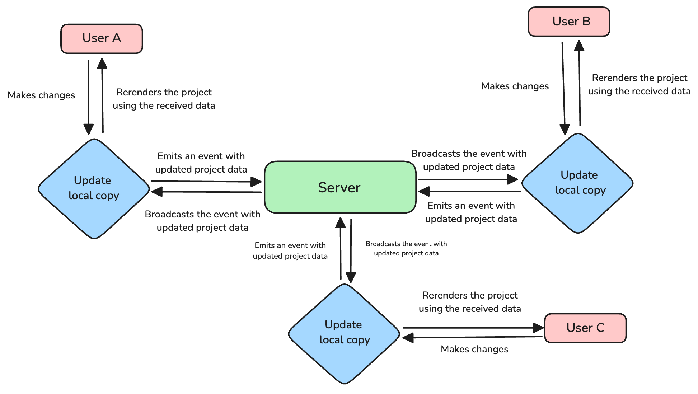

# Music Blocks Real-Time Collaboration Feature

## Table of Contents
1. [Introduction](#introduction)
2. [Feature Highlights](#feature-highlights)
3. [User Guide](#user-guide)
   - [Getting Started](#getting-started)
   - [Using Collaborative Features](#using-collaborative-features)
   - [Managing Collaborative Sessions](#managing-collaborative-sessions)
4. [Developer Guide](#developer-guide)
   - [Architecture Overview](#architecture-overview)
   - [Implementation Details](#implementation-details)
   - [Extending the Collaboration Feature](#extending-the-collaboration-feature)
5. [Troubleshooting](#troubleshooting)
6. [Future Developments](#future-developments)
7. [Glossary](#glossary)
8. [References and Resources](#references-and-resources)

## Introduction

Music Blocks is an innovative platform for music education and creation. This document introduces the real-time collaboration feature, a powerful tool that enables multiple users to work together on Music Blocks projects simultaneously.

The real-time collaboration feature brings numerous benefits:
- Enhanced learning through peer interaction
- Improved creativity through collaborative composition
- Efficient remote collaboration for distributed teams

## Feature Highlights

Key functionalities include:

- Real-time synchronization of project changes such as:
	- Adding a block to the canvas
	- Deleting a block from the canvas
	- Connecting a block in the stack
	- Disconnecting a block from the stack
	- Changing the position of a block
	- Updating the value of a block
	- Changing the position of the cursor
- Multi-user editing capabilities with minimal latency
- In-app collaborative mouse to represent the position of each user

These features significantly enhance the Music Blocks experience by fostering collaboration, enabling instant feedback, and facilitating shared creative processes.

## User Guide

### Getting Started

1. **Enabling the collaboration feature:** The collaboration feature is designed to allow any project to be initiated in collaboration mode. To start collaborating:
    1. Click the planet icon in the top bar to navigate to the **Planet** server.
    2. Switch to **Global** mode.
    3. Select the project you want to collaborate on.
    4. Click the `Collaborate` button next to your chosen project.
2. **Creating a collaborative session:** Once you've clicked the `Collaborate` button:
    1. The project will open automatically in a new tab with collaboration enabled.
    2. While the project loads, you'll see an input box. You can enter your name here if you wish. If you leave it blank and press `Enter`, you'll be assigned a random, cool name automatically.
    3. After loading, the project will display a `Collaboration Link`. Copy this link to share with others you want to invite to the session.
3. **Joining a collaborative session:** If someone has sent you a `Collaboration Link`:
    1. Paste the link into your browser's address bar.
    2. When prompted, enter your name in the input box that appears.
    3. Once the project loads, you'll see your collaborator's name represented by a cursor on the screen. This cursor shows their mouse position in real-time.

Remember, collaboration happens in real-time. Any [changes](#changes) you or your collaborators make will be visible to everyone in the [session](#session) immediately.

### Using Collaborative Features

1. **Real-time editing:** In a collaboration [session](#session), when a user makes any [changes](#changes), those changes are shared among all the connected users in that particular [room](#room) with minimal possible latency. 
	> Currently, we use a re-rendering mechanism to update the changes, so it takes a few seconds to update the project.

2. **Viewing other users' changes:**
	- You can easily track changes made by your collaborators in real-time. Each user's cursor is visible, showing their current position on the canvas. Any [changes](#changes) they make are immediately synchronized, whether they are adding, modifying, or deleting blocks.
	- To monitor ongoing changes, simply follow the visual cues such as highlighted areas or updated block configurations.

### Managing Collaborative Sessions

1. **Permissions and roles:** As of now, we don't have any Permissions and roles features for the collaboration. Anyone can start collaboration, make changes in a room, and exit the room.
2. **Saving and sharing collaborative projects:** Music Blocks already provides an automatic save functionality for the current state of the project. Building on this, I have implemented a feature that safely [exits users](#exiting-collab) from a collaboration session after specific activities, while ensuring that their work is saved.

	To share a project and collaborate with others, simply copy the **Collaboration Link** and share it with your friends. This link allows multiple users to join and work together on the same project in real-time.
3. **Exiting from the collaboration:** There are several ways to exit a collaboration session: 
	- **Exiting Music Blocks:** The simplest way to leave a collaboration is by closing the Music Blocks application or the browser tab in which it's running. 
	- **Creating a new project:** When you initiate the creation of a new project, you are automatically exited from the current collaboration session. 
	- **Loading a project from a file:** If you load a project from a file, you are also removed from the collaboration. 
	In all cases, your current work is saved locally before you exit the collaboration, ensuring that no changes are lost. 

## Developer Guide

### Architecture Overview

#### High-level diagram of the system architecture

The collaboration feature in Music Blocks follows an event-driven, client-server architecture with multiple clients (users) connected to a central server. The system is designed to facilitate real-time synchronization of changes across all connected clients through event emission and broadcasting.

#### Explanation of key components and their interactions

1. **Users (Clients)**
    - Represented by: User A, User B, User C
    - Role: End-users interacting with the Music Blocks interface
    - Actions: Make changes to the project, such as adding/removing blocks, modifying parameters, etc.
2. **Local Copy Update**
    - Represented by: "Update local copy" nodes
    - Role: Manages the local state of the project for each user and handles communication with the server
    - Functions:
        - Receives changes made by the local user
        - Emits events with updated project data to the server
        - Receives broadcasted events from the server
        - Rerenders the project using the received data
3. **Server**
    - Represented by: Central "Server" node
    - Role: Coordinates events and data between all connected clients
    - Functions:
        - Receives events with updated project data from clients
        - Broadcasts events with updated project data to all connected clients
4. **Interactions and Data Flow** 
    a. User to Local Copy:
    
    - "Makes changes": User actions in the interface trigger local updates
    
    b. Local Copy to Server:
    
    - "Emits an event with updated project data": Local changes are transmitted to the server as events
    
    c. Server to Local Copy:
    
    - "Broadcasts the event with updated project data": Server distributes updates to all connected clients
    
    d. Local Copy to User:
    - "Rerenders the project using the received data": Local copy updates the user interface to reflect changes
5. **Event-Driven Synchronization Process**
    1. User makes a change in their local Music Blocks interface
    2. Local copy receives the change
    3. Local copy emits an event with updated project data to the server
    4. Server receives the event with updated project data
    5. Server broadcasts the event with updated project data to all connected clients
    6. Each client's local copy receives the broadcasted event
    7. Local copies rerender the project using the received data, updating their respective user interfaces

This event-driven architecture ensures that all users see the same project state in real-time, allowing for seamless collaboration. The use of events for communication provides an efficient and scalable approach to handling updates across multiple clients.

Key benefits of this architecture:

- Real-time synchronization across all clients
- Scalability through event-driven communication
- Consistency maintained by server broadcasting to all clients, including the originator
- Clear separation of concerns between local updates and server communication

This architecture allows Music Blocks to provide a responsive and collaborative environment where multiple users can work on the same project simultaneously, seeing each other's changes in real-time.

### Implementation Details

#### 1. **Technologies Used**

- **JavaScript**: The primary programming language used for both client-side and server-side development. JavaScript's versatility allows for seamless integration between front-end and back-end components.

- **Socket.IO**: A real-time engine for building bi-directional communication channels between web clients and servers. Socket.IO is the core technology enabling real-time updates and synchronization in our collaboration feature.

- **Node.js**: A JavaScript runtime built on Chrome's V8 JavaScript engine, used for running the server-side application. Node.js provides an event-driven, non-blocking I/O model that makes it lightweight and efficient for real-time applications.

#### 2. Data Flow and Synchronization Mechanism

Our real-time collaboration feature implements a client-server architecture using Socket.IO for data transmission and synchronization. Here's an overview of the data flow:

1. **Client-Server Connection:**
   - When a client (user) connects to the application, a WebSocket connection is established between the client and the server using Socket.IO.
   - Each client is assigned a unique socket ID upon connection.

2. **Room Management:**
   - Clients join specific "rooms" (e.g., document IDs or project spaces) to collaborate.
   - The server maintains a list of active rooms and the clients connected to each room.

3. **Data Transmission:**
   - When a client makes a change (e.g., adding a block), the change is immediately sent to the server via a Socket.IO event.
   - The server receives the event and processes the data.

4. **Data Broadcasting:**
   - After processing, the server broadcasts the change to all other clients in the same room using Socket.IO's room feature.
   - Only clients in the relevant room receive the update, ensuring data privacy and reducing unnecessary network traffic.

5. **Client-Side Update:**
   - Clients receive the broadcasted data and update their local state accordingly.
   - The user interface is then updated to reflect the changes in real-time.

6. **Data Persistence:**
   - Music Block's built-in mechanism to save projects to local storage ensures data persistence.

7. **Reconnection Handling:**
   - If a client disconnects, Socket.IO attempts to reconnect automatically.
   - Upon successful reconnection, the client requests the latest state from the server to ensure synchronization.

This architecture enables real-time collaboration by ensuring that all connected clients receive updates almost instantly, creating a seamless and responsive user experience.

### Extending the Collaboration Feature

#### Structure and Organization

1. **Collaboration Folder Structure:**
    - The core logic of the collaboration feature is located in the `collaboration` folder.
    - Key files include:
        - `collaboration.js`: Contains the core logic for initiating and managing collaborations.
        - `collabcursor.js`: Handles the creation and management of collaborative cursors.
2. **Modular Design:**
    - The collaboration feature is implemented using a modular approach.
    - Before adding new functionality, review the existing codebase to avoid duplication and leverage pre-written methods.

#### Guidelines for Adding New Collaborative Functionalities

1. **Code Review:**
    - Thoroughly examine the existing codebase in the `collaboration` folder before implementing new features.
    - Look for reusable methods or patterns that can be extended for your new functionality.
2. **SOLID Principles:**
    - Adhere to [SOLID Principles](https://www.digitalocean.com/community/conceptual-articles/s-o-l-i-d-the-first-five-principles-of-object-oriented-design) when implementing new features:
        - **S**ingle Responsibility Principle: Each class or module should have one, and only one, reason to change.
        - **O**pen-Closed Principle: Software entities should be open for extension but closed for modification.
        - **L**iskov Substitution Principle: Objects of a superclass should be replaceable with objects of its subclasses without affecting the correctness of the program.
        - **I**nterface Segregation Principle: Many client-specific interfaces are better than one general-purpose interface.
        - **D**ependency Inversion Principle: Depend upon abstractions, not concretions.
    - Following these principles ensures that new features don't break existing functionality and promotes maintainable, scalable code.
3. **Documentation:**
    - Thoroughly document any new methods or classes you add.
    - Update existing documentation to reflect changes or extensions to current functionality.
4. **Testing:**
    - Implement tests for new features to ensure they work as expected and don't introduce regressions.

#### Maintaining Real-Time Performance

1. **Caching and Local Storage:**
    - Music Block utilizes caching and local storage for various operations.
    - Consider a periodic cleanup for these storage solutions to ensure smooth collaboration development and testing.
2. **Code Optimization:**
    - While the existing collaboration implementation considers optimization, there's always room for improvement:
        - Regularly review and refactor code to use algorithms with lower time and space complexities.
        - Minimize timeout intervals to their lowest practical values without compromising functionality.
        - Implement lazy loading techniques for non-critical components to improve initial load times.
3. **Scalability Considerations:**
    - Design new features with scalability in mind, considering how they will perform with a large number of concurrent users.
    - Implement load testing scenarios to ensure the system can handle increased user loads.

By following these guidelines and continuously focusing on performance optimization, you can extend the collaboration feature while maintaining its real-time responsiveness and efficiency.

## Troubleshooting

### Common Issues and Solutions

#### 1. Connection Problems

a) **Connection Failed**

- **Issue**: Unable to establish a connection to the collaboration server.
- **Solution**:
    - Ensure you have a stable internet connection.
    - Check if the server is operational.
    - Try refreshing the page or clearing your browser cache.
- **Note**: The collaboration feature is designed to work with minimal network requirements, but a reliable connection is still necessary for optimal performance.

b) **Maximum Socket Calls Reached**

- **Issue**: The client is unable to connect to the server after multiple attempts.
- **Solution**:
    - Retry joining the collaboration using the provided collaboration link.
    - If the issue persists, try the following:
        1. Clear your browser cache and cookies.
        2. Restart your browser.
        3. If possible, try connecting from a different network.

#### 2. Synchronization Issues

a) **Project Doesn't Reload on Change**

- **Issue**: Changes made by other collaborators are not reflected in real-time.
- **Solution**: To resolve this issue, please ensure:
    - You are connected to the server (check for any connection error messages).
    - Your network connectivity is stable (try loading a different website to verify).
    - You don't have excessive local storage and cache (clear browser data if necessary).
- **Additional Troubleshooting Steps**:
    1. Refresh the page to re-establish the connection.
    2. Check if you're in the correct collaboration room/session.
    3. Temporarily disable any browser extensions that might interfere with WebSocket connections.

### Reporting Issues

If you encounter any issues not covered here or if suggested solutions don't resolve your problem, please report them [here](https://github.com/sugarlabs/musicblocks/issues/new/choose). When reporting, include:

- A detailed description of the issue
- Steps to reproduce the problem
- Your browser and operating system versions
- Any error messages you've received

This information will help our development team and community to quickly identify and resolve the issue.

## Future Developments

### Planned Enhancements and Feature Additions

The following enhancements and features are under consideration for future updates to our collaboration system. These ideas are subject to discussion and finalization:

1. **Collaboration Space**
    - **Description**: A dedicated area to discover projects that are currently being collaborated on.
    - **Potential Benefits**:
        - Increased visibility of collaborative projects
        - Easier team formation and project discovery
        - Potential for community building and knowledge sharing

2. **CRDT (Conflict-free Replicated Data Type) Mechanism Implementation**
    - **Description**: Implement CRDT to make collaboration smoother by updating only the changed parts of a project, avoiding whole re-renders.
    - **Potential Benefits**:
        - Improved performance, especially for large projects
        - Reduced network traffic
        - Enhanced real-time synchronization
        - Better handling of concurrent edits

3. **Collaborative Chat Feature**
    - **Description**: Implement an in-app chat system for collaborators.
    - **Potential Benefits**:
        - Improved communication between team members
        - Reduced need for external communication tools
        - Context-aware discussions linked to specific project elements

4. **More Robust Event Messages**
    - **Description**: Implement more detailed and informative messages for various collaboration events.
    - **Potential Benefits**:
        - Enhanced user awareness of system and collaborator actions
        - Improved troubleshooting and user support
        - Better overall user experience and engagement

5. **Rate Limiting for Collaboration Mouse Events**
    - **Description**: Add a feature to limit the rate of mouse event updates based on the number of users in a collaboration room.
    - **Potential Benefits**:
        - Optimized performance for rooms with many users
        - Reduced server load and network traffic
        - Smoother experience in large collaborative sessions

These planned enhancements aim to improve the overall collaboration experience, system performance, and user engagement.

### Feedback and Suggestions

We value input from our user community. If you have thoughts on these planned features or additional ideas for enhancing the collaboration system, please share them [here](https://github.com/sugarlabs/musicblocks/issues/new/choose). Your insights can help shape the future development of Music Blocks.

## Glossary

- <a name="session">Session</a>: A **session** refers to an interactive working environment where multiple users can engage simultaneously on a shared platform or task in real-time. Collaborative sessions often involve tools like file sharing, code or document editing, or design work, where all participants can see updates, provide input, and make changes at the same time.

- <a name="room">Room</a>: A virtual space where users can collaborate on a project in real time. Each room has a unique identifier named `roomID` and allows multiple users to join, make changes, and see updates live. Rooms manage user permissions, project data, and collaboration-related activities.

## References and Resources

- https://socket.io/docs/v4/
- https://github.com/sugarlabs/musicblocks/tree/master/documentation