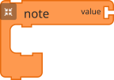
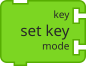

# Guide to adding blocks for support in code to blocks conversion

This guide explains how to add new blocks for code to blocks support in the [ast2blocks.json](./ast2blocks.json) configuration file. This file contains two main sections: `argument_blocks` and `body_blocks`.

## Table of Contents
1. [Basic Structure](#basic-structure)
2. [Argument Blocks](#argument-blocks)
3. [Body Blocks](#body-blocks)
4. [How to Add a Block](#how-to-add-a-block)
5. [Common Patterns](#common-patterns)
6. [Examples](#examples)
7. [Helper Code](#helper-code)
8. [Troubleshooting](#troubleshooting)

## Basic Structure

The ast2blocks.json file has two main sections:
```json
{
    "argument_blocks": [...],
    "body_blocks": [...]
}
```

- `argument_blocks`: Defines blocks that can be used as arguments in other blocks
- `body_blocks`: Defines main blocks that can contain other blocks, or are just a block of their own

## Argument Blocks

Argument blocks are used as arguments for other blocks. They typically represent values or expressions.

### Basic Structure
```json
{
    "comment": "Description of the argument block",
    "ast": {
        "identifiers": [
            {
                "property": "path_one",
                "value": "the_value_at_this_path"
            },
            {
                "property": "path_n",
                "value": "the_value_at_this_path"
            },
            {
                "property": "last_path",
                "value": "PROPERTY_NAME"
            }
        ],
        "name_property": "name",
        "argument_properties": [
            "path_to_get_arguments"
        ]
    },
    "name_map": {
        "PROPERTY_NAME": "block_name"
    }
}
```

They usually look like the following, with a connector section on the left that can fit into another block:


They may also look like this, an argument with space for one or more arguments themself:


### Key Components
- `comment`: Description of what the block does
- `ast`: Abstract Syntax Tree pattern matching
  - `identifiers`: Array of conditions that must match
  - `name_property`: Property to extract for block name, such as 'voicename' and 'random' in the above blocks
  - `argument_properties`: Properties to extract for arguments such as 'min' and 'max' in the random block example above. The goal is to construct an array of paths to each argument, and there are two ways to do this. The first way is when you know exactly how many arguments and where they are, so you can construct an array `argument_properties`: ['path_to_arg1', 'path_to_arg_n']. The second way is seen directly below.
  - `arguments_property`: This is an ALTERNATIVE TO `argument_properties`, this is used when not all blocks in name_map have the same number of arguments. Therefore you will construct your arguments array using `arguments_property`: 'path_to_all_args'. The code will recognize this pattern and construct the array for you.
- `name_map`: Maps AST identifiers to block names

## Body Blocks

Body blocks are the main blocks that are either their own block or can contain other blocks. There are two kinds of body blocks:

A body block that can take in children as shown below (see the clamp like structure that can hold children):



A body block that is just a block by itself:



### Basic Structure
```json
{
    "name": "block_name",
    "comments": "Description of the block",
    "arguments": [
        {
            "type": "argument_type"
        }
    ],
    "ast": {
        "identifiers": [
            {
                "property": "path_one",
                "value": "the_value_at_this_path"
            },
            {
                "property": "path_n",
                "value": "the_value_at_this_path"
            }
        ],
        "argument_properties": [
            "argument_path"
        ],
        "children_properties": [
            "children_path"
        ]
    },
    "blocklist_connections": [
        "parent_or_previous_sibling",
        "argument",
        "first_child",
        "next_sibling"
    ],
    "default_vspaces": {
        "argument": 1
    }
}
```

### Key Components
- `name`: Unique identifier for the block as represented in the blocklist
- `comments`: Description of what the block does
    - This is only for readability, write whatever you want and make it clear.
- `arguments`: Array of argument types the block accepts
- `ast`: Abstract Syntax Tree pattern matching
  - `identifiers`: Array of conditions that must match
  - `argument_properties`: Paths to extract arguments
  - `children_properties`: Paths to extract child blocks
- `blocklist_connections`: Defines how the block connects to others
    - The blocks in the blocklist is in the form of [ID, name, x, y, [blocklist_connections]]
- `default_vspaces`: Vertical spacing configuration. This property is needed purely for the addition of vertical spacing if arguments are too long and could cover up blocks beneath them. There are two types of blocks that needs this:
    - Blocks with children need to know how long their arguments are compared to the initial space for arguments they have to add the delta amount of vspaces to the children as seen here:  
Therefore in this case we add 'argument' : 1, because the initial argument space is 1.
    - Blocks without children need to know how long the block itself is to add space beneath it in case the argument length exceeds that, as seen here:  Therefore in this case, we add 'body' : 2, since the block is 2 vertical spaces tall without the arguments.

## How to Add a Block
First, read the argument and body blocks section, understand their structures, and categorize the new block into either an argument block or a body block.

Make a new .js file with just the JS code with your new unsupported block in it, go to the Helper code section, and follow the initial steps of running that script to get your AST representation of that code.

Initially, you will get an unsupported statement error, which should be your unadded block.

Now, download the HTML file for your block and locate the blocklist. This will look something like below, with the blocklist between the red parentheses.


As you can see, blocklist representation is in the form of 

`[ID, name, x, y, [blocklist_connections]]`

Using this structure, you can find the name of your new block in this way and add under the name property.

Next, use the AST you previously generated and command/ctrl F to find the name of that block AS SHOWN IN YOUR CODE (note the name from the blocklist is most times different from what shows up in the code and AST).
  - Work your way up the tree from the name until you hit the object the name is in right before you hit a list. This means find the largest possible object the name is in. You will either find the object is in an array called "body", as shown below


  - Or the object is in an array called "arguments", as shown below


  - Your identifiers path will start from the top of this object, all the way down back to the name to get your identifiers path
    - For the above example, the path would be 
```json 
{
    "property": "type",
    "value": "ExpressionStatement"
},
{
    "property": "expression.type",
    "value": "AwaitExpression"
},
{
    "property": "expression.argument.type",
    "value": "CallExpression"
},
{
    "property": "expression.argument.callee.type",
    "value": "MemberExpression"
},
{
    "property": "expression.argument.callee.property.name",
    "value": "doVibrato"
}
```
One detail to note for the identifiers path is that during matching, we use AND logic, meaning all of these property value pairs must be satisfied. However, if there are multiple possible paths, we use the same property with different values as much as needed, and the code will use OR logic on those paths. An example is shown below:

```json
{
        "property": "type",
        "value": "VariableDeclaration"
},
{
        "property": "declarations[0].init.type",
        "value": "Literal"
},
{
        "property": "declarations[0].init.type",
        "value": "BinaryExpression"
},
{
        "property": "declarations[0].init.type",
        "value": "UnaryExpression"
},
{
        "property": "declarations[0].init.type",
        "value": "CallExpression"
}
```
For this example, all values with property path 'declarations[0].init.type' count as a match.
  - For arguments and children property paths, there is a property called "arguments" in the object. Get the full path to the arguments list, and the first n elements should be the n arguments, so list them in the argument_properties for your block. 
    - If there are arguments, you also have to add an "arguments" section above "ast", with the types of the arguments. Based on the block, this can be one of the following supported types:
        - text (string arguments)
        - BooleanExpression (expression returning boolean such as a = 1)
        - NumberExpression (expression returning number such as 1 + 1)
        - ValueExpression (variable assignment)
        - custom type (if the argument has a custom name, just write that name)
  
  - The children path is most times the path to the last argument in that list, then add .body.body to the path
  - See examples and generate your own AST for those blocks to follow along so the process will become clearer.

  - To get the blocklist_connections:
    - Use UI to see what kind of connections a block needs. This will be in the form of "parent_or_previous_sibling" if a block can connect with a block above it, "argument" if the block has an argument slot, "first_child" or "second_child" depending on how many clamps a block has, and "next_sibling", if a block can have another block connected underneath it.
    - The default blocklist_connections configuration is a simple single clamp block that takes in one argument, which means it will simply have all 4 of the above components. For example:
    
    
    
    If the new block being added has that configuration, there's no need to add this section.

  - The default vertical spacing will be for a single body block of vspace 1. Do not add this section if the block being added fits that description. Otherwise, use "argument": n for clamp blocks with n arguments, and "body": n for non clamp blocks with n arguments.

## Common Patterns

### 1. Simple Method Call
```json
{
    "name": "methodname",
    "comments": "Description",
    "ast": {
        "identifiers": [
            {
                "property": "type",
                "value": "ExpressionStatement"
            },
            {
                "property": "expression.type",
                "value": "AwaitExpression"
            },
            {
                "property": "expression.argument.callee.property.name",
                "value": "methodName"
            }
        ]
    }
}
```

### 2. Method with Arguments
```json
{
    "name": "methodname",
    "comments": "Description",
    "arguments": [
        {
            "type": "argument_type"
        }
    ],
    "ast": {
        "identifiers": [...],
        "argument_properties": [
            "expression.argument.arguments[0]"
        ]
    }
}
```

### 3. Method with Children
```json
{
    "name": "methodname",
    "comments": "Description",
    "ast": {
        "identifiers": [...],
        "children_properties": [
            "expression.argument.arguments[0].body.body"
        ]
    }
}
```

## Examples

### Example 1: Simple Argument Block
```json
{
    "comment": "Mouse X coordinate",
    "ast": {
        "identifiers": [
            {
                "property": "type",
                "value": "MemberExpression"
            },
            {
                "property": "object.name",
                "value": "mouse"
            },
            {
                "property": "property.name",
                "value": "X"
            }
        ],
        "identifier_property": "property.name"
    },
    "name_map": {
        "X": "x"
    }
}
```

### Example 2: Body Block with Arguments
```json
{
    "name": "setcolor",
    "comments": "Set color block",
    "arguments": [
        {
            "type": "NumberExpression"
        }
    ],
    "ast": {
        "identifiers": [
            {
                "property": "type",
                "value": "ExpressionStatement"
            },
            {
                "property": "expression.type",
                "value": "AwaitExpression"
            },
            {
                "property": "expression.argument.callee.property.name",
                "value": "setColor"
            }
        ],
        "argument_properties": [
            "expression.argument.arguments[0]"
        ]
    },
    "blocklist_connections": [
        "parent_or_previous_sibling",
        "argument",
        "next_sibling"
    ],
    "default_vspaces": {
        "body": 1
    }
}
```

### Example 3: Body block with arguments and children
```json
{
    "name": "semitoneinterval",
    "comment": "Set semitone interval block",
    "arguments": [
        {
            "type": "intervalname"
        }
    ],
    "ast": {
        "identifiers": [
            {
                "property": "type",
                "value": "ExpressionStatement"
            },
            {
                "property": "expression.type",
                "value": "AwaitExpression"
            },
            {
                "property": "expression.argument.type",
                "value": "CallExpression"
            },
            {
                "property": "expression.argument.callee.type",
                "value": "MemberExpression"
            },
            {
                "property": "expression.argument.callee.property.name",
                "value": "setSemitoneInterval"
            }
        ],
        "argument_properties": [
            "expression.argument.arguments[0]"
        ],
        "children_properties": [
            "expression.argument.arguments[1].body.body"
        ]
    },
    "default_vspaces": {
        "argument": 1
    }
}
```

## Helper Code
Copy the following driver code into a file in the same folder as ast2blocklist.js, then add another file with the JS code you want to convert to blocks and run using 

```node [name of this file] [name of file you want to convert]```.

You will get an error for unsupported blocks, and also the AST that will help you with adding the blocks.

Once finished adding, run the same command again, and you should see the outputted blocklist form if done right.

Finally, run ```node minify.js``` to compress the JSON as the code uses the minified file.

```
function main() {
    const fs = require('node:fs');
    const acorn = require('../../lib/acorn.min');
    const { AST2BlockList } = require('./ast2blocklist');
    const config = require('./ast2blocks.json');

    if (process.argv.length <= 2) {
        console.error("node code2blocks.js [music_block_js_file]");
        return;
    }
    let jsFile = process.argv[2];

    fs.readFile(jsFile, 'utf8', (err, data) => {
        if (err) {
            console.error(err);
            return;
        }
        const AST = acorn.parse(data, { ecmaVersion: 2020 });
        console.log(JSON.stringify(AST, null, 2));
        try {
            let blockList = AST2BlockList.toBlockList(AST, config);
            console.log(toString(blockList));
        } catch (e) {
            console.error("message" in e ? e.message : e.prefix + data.substring(e.start, e.end));
        }
    });
}

function toString(blockList) {
    if (!Array.isArray(blockList)) {
        return String(blockList); // Handle non-array inputs
    }

    return blockList.map(item => {
        if (typeof item === 'object' && item !== null) {
            return JSON.stringify(item); // Expand objects
        } else {
            return String(item); // Convert other items to strings
        }
    }).join(',\n');
}

if (require.main === module) {
    main();
}
```

## Troubleshooting

Common issues when adding blocks:

1. **Pattern Not Matching**
   - Check all identifier conditions
   - Verify property paths are correct

2. **Arguments Not Working**
   - Verify argument types are defined
   - Check argument property paths
   - Ensure proper connection points

3. **Children Not Appearing**
   - Verify children_properties paths
   - Check blocklist_connections